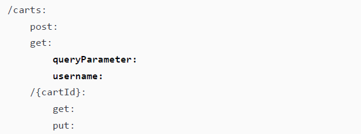

# 开篇词

---

> **写在前面**
>
> 今天又淘到一本介绍 Postman 的宝藏级小册子，非常适合想进一步了解 API 接口测试的朋友们。本书最大的特点就是手把手教学。想当年第 1 版问世时，初出茅庐的我随便拣了书中一两招，就能轻松搞定工作中五花八门的 API 疑难杂症。只是当时太忙，无暇系统学习梳理。昨天看到这本书在今年 6 月又出了全新第 2 版，有些新内容还是作者在成书过程中一边写一边学会的。于是就有了翻上一翻的冲动（很遗憾，这两版目前都还没有中文译本）。但我相信这一遍学完后，手里就又多了一套应对 API 接口调试与开发的“瑞士军刀”。

## 1 专栏初衷

在这个快餐当道、快时尚盛行、快速营销策略无孔不入的世界里，**软件质量** 还重要吗？现实生活中，人们往往会在各方的压力驱使下谋求各种各样的捷径，哪怕是在开发高质量软件这件事上也不例外。笔者也一直在为反击这个充斥着“快”文化的疯狂世界而积极奔走，只求略尽绵力。在他看来，质量仍然是至关重要的。生活中那些动不动就状况百出的垃圾产品已经够多的了，也是时候该提高一下质量了。希望通过这本书的解读能帮助更多的有缘人一窥高质量的软件产品与设计理念。

就像作者所说，在这个知识爆炸到急速贬值的年代，似乎软件质量已经没有开发速度重要了：前期设计得再好，代码写得再怎么优雅，也敌不过一些低价竞争的“屎山”代码；而往往正是这样的“屎山”团队能让甲方觉得“这个团队很积极、很上心”，别人要开发一个月，交给他们只要一周不到就做好了；能不能用先另说，关键是 **积极响应** 了。事实上，这些公司无非是想用低报价换得部分市场，再通过后续不断地定制开发扎下根来。这样的公司要么人才储备基本到位，确实能快速进入新领域并站稳脚跟；要么就是一个草台班子，上至产品经理下至开发人员没有一个人接触过相关业务场景，整个团队都在摸着石头过河。遗憾的是，后者往往占绝大多数。因为就业市场上从不缺人，这种开发模式就像敢死队冲锋，干废一批立马再换下一批，主打一个“铁打的营盘流水的兵”，等熬到最终软件交付的那天，也往往是团队不堪重负就地解散的那天——各种先天不足，让软件后续的运维实施举步维艰。都说一将功成万骨枯，像这样的软件定制开发，万古枯换来的无非是不计其数的豆腐渣工程。

正如企业制定的安全生产条例，那些看似影响工作效率的条条框框背后，往往是以一个个鲜活的生命为代价的。国内的中小软件公司很多都正处在这样的“案例收集”阶段，对软件质量的认识依旧很肤浅。您可能会问：这与我何干？都是老板们考虑的事，我一个底层码畜拿多少薪资干多少活，代码和人，只要有一个能跑就行了，要啥自行车？

没错，现在看来这些问题还是高层的老板的事，可再过一段时间就未必了。在 AI 飞速发展的当下，还有多少一线开发者是完全脱离 AI 助手从零开始实现每个功能或者业务模块的？保守估计五个人里可能只有一个。以后这个比例还会越来越小，这就是趋势，无论 AI 助手是否收费。众所周知，AI 并不是万能的，充其量只是一个效率工具——即所谓的 AI 放大镜效应——让强者愈强，弱者愈弱。经过一年多来的实践，人们对 AI 的认识逐渐回归理性，不再盲目追求提示词工程这样的“术”的层面，而是更强调对自身基础能力的强化：逻辑推理能力、知识体系的完善、语言沟通水平的提高……这些新的要求都指向了同一个热搜词——超级个体。

看到 **超级个体** 四个字，你的第一印象是什么？一开始我对这个词也是有偏见的，认为那都是短视频带货圈子里出现的概念炒作，普通人根本没机会接触到。可随着一大批 AI 助手和工具的诞生，时至今日，我已经很难完全不用这些新事物来处理日常工作了：看英文原版书有 AI 翻译助手、看累了还可以用 AI 语音来转成音频；写代码遇到问题，最早是求助百度、博客园，后来是必应、谷歌、Stack Overflow，现在则是 GitHub Copilot、ChatGPT、文小言、豆包、KIMI……在不久的将来，相信随着 AI 工具在 IT 圈的进一步深化，越来越多的人还会投身到给自己定制 LLM 的工作中，这就少不了要搭建相关的环境，部署并调用相关的 API 接口。

留心周围的一切不难发现，API 接口正在成为 Web 的支柱：它既能帮助企业实现外部通信，同时也为现代软件系统的许多内部组件提供通信相关的基础设施。不同服务之间的良好通信是应用程序的良好运行的极其重要的保障。因此，API 接口测试对于产出优质的软件产品至关重要。

按照 **二八定律**，相当一部分开发者对 Postman 这样的占 API 测试与开发统治地位的工具软件知之甚少。国内大部分程序员对测试的概念还停留在手动测试阶段，最多用 Postman 发个 POST 请求，看看部署的站点是否能用，工作中用到的功能可能仅仅只有 2% 左右。这正是我下决心突破 Postman 并创建本专栏的初衷：让更多的人知道那应该熟知的 18%，幸运的话能有幸一窥奠定 Postman 在 API 领域统治地位的那 80% 的强大功能。看看我们离这样的工具软件究竟还有多大的差距。如果身为开发人员甚至从来都没见过好的 API 接口设计、好的测试用例，那他/她就只能寄希望于今后的公司（但愿不是我上面提到的那种公司），靠自我摸索去填补这方面的空白。老实说，这无异于在用自己宝贵的职业生涯进行一场豪赌：你怎么预判公司推广的模式就是业界主流做法、最佳实践？

归根结底，还得看自己的底层基础知识体系是否完整。如果不具备这样的体系化认知，就得想方设法从最基础的核心知识入手，完成必要的原始积累。我很难想象一个连马步都站不了两分钟的人能把太极拳打到驾轻就熟的地步；软件开发、各行各业亦是如此。这本小册子就是用来夯实 API 测试开发基础的绝佳参考资料。

## 2 关于内容设计

本书共分为十五个章节，开始的几章还比较有感觉，后面讲到接口鉴权的时候感觉就有点敷衍了，比如介绍 `OAuth2.0` 那一节，给出的案例都没法在网上验证，所有的配置环节只能靠想象，我甚至怀疑自己对这本书的期望太高了点。后来想明白了，这本书的主要任务是扫盲，让你知道有这些东西，至于怎么灵活应用，区区三百来页的小册子如果都能讲得很透彻，那不是作者的脑子有问题，就是我的脑子有问题。因此，要充分发扬 **拿来主义** 精神，主动去其糟粕，留其精华，然后顺着书中脉络，结合自己的薄弱环节再作进一步延伸，直到形成自己的完整知识体系。

因此，本专栏会按照书中内容的顺序做笔记，并且根据实际需要做一些拓展或实践，让 Postman 不再陌生。希望学完这本小册子最好今后遇到相关问题可以发表一些自己的浅见；同时，也希望在梳理自学笔记的过程中帮到可能会遇到同样问题的后来者。我一向是比较反感用 **先驱** 这样的字眼标榜自己的，一来水平有限，二来也不想搞得那么悲壮，你我不过是在不同的时间坐标开始相关的学习罢了，因此言论是完全自由的，可以在专栏文章里给我留言，多多交流，共同进步！


---

---

另附前言翻译：

# 关于本书

## 1 前言

在这个快餐当道、快时尚盛行、快速营销策略无孔不入的世界里，**质量** 还重要吗？这个世界给人们带来的压力似乎总在驱使大家去走各种各样的捷径，哪怕是开发高质量的软件也不例外。笔者也一直在为反击这个充斥着“快”文化的疯狂世界而积极奔走，只求略尽绵力。在我看来，质量仍然是至关重要的。生活中那些动不动就状况百出的垃圾产品已经够多的了，也是时候该提高一下质量了。

写这本书算是抛砖引玉，希望能帮助更多的有缘人一窥高质量的软件产品与设计理念。无论您是专业测试人员，还是希望了解更多测试知识的开发者，但愿都能与我一起，通过高质量的软件应用来造福这个世界。

API 接口正在成为互联网的支柱。它既能帮助企业实现外部通信，同时也为现代软件系统的许多内部组件提供通信相关的基础设施。就像美满婚姻需要良好的沟通来维系，互联网也是如此。不同服务之间的良好通信是应用程序的良好运行的极其重要的保障。因此，API 接口测试对于产出优质的软件产品至关重要。

从表面上看，本书主要介绍的是 API 接口测试工具 Postman，但笔者也试图在书中穿插一些实例和教学经验，帮助读者以一种对质量有实际影响的方式来用好 Postman。通过本书的学习，您将深入理解 Postman 的工作原理，同时也将为如何考虑 API 接口测试打下坚实的基础。希望您掌握的不仅仅是 Postman 解决实际问题的各种操作技巧，更能够清楚地知道怎样因地制宜、因时制宜，从而有效地构建高质量的 API 接口。


## 2 本书读者

这本书首先是写过我自己的。书中谈到的许多想法都是我几年前自学的内容。事实上，Postman 的新功能的更新迭代速度极快，甚至这本全新第二版中的部分内容都是我在写书时学到的新知识。

我一直在成长和学习，尤其喜欢与他人分享我学到的新知识，以帮助他们行稳致远。

一开始接触 API 接口测试，可能会让人感到不知所措——毕竟这是一个庞大的主题，可能会让初学者望而生畏。正因如此，我才动了写这本书的念头。本书主要是针对那些需要测试 API 接口、但又不知道从何开始的软件测试人员和开发者。我在书中尽量不去假设读者拥有太多深入的编程经验，但了解一些编程的基础知识无疑会对书中的某些知识点的学习有所帮助。

如果您是一名软件测试人员，并且有兴趣涉猎 API 测试这一领域，本书绝对适合您。如果您是一名开发者，想要提升自己在测试与质量方面的相关技能，那么恭喜您，正在为前途光明的个人职业生涯添砖加瓦！未来懂得如何产出高质量软件的开发者将始终供不应求，备受青睐。无论您的背景如何，其间可能会略过本书的某些内容，但如果花上一些时间阅读学习，您就会发现自己已经能够轻松驾驭 Postman 这款测试神器，并知道如何设计及编写良好的 API 测试。


## 3 本书结构

本书共分为十五个章节，主要内容如下——

**第 1 章：API 术语和类型**，帮助您了解一些基本的 API 术语，并介绍不同类型的 API。

**第 2 章：API 文档与设计**，涵盖了适用于创建和测试 API 的设计原则，以及创建实用文档的方法及注意事项。

**第 3 章：OpenAPI 与 API 规范**，介绍了 API 规范的相关概念及其在 Postman 中的应用。

**第 4 章：良好 API 测试自动化的考虑因素**，教您如何在 Postman 中创建和执行有价值且经久不衰的 API 测试。

**第 5 章：理解鉴权设置**，介绍了如何使用 Postman 中现有的多种 API 接口鉴权方法。

**第 6 章：创建测试验证脚本**，解释了如何在 Postman 中创建和使用测试脚本。

**第 7 章：数据驱动测试**，介绍了数据驱动测试的概念，以及将其用于 Postman 中创建可扩展测试的具体方法。

**第 8 章：工作流测试**，解释了什么是工作流测试，以及如何在 Postman 中创建流程。

**第 9 章：使用 Newman 在 CI 中运行 API 测试**，展示了如何使用 Newman 运行 Postman API 测试的命令行。

**第 10 章：使用 Postman 监控 API**，探讨了如何使用 Postman 监控 API 接口的产品使用情况。

**第 11 章：测试现有 API**，通过一个实际示例展示在测试现有 API 时应该创建什么样的测试。

**第 12 章：在 Postman 中创建和使用模拟服务器**，解释了什么是模拟服务器以及如何在 Postman 中设置和使用它们。

**第 13 章：使用合约测试验证 API**，介绍了合约测试的概念，并演示了其在 Postman 中的用法。

**第 14 章：API 安全测试**，简要介绍了安全测试，并给出了在 Postman 中设置模糊测试的示例。

**第 15 章：API 性能测试**，解释了不同类型的性能测试，并介绍了 Postman 中可以用来评估 API 性能的一些功能。


## 4 本书学习建议

本书旨在为您提供在测试或开发工作中能够起到立竿见影效果的实用技能。如果您想从本书中获得最大的价值，请立即行动起来，学以致用。完成本书中的所有练习后，还要积极尝试将您学到的理念应用到“现实世界”中。

本书不假设读者具备大量关于 API 的先前知识，甚至不需要了解开发和测试原则。只要您对网络技术有基本的了解，并且对软件开发的整体概念有所认识，您就应该能够跟上本书的内容，并掌握所需的一切。本书中一些 Postman 的测试脚本使用了 JavaScript，但您不需要深入了解其工作原理，尽管基本的理解会有所帮助。书中有许多练手机会和拔高测试，它们是本书的重要组成部分，为了充分利用本书，您应该花时间逐一攻克这些问题与挑战。


## 5 代码约定与代码库

### 示例代码与彩页资源

本书完整的示例代码详见本文绑定的代码资源压缩包。彩页为 PDF 格式，也在资源压缩包内。

### 代码约定

本书中使用了多种样式约定。

`CodeInText`：表示文本中嵌入的代码、数据库表名、文件夹名称、文件名、文件扩展名、路径名、虚拟网址、用户输入和推特用户名。例如：“`/product` 端点提供有关通过此 API 访问的产品的信息。”

代码格式示例如下：

```yaml
openapi: 3.0.1
info:
    title: ToDo List API
    description: Manages ToDo list Tasks
    version: "1.0"
servers:
    -url: https://localhost:5000/todolist/api
```

当希望引起您对代码块中特定部分的注意时，相关的行或项目会以粗体显示：



命令行格式如下：

```bash
npm install -g newman
```

**粗体字**：表示一个新术语、一个重要的词，或您在屏幕上看到的词。例如，菜单或对话框中的词在文本中显示为这样。例如：“点击 **导入** 按钮并选择 **OpenAPI** 选项。”

> [!note]
>
> 像这样显示警告或重要说明。

> [!tip]
>
> 像这样显示提示和技巧。