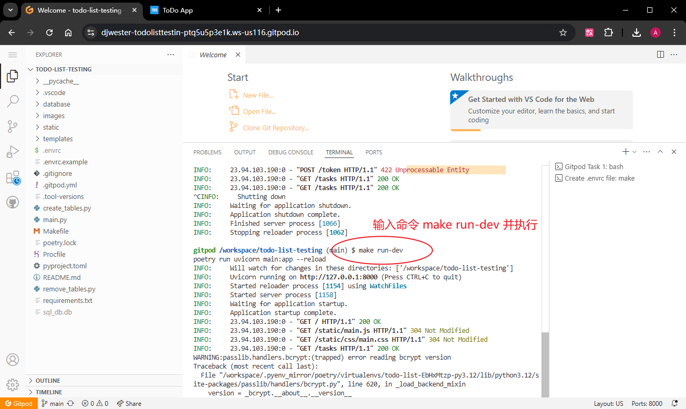
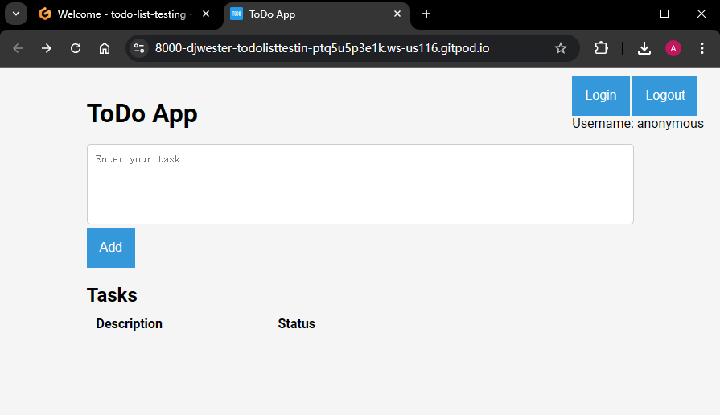

# 第一章 API 相关术语及类型

## 1.1 何为 API（应用程序接口）

- 广义：API 是两种不同代码，或者人与代码进行交互的一种方式。比如具备公共方法的 `class` 类、接受特定输入的脚本、以特定方式调用的驱动程序等。
- 狭义：即 Web API（本书沿用该定义）。在 Web API 中，客户端位于接口的一侧发送请求，而服务器（或服务器集群）位于接口的另一侧响应请求。

API 的主要类型：

- 基于 `SOAP` 协议的接口：**SOAP** 即 **Simple Object Access Protocol**（即 **简单对象协议**），为早期针对企业构建的 API 接口。
- 基于 `REST` 风格的接口：**REST** 即 **Representational State Transfer**，较 **SOAP** 更灵活，针对基于消费者的 Web 互联网。
- 基于 `GraphQL` 的接口：主要用于解决在移动端传输大量数据的问题。

## 1.2 API 接口的调用类型

主要分两类：

- 安全调用（safe）：调用后服务器状态不变的 API 调用，有利于后续测试的并行运行
- 幂等调用（idempotent）：无论调用多少次都返回相同结果的 API 调用

## 1.3 Postman 的安装

登录 Postman 官网：[https://postman.com](https://postman.com)，注册一个帐号，再下载 Postman 的桌面客户端。

最新客户端（v11.18.00）百度网盘地址：`https://pan.baidu.com/s/1Bb-H7C8rBYqYE2j5ic9leg`，验证码：`dqod`

发送第一个请求：`https://postman-echo.com/get`：

**图 1 用 Postman 发送第一个测试 URL 效果截图**

## 1.4 API 请求的结构

API 请求的基本结构如下：

- **API endpoint**：API 端点，即一个 `URL`（全称 **Uniform Resource Locator**，统一资源定位符）。
- **API action**：API 操作，即 verb 动词，如 `GET`、`POST` 等。
- **API parameters**：即接口参数，又分为两类 ——
  - **请求参数（request parameters）**：如 `/users/:username/repos`
  - **查询参数（query parameters）**：如 `{{baseUrl}}/users/djwester/repos?type=members` 中 `?` 后面的部分 `type=members`。可在 `Params` 标签页统一管理
- **API headers**：即接口请求头，可在 `Headers` 标签页管理
- **API body**：即接口正文部分，可在 `Body` 标签页管理
- **API response**：即接口响应

## 1.5 搭建测试项目 ToDoList

步骤：

1. 访问测试项目在线地址：[https://gitpod.io/#https://github.com/djwester/todo-list-testing](https://gitpod.io/#https://github.com/djwester/todo-list-testing)
2. 打开页面后点击【**Continue with GitHub**】
3. 待网页版 IDE 就位后，在命令行输入：`make run-dev`，按回车执行命令
4. 如果有弹出通知栏，选择【**Make Public**】
5. 在 `PORTS` 标签页查看可以访问的项目主页地址（`https://8000-djwester-todolisttestin-ptq5u5p3e1k.ws-us116.gitpod.io/`）

**图 2 在线运行测试项目 ToDoList**

**图 3 在 PORTS 标签页查看项目主页 URL**

> [!tip]
>
> 本节还提供了测试项目的本地部署方案，但由于对 Python 不太熟，运行始终有报错。后面有时间了再来补上。

最终运行效果如下：

**图 4 在线测试项目 ToDo App 首页效果截图**

然后可以在页面添加几条待办事项，然后用 Postman 请求 `/tasks/:taskId` 查看接口调用结果：

页面添加情况：

**图 5 ToDo App 项目页面添加情况截图**

**图 6 实测 ToDo App 项目待办事项列表接口调用结果**

## 1.6 API 测试的注意事项

主要注意三个方面：

1. 从自我探索开始：以《星球大战》电影数据接口 `https://swapi.dev/` 为例，探索 `{{baseUrl}}/api/people/1` 接口。
2. 查找一些业务问题
3. 尝试一些非常规的情况

## 1.7 不同类型的 API 接口

主要有三大类：

1. `REST` 风格的 API 接口（本书重点）
2. 基于 `SOAP` 协议的 API 接口（带 Postman 实测案例）
3. 基于 `GraphQL` 语法的 API 接口（带 Postman 实测案例）