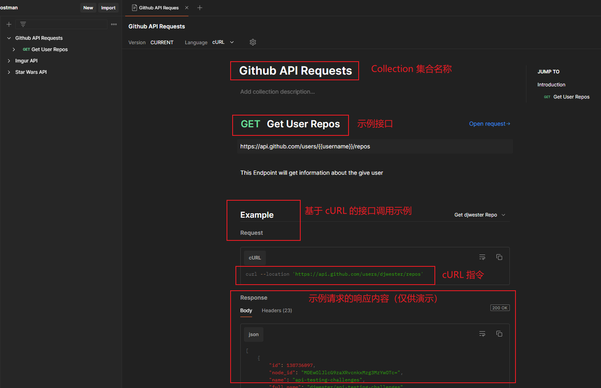

# 第二章 API 接口文档与设计

> **本章概要**
>
> - 明确 API 接口的目的
> - 实用 API 接口的创建
> - 为 API 接口编写文档（借助 Postman）
> - API 接口设计示例（实战练习）

---


## 2.0 概述

API 的 **设计（design）**、**测试（testing）** 和 **文档（documentation）** 与 API 的开发一样，都是构建优质产品的重要组成部分。

在开发 API 的语境下，良好的设计是指让开发者和测试人员的用户体验更好。

相关文档：详见 [GitHub 仓库第二章](https://github.com/PacktPublishing/API-Testing-and-Development-with-Postman-Second-Edition/tree/main/Chapter02)。


## 2.1 从了解目的入手

真正好的 API 设计实践起来是非常难的。为此需要弄清开发 API 的目的。具体细分为以下几步：

1. 明确目标受众（Personas）：可以是虚构的人，站在他们的角度思考问题，假想其与 API 交互的过程；
2. 明确要解决的痛点（The why）：即为什么要开发这套 API？主要为了解决什么问题？
3. 实践并迭代（Try it out）：按上述步骤实践，询问不同的潜在 API 调用群体，收集痛点，总结成一两句话，然后复盘迭代。


## 2.2 实用 API 接口的创建方法

实用性（Usability）就是对 API 功能的多寡进行权衡。以开发某博物馆 API 接口为例，极端情况下，用一个接口返回所有展品信息的做法，与给每件展品都创建一个接口相比，实用性都不强——前者需要事后做大量处理，后者需要提前充分了解整套 API，都不可取。

为实现 API 功能的动态平衡，可以考虑以下几个要素：

1. 实用的 API 结构：尽量只用名词（**nouns**）来构建 API 端点（**endpoint**）。以获取学生信息为例——
   1. :x:：`GET /getAllStudents`。使用动词+名词，可扩展性差。
   2. :heavy_check_mark:：`GET /students`。进而获取单人：`GET /students/{studentId}`；按条件筛选：`GET /students?name=JimJones&age=25`
2. 设计良好的错误信息：正确使用 HTTP 状态码，或者在报错时提供有参考价值的提示信息。


## 2.3 API 接口文档的编写

API 文档是优质 API 接口的重要组成部分，也是最容易被忽略的部分。

本节以第一章演示过的 GitHub 接口为例，其配置文件 `Github API Requests.postman_collection.json` 已上传到我的网盘：`https://pan.baidu.com/s/1cJNRhe_1u6qCdc5-jeAbag`，提取码：`sv8l`。

### 2.3.1 用 Postman 编写接口文档

示例接口用于查询某用户在 GitHub 上的公开可见的仓库信息列表，以及该接口发布到 Postman 社区的具体步骤。这里仅提示几个关键点：

（1）导入 JSON 配置文件的地方：Postman 的 Workspaces 首页左上角有个 `Import` 按钮：


**图 2.1 导入 API 接口 JSON 配置文件的位置**

（2）查看某接口文档的位置：


**图 2.2 Get User Repos 请求的接口文档调出位置**

点击【**View documentation**】会在右边打开一个标签页，即该 Collection 集合下的所有请求的接口文档详情页：



**图 2.3 示例 Collection 集合的文档详情页截图**

（3）接口文档的编辑位置。打开示例请求页，右侧边栏有个文档图标，可在里面补充接口文档信息，支持富文本和 Markdown 两种格式：


**图 2.4 补充接口文档的位置截图**

点开后可切换编辑格式（Markdown / 富文本）：


**图 2.5 接口文档编辑页截图，支持 Markdown 格式和富文本格式**

（4）根据最新版 Postman 桌面客户端（`v11.18.2`），API 接口文档的发布按钮位置还是不变，在 **Send** 按钮上面，只是改为了 **Share** 按钮：


**图 2.6 新版 Postman 中的 API 接口发布位置截图**

点开后按提示操作即可，难度不大。

（5）发送请求时需要先补全变量 `username`，点击图 2.6 右上角的带红色感叹号的图标，即可快速查看并设置缺失的变量。


### 2.3.2 编写接口文档的最佳实践

主要包含以下几个方面：

- 一致性：术语一致、写法一致、格式一致
- 利用文档反查接口存在的问题
- 添加通俗易懂的示例（examples）：永远不要低估一个精心制作的示例的作用
- 及时更新文档

关于 API 接口开发，当前业内存在一个广泛争论（debates）：到底应该设计先行，还是开发先行。作者建议不要走极端，根据实际情况取折中方案即可。


### 2.3.4 基于 REST 风格的 API 建模语言简介

全称 **RESTful API Modeling Language**，简称：`RAML`。

官网：[https://raml.org/](https://raml.org/)

作用：以纯文本格式描述和设计基于 REST 风格的 API 接口，帮助开发者清晰地定义 API 结构、资源及其交互方式，便于文档编写和团队协作。


## 2.4 API 接口设计案例演示

本节以一个电商网站 API 接口为例，演示了 RAML 语言的用法。完整配置文件如下：

```yaml
#%RAML 1.0
---
title: E-Commerce API
baseUri: http://api.ecommerce.com/{version}
version: v1

/products:
    get:
    /{productId}:
        get:
/users:
    post:
    get:
    /{username}:
        get:
        put:
/carts:
    post:
    get:
        queryParameter:
            username:
    /{cartId}:
        get:
        put:
```

`RAML` 文件的具体配置，可参考其官方教程：[https://raml.org/developers/raml-100-tutorial](https://raml.org/developers/raml-100-tutorial)

设计步骤：

1. 定义端点（endpoints）：即 `/products`、`/users`、`/carts`；
2. 定义操作（actions）：即请求方法 GET、POST、PUT 等；
3. 设置查询参数（query parameters）；
4. 导入 RAML 文件：操作步骤同 `JSON` 文件导入。


**图 2.7 导入 .raml 格式的配置文件时 Postman 弹出的配置对话框截图**

单击 **Import** 按钮，将得到完整的 API 接口集合，名称为 `E-Commerce API`：


**图 2.8 导入 RAML 后的完整 Collection 集合**