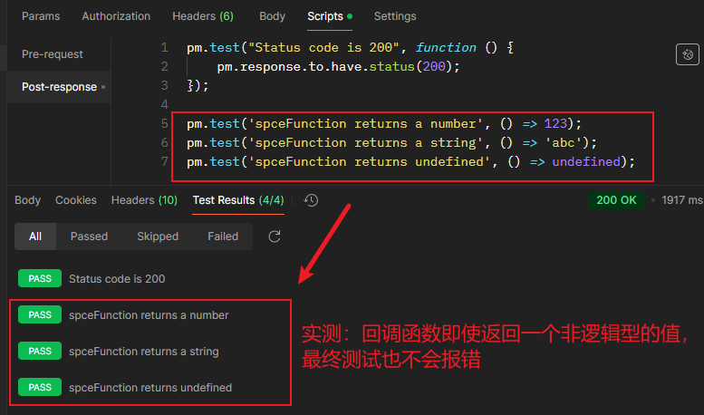

# 第六章 Postman 测试脚本的创建

> **本章概要**
>
> - 检查 API 接口响应
> - 设置预请求脚本（pre-request scripts）
> - Postman 环境（environments）的用法

---

## 6.0 概述

如果某个测试脚本运行了很长时间都从没出现过故障，那么不排除脚本本身在写法上可能有问题，例如一些低级断言错误：`true === true`、`5 === 5` 等。

设计良好的测试套件也可能因为糟糕的断言脚本而功败垂成。

所谓 **断言（assertion）**，即测试中检查实际结果是否符合预期的校验逻辑。

`Postman` 的测试脚本是基于 `JavaScript` 实现的，并内置了 `Chai.js` 断言库，可以对请求的 Header 头信息及 body 正文进行断言校验。

本章介绍这些断言的基本写法与用法，并结合 Collection Runner 工具介绍在测试套件层面（即 Collection 集合）自动运行多个请求的具体操作。

相关资源链接：详见 [GitHub 第六章文件夹](https://github.com/PacktPublishing/API-Testing-and-Development-with-Postman-Second-Edition/tree/main/Chapter06)。


## 6.1 检查 API 接口响应

示例项目：电影《星球大战》API 接口（集合名称：`Star Wars API – Chapter 6`）。

相关 JSON 配置文件 `Star Wars API_Chapter6_initial.postman_collection.json` 详见百度网盘：

- 链接地址：`https://pan.baidu.com/s/1cbc8hFxzi2g08egDVU8XAw`
- 提取码：`yo47`

导入配置后，点击 Postman 右上角的 `Variables` 图标查看变量声明情况，会看到预先定义的基础 URL 变量 `base_url`：


**图 6.1 导入演示项目后看到的预定义变量 base_url**

然后将初始请求 `Get People` 的 URL 由 `https://swapi.dev/api/people/1` 替换为 `{{base_url}}/people/1` 就完成了环境搭建。

接着找到 `Get People` 下的 `Scripts` 标签，选中左边的 `Post-response` 选项卡，在脚本编辑区插入一段 Postman 内置的测试用例，例如验证响应码为 200 的示例代码：

```js
pm.test("Status code is 200", function () {
    pm.response.to.have.status(200);
});
```

实测执行情况如下（左下角表示断言已通过）：


**图 6.2 执行修改后的 Get People 请求得到的响应结果与测试结果截图**


### 6.1.1 关于 pm.test 方法

测试脚本中的 `pm.test` 方法，即与绝大多数测试框架中的 `test` 方法用法一致，其中的 `pm` 指代 Postman，是一个全局对象，用于访问 **请求** 或 **响应** 中的数据，或者访问 **变量**、**Cookie** 等。而 `test` 方法接收一个描述信息字符串和一个回调函数；前者用于说明测试用例的意图，后者为具体的测试校验逻辑。`pm.test()` 方法在 `Postman` 中的签名为：

```ts
test(testName: string, specFunction: Function): void
```

其中 `specFunction` 是一个异步函数，本质上是一个返回逻辑 `true` 或 `false` 的条件判定函数（也称 `predicate` 谓词函数）。虽然实测发现，令回调函数返回一个非逻辑值也不会报错，但最好还是按惯例返回逻辑值：



**图 6.3 实测回调函数返回值类型：返回一个非逻辑值也不报错，但最好返回逻辑值**


### 6.1.2 关于 Chai 断言

`Postman` 中的断言是基于断言库 `Chai.js` （`Chai` 读作 `/ʧaɪ/`，同英文单词 chai 的发音，表示“茶叶”）做的二次封装，`Chai.js` 是一款同时支持 `TDD` 风格和 `BDD` 风格的断言库，其名称来自一种印度茶，暗含提供一种友好易用的测试体验的意思。因此刚才的断言逻辑也可以用 `Chai.js` 重构为：

```js
const chai = require('chai');
pm.test("Status code is 200", function () {
    // pm.response.to.have.status(200);
    chai.expect(pm.response.code).equals(200);
});
```

实测结果：


**图 6.4 在 Postman 中使用 chai 断言重写校验逻辑**


## 6.2 检查响应的 body 部分

如果从 Postman 提供的示例脚本中选择 `Response body: Contains string`，则可以校验响应 body 中是否包含字符串，例如 `"skin_color"`：

```js
pm.test("Body matches string 'skin_color'", function () {
   pm.expect(pm.response.text()).to.include("skin_color");
});
```

这里的 `pm.response.text()` 返回字符串形式的响应 body 内容。

如果选择示例代码 `Response body:JSON value check`，则可以校验请求响应的 `JSON` 结果，得到如下模板：

```js
pm.test("Your test name", function () {
    var jsonData = pm.response.json();
    pm.expect(jsonData.value).to.eql(100);
});
```

从第 2 行可见，Postman 的示例脚本还是用的 `ES5` 语法。这里也可以改为 `ES6` 的写法。关键是无需从零开始手动构建测试脚本。

此外，回调函数还支持 `console.log()` 控制台输出，方便调试测试脚本。控制台标签 `console` 位于主界面的左下角位置。

实测：Luke 的家园 URL 是否正确：

```js
pm.test("Check the homeworld URL", function () {
    const { homeworld } = pm.response.json();
    const expected = 'https://swapi.dev/api/planets/1/';
    pm.expect(homeworld).to.eql(expected);
});
```

运行结果（书中放到 GitHub 的参考文件是错的，期望值写的是 `http`，新版响应中为 `https`）：


**图 6.5 实测响应 body 为 JSON 数据时，校验 homeworld 字段的值是否正确**


## 6.3 检查请求头 Header 

Postman 示例代码：`Response header: Content-Type header check`

```js
pm.test("Content-Type is present", function () {
    pm.response.to.have.header("Content-Type");
});
```

这里和最开始校验响应码的写法很像。这也是 BDD 风格的优势：声明式语法，贴近自然语言。


## 6.4 Postman 常见的断言写法

### 6.4.1 常见自定义断言对象

`Postman` 在 `Chai.js` 的基础上内置了几个常用的自定义断言对象，例如 `pm.response.to.have.status` 中的 `.status`，以及检查 `Header` 时用到的 `pm.response.to.have.header` 中的 `.header`。

常用的自定义断言对象梳理如下：

|     自定义对象     |                           功能描述                           | 断言示例                                                     |
| :----------------: | :----------------------------------------------------------: | ------------------------------------------------------------ |
|   `.statusCode`    |                       校验响应码的取值                       | `pm.response.to.have.statusCode(200);`                       |
| `.statusCodeClass` | 校验响应码所属类别：2 表示以 2 开头的响应码，3 表示以 3 开头的响应码，以此类推 | `pm.response.to.have.statusCodeClass(2);`                    |
|  `.statusReason`   | 校验响应码描述信息，它是与响应码对应的固定文字描述信息，例如 `200` 对应 `OK` | `pm.response.to.have.statusReason('OK');`                    |
|     `.status`      |                   校验响应码或对应描述信息                   | `pm.response.to.have.status(200);`<br/>`pm.response.to.have.status("Created");` |
|     `.header`      |        校验请求头是否存在，或者请求头的键值对是否正确        | `pm.response.to.have.header("Content-Type");`<br/>`pm.response.to.have.header("Content-Type", "application/json;");` |
|    `.withBody`     |                    校验响应是否包含 body                     | `pm.response.to.be.withBody;`                                |
|      `.json`       |                 检查 body 是否为 `JSON` 格式                 | `pm.response.to.be.json;`                                    |
|      `.body`       | 1. 校验 body 是否存在<br/>2. 校验 body 文本是否完整匹配期望内容<br/>3. 校验 body 是否匹配某正则表达式<br/>4. 校验 body 是否与给定 JSON 匹配 | `pm.response.to.have.body;`<br/>`pm.response.to.have.body("JSON text");`<br/>`pm.response.to.have.body(<regex>);`<br/>`pm.response.to.have.body({key1:value1,...});` |
|    `.jsonBody`     | 1. 是否为 JSON 格式的响应 body<br/>2. 是否与给定 JSON 匹配 [^1] | `pm.response.to.have.jsonBody;`<br/>`pm.response.to.have.jsonBody({key: value});` |
|  `.responseTime`   | 1. 响应时间精确匹配给定毫秒时间<br/>2. 响应时间不少于给定毫秒时间<br/>3. 响应时间不超过给定毫秒时间<br/>4. 响应时间介于给定时间范围内（单位：ms） | `pm.response.to.have.responseTime(150);`<br/>`pm.response.to.have.responseTime.above(150);`<br/>`pm.response.to.have.responseTime.below(150);`<br/>`pm.response.to.have.responseTime.within(100,150);` |
|  `.responseSize`   | 1. 响应内容尺寸精确匹配给定字节大小<br/>2. 响应内容尺寸不少于给定字节大小<br/>3. 响应内容尺寸不超过给定字节大小<br/>4. 响应内容尺寸介于给定字节范围内（单位：字节） | `pm.response.to.have.responseSize(50);`<br/>`pm.response.to.have.responseSize.above(50);`<br/>`pm.response.to.have.responseSize.below(100);`<br/>`pm.response.to.have.responseSize.within(50,100);` |
|   `.jsonSchema`    |    校验响应的 JSON 格式的 body 是否与给定 schema 模式匹配    | `pm.response.to.have.jsonSchema(mySchema);`                  |

注意：原书 `.jsonBody` 中的第二个写法是错的，这里为了照顾下一节的实测环节，暂时保留错误写法。正确写法应该是：`pm.response.to.have.jsonBody(key, value);`。


> [!tip]
>
> **关于断言结果取反**
>
> 可以在上述断言中添加 `.not` 让断言逻辑取反。例如：
>
> ```js
> pm.response.to.not.have.jsonSchema(mySchema);
> // 或者
> pm.response.to.have.not.jsonSchema(mySchema);
> ```
>
> 只要加在助动词（`to`）或动词（`have`）后，取反逻辑就成立。


### 6.4.2 实测情况

（1）实测 `.body` 对象：

```js
pm.test('The response contains body', () => {
    pm.response.to.have.body;
    pm.response.to.have.body();
});

pm.test('The response body equals expected string', () => {
    const bodyText = pm.response.text();
    pm.response.to.have.body(bodyText);
});

pm.test('The response body matches some RegExp', () => {
    pm.response.to.have.body(/skin_color/i);
});

pm.test('The response body matches expected JSON object', () => {
    const json = pm.response.json();
    pm.response.to.have.body(json);
});
```

运行结果（匹配文本和 JSON 对象时 **必须完全匹配**）：


**图 6.6 实测自定义断言对象 .body 结果截图**


（2）实测 `.jsonBody` 对象：

```js
pm.test('The response has a JSON-format body', () => {
    pm.response.to.have.jsonBody;
    pm.response.to.have.jsonBody();
});

pm.test('The response JSON match some key-value pair', () => {
    // Error
    pm.response.to.have.jsonBody({
        'films[2]': 'https://swapi.dev/api/films/3/aaabbbccc'
    });
    // Correct
    pm.response.to.have.jsonBody(
        'films[2]', 'https://swapi.dev/api/films/3/'
    );
});
```

运行结果：


**图 6.7 实测自定义对象 jsonBody 的写法运行结果截图。书中所给的第二个写法是错的，参数不能为一个 JSON 对象**

> [!warning]
>
> **注意**
>
> 根据实测结果，校验响应 JSON 中是否包含给定的键值对，不能直接传入一个 JS 对象，而应该按 Postman 提示的方法签名，分别传入 `key` 和 `value` 的值作为参数。这里顺便分享一个小技巧，可以很方便的查看 Postman 方法的内置签名：书写脚本时，Postman 会自动提示当前对象的方法签名，遇到存在多个签名的情况，可以使用 <kbd>Alt</kbd> + <kbd>Up</kbd> 或 <kbd>Alt</kbd> + <kbd>Down</kbd> 进行翻页，查看隐藏的其他签名。例如 `pm.response.to.have.jsonBody()` 方法的签名就有四个，如下图所示：
>
> 
>
> **图 6.8.1 pm.response.to.have.jsonBody() 方法存在四种签名**
>
> ```ts
> // Signature 1
> jsonBody(): any
> // Signature 2
> jsonBody(optionalExpectEqual: any): any
> // Signature 3
> jsonBody(optionalExpectPath: string): any
> // Signature 4
> jsonBody(optionalExpectPath: string, optionalValue: any): any
> ```
>
> 根据实测的上下文，这里显然应该使用第四种签名写法。


（3）实测 `.jsonSchema` 对象：

校验响应中的 JSON 结构时，旧版 `Postman` 使用 `tv4` 模块（`tv4` 全称 `Tiny Validator for JSON Schema version 4`）；新版中该写法已经废弃，推荐写法为上述列表中的写法，即改用 `Ajv` 依赖（全称 `Another JSON Schema Validator`）并作为 `pm.response` 下的内置对象，实测脚本如下：

```js
// fictional results from pm.response.json();
const json1 = {
    "args": {},
    "films": [],
    "files": {},
    "form": {
        "foo1": "bar1",
        "foo2": "bar2"
    },
    "headers": {},
    "json": null,
    "url": "https://postman-echo.com/post"
};

const schema = {
    type: 'object',
    properties: {
        films: {type: 'array'},
        url: {type: 'string'},
    },
    required: [
        'films', 'url'
    ]
};

const tv4 = require('tv4');
pm.test('Response is a valid JSON (via tv4)', function() {
    pm.expect(tv4.validate(json1, schema)).to.be.true;
});

const Ajv = require('ajv');
const ajv = new Ajv();
pm.test('Response is a valid JSON (via Ajv)', function() {
    pm.response.to.have.jsonSchema(schema);
    pm.expect(ajv.validate(schema, json1)).to.be.true;
});
```

运行结果：


**图 6.8 校验响应 JSON 的 schema 模式时，Postman 新旧两版写法的实测结果对比截图**


（4）本节给出的三个练手测试实战

（4.1）检查服务器是否为 nginx（该信息位于 Header 中）：

```js
pm.test('The server is nginx', () => {
    const server = pm.response.headers.get('Server');
    pm.expect(server).to.contain('nginx');
});
```

实测结果：


**图 6.9 实测从 Header 中读取信息、校验服务器是否为 nginx 的运行结果**


（4.2）检查请求响应时间是否在 500ms 内：

```js
pm.test('The response time for this call is less than 500ms', () => {
    pm.response.to.have.responseTime.below(500, 'responseTime too long');
});
```

实测结果：


**图 6.10 可根据 Chai.js 相关文档，结合 Postman 自动提示，自定义报错提示内容**


（4.3）检查 Luke 是否出演过当中的 4 部电影：

```js
pm.test('Luke appears in 4 films', () => {
    const { films } = pm.response.json();
    pm.expect(films).lengthOf(4);
});
/* "films": [
    "https://swapi.dev/api/films/1/",
    "https://swapi.dev/api/films/2/",
    "https://swapi.dev/api/films/3/",
    "https://swapi.dev/api/films/6/"
],*/
```

实测结果：


**图 6.11 根据 Postman 自动提示校验响应 JSON 中的某数组字段的长度情况**


## 6.5 在集合、子文件夹层面创建测试

`Collection` 集合、以及集合下的子文件夹（`Folder`）也可以分别创建测试脚本。各级测试脚本的执行顺序依次为：

1. `Collection` 级 `Pre-request` 脚本；
2. `Folder` 级 `Pre-request` 脚本；
3. `Endpoint` 级 `Pre-request` 脚本；
4. `Collection` 级 `Post-response` 脚本；
5. `Folder` 级 `Post-response` 脚本；
6. `Endpoint` 级 `Post-response` 脚本；

实测脚本：

```js
// Collection Pre-request
pm.test('Collection Pre-request scripts running ...', () => {});

// Collection Post-response
pm.test('Collection Post-response: the response has a JSON body', () => {
    pm.response.to.have.jsonBody();
});

// Folder Pre-request
pm.test('Folder Pre-request scripts running ...', () => {});

// Folder Post-response
pm.test("Folder Post-response: Check that they are in film 1", function () {
    var { films } = pm.response.json();
    pm.expect(films).to.contain("https://swapi.dev/api/films/1/");
});

// Endpoint Pre-request
pm.test('Endpoint Pre-request scripts running ...', () => {});

// Endpoint Post-response
pm.test('Luke appears in 4 films', () => {
    const { films } = pm.response.json();
    pm.expect(films).lengthOf(4);
});
```

运行结果：


**图 6.12 不同位置的测试脚本执行顺序实测情况截图**


### 6.5.1 关于测试结束后的扫尾清理工作

测试后的清理工作包括变量值的清除、临时状态的复位等。这类脚本一般都写在 `Post-response` 位置。

鉴于脚本的执行顺序因位置而不同，推荐做法是：

- 变量在哪里声明，就在哪里销毁；
- 若需传参，则根据脚本的执行顺序来具体确定清理的位置。


### 6.5.2 DIY：在 Postman 中使用 AI 助手

实测发现，最新版 `Postman` 提供了很多贴心的功能，比如 AI 工具 `Postbot`、私包仓库 `Package Library` 等。

`Postbot` 位于 `Postman` 主界面的右下方，通过一问一答的形式回答您具体遇到的 `Postman` 相关的问题，可通过快捷键 <kbd>Ctrl</kbd> + <kbd>Alt</kbd> + <kbd>P</kbd> 弹出：


**图 6.13 新版 Postman 推出的 AI 助手 Postbot 操作界面**

经实测，`Postbot` 不用科学上网也能正常使用，虽然能用中文提问，但回复内容却是纯英文（慢慢适应吧）。

此外，`Postbot` 还可以根据测试用例中输入的字符串描述信息（即 `pm.test()` 方法的第一个参数，也叫测试名称），结合 AI **自动生成** 相应的测试脚本，甚至都不需要在上述对话框中提问；而且 `Postman` 的很多地方都作了类似这样的智能跟随处理（比如响应的可视化展示、补全接口文档等），用户体验真的做得非常棒（再次感叹咱们国产软件与 `Postman` 之间的差距……）。

目前 `Postbot` 提供每月 50 次免费调用额度。超过额度后需订阅 `Postbot` 付费插件开通不限额使用。截止 2024 年 11 月 6 日，对于免费版、基本版和专业版 `Postman` 用户，付费版 `Postbot` 的价格为 `$9/人/月`；企业版用户则为 `$9/人/月`，暂时只支持按年支付。（再次说明工具好用也是有代价的）


### 6.5.3 DIY：在 Postman 中使用模块导入功能

实测时还发现一个彩蛋功能：`Package Library`（就叫 **私包仓库**，可好？）。它能够在测试脚本中使用模块导入导出功能（具体用法详见 [Postman 在线文档](https://learning.postman.com/docs/tests-and-scripts/write-scripts/package-library/)），极大地提高了代码的可复用性。下面以上一节的响应 JSON 字段校验为例，重构后的测试脚本更加简洁明了，也符合前端 JS 的开发惯例。

目前 `Package Library` 标签页只支持从右侧边栏打开：


**图 6.14 Postman 新增的私包仓库 Package Library 标签页的打开方法**

然后在弹出的 `Package Library` 标签页，根据提示创建一个 `package` 包（包名随便取，比如这里的 `my-validator`），然后定义模块：

```js
// Use module.exports to export the functions that should be
// available to use from this package.
// module.exports = { <your_function> }

// Once exported, use this statement in your scripts to use the package.
// const myPackage = pm.require('<package_name>')

const tv4 = require('tv4');
const Ajv = require('ajv');
const ajv = new Ajv();

const schema = {
    type: 'object',
    properties: {
        films: {type: 'array'},
        url: {type: 'string'},
    },
    required: [
        'films', 'url'
    ]
};

const validateByTv4 = (target) => tv4.validate(target, schema);

const validateByAjv = (target) => ajv.validate(schema, target);

module.exports = {
    validateByTv4,
    validateByAjv
};
```

然后使用 `pm.require('<package_name>')` 语法导入到测试用例中，在 `Get People` 请求的 `Post-response` 中输入下列重构脚本：

```js
const {validateByTv4, validateByAjv} = pm.require('@warped-water-460678/my-validator');

// fictional results from pm.response.json();
const json1 = {
    "args": {},
    "films": [],
    "files": {},
    "form": {
        "foo1": "bar1",
        "foo2": "bar2"
    },
    "headers": {},
    "json": null,
    "url": "https://postman-echo.com/post"
};

pm.test('Response is a valid JSON (via tv4)', function() {
    pm.expect(validateByTv4(json1)).to.be.true;
});

pm.test('Response is a valid JSON (via Ajv)', function() {
    pm.expect(validateByAjv(json1)).to.be.true;
    const json = pm.response.json();
    pm.expect(validateByAjv(json)).to.be.true;
});
```

运行结果：


**图 6.15 利用 Package Library 定义并导出私有模块、再到断言脚本中导入模块后的运行结果截图**

这样一来，很多可以复用的代码片段都可以通过这样的私有模块进行封装，然后按需导入测试脚本了！

同样，正因为模块功能的强大，创建模块的个数也是严格限制了的。根据目前 `Postman` 官方报价，免费版和基础版的私有模块创建个数不能超过 3 个；专业版不超过 25 个；企业版不超过 100 个。其实也能理解，要是不加限制，允许所有人创建无数个 package 模块，那不就相当于在 Postman 里嵌入了一个 npm 平台么？感觉最多 3 个的限制对于日常接口测试工作感觉已经完全够用了。且行且珍惜吧！


## 6.6 预请求脚本的使用

本节通过三个示例，演示了预请求脚本在变量设置及定制请求工作流方面的具体应用。测试时经常遇到根据上一个请求结果触发下一个请求的情况，此时就可以利用前一个请求的 `Post-response` 脚本和后一个请求的 `Pre-request` 脚本实现变量的读写，进而实现多个请求间的数据关联。

### 【示例1】手动设置  Get a Person 请求所需参数

具体步骤：

1. 创建一个名为 `Get a Person` 的 GET 请求，URL 为：`{{base_url}}/people/{{person_id}}`。
2. 在 `Pre-request` 脚本位置定义请求参数 `person_id`：`pm.environment.set("person_id", 1);`
3. 发送请求。

实测结果：


**图 6.16 手动设置请求参数 person_id 效果图**


### 【示例2】创建前置请求 Get Homeworld

该请求负责为 `Get Homeworld` 提供目标 URL。

具体步骤：

1. 创建一个名为 `Get a Person` 的 GET 请求，URL 为：`{{base_url}}/planets/1`。

2. 在 `Post-response` 脚本处添加如下代码，定义集合变量 `residentList`：

   ```js
   const { residents: planetResidents } = pm.response.json();
   pm.collectionVariables.set("residentList", planetResidents);
   ```

3. 发送该 `Get Homeworld` 请求。

4. 删除 `Get a Person` 中的预请求脚本，改为如下内容：

   ```js
   const residentList = pm.collectionVariables.get('residentList');
   const randomResident = residentList[Math.floor(Math.random() * residentList.length)];
   pm.environment.set("random_resident", randomResident);
   ```

5. 修改 `Get a Person` 的 URL，改为：`{{random_resident}}`

6. 发送 `Get a Person` 请求。

实测结果：


**图 6.17 利用集合变量 residentList 和 JavaScript 脚本，随机获取一个 URL 并发送的实测效果图**

这两个示例，后者负责获取 URL 数组，前者从该数组选择任意一个发起二次请求，它们都是手动发送的。`Postman` 的强大在于，可以通过 `JavaScript` 脚本和内置的集合运行工具 Collection Runner 实现多个请求的自定义触发。


### 【示例3】构建请求工作流

使用 Collection Runner 时，各请求的默认顺序是从上往下顺次执行的。也可以通过请求前的复选框屏蔽某些请求，或者利用拖拽实现简单的排序。此外还可以通过 `JavaScript` 手动指定请求的触发顺序，核心语句为：

```js
pm.execution.setNextRequest("Get a Person");
```

这里的 `setNextRequest()` 方法，其参数既可以是一个请求的名称（如 `Get a Person`），根据官方文档，为避免请求名称有变动，也可以是一个请求的 ID（可通过 `pm.info.requestId` 获取当前请求的唯一 ID）。一旦使用了 `setNextRequest()` 来定制请求顺序，就需要避免出现死循环的情况。

另外需要特别注意，`setNextRequest()` 方法只在运行 Collection Runner 时有效，手动点击发送按钮时 **并不会执行**。

**演示内容**：通过 `Collection Runner` 运行两个请求（`Get a Person` 与 `Get Homeworld`），并将前一个请求返回的 URL 集合通过 `JavaScript` 脚本依次作为后一个请求的 URL 并分别发送成功。

**具体步骤**：

1. 在集合 `Star Wars API - Chapter 6` 中创建一个 GET 请求 `Get a Person`，令其 URL 为 `{{resident}}`；

2. 在 `Pre-request` 中输入以下 JS 脚本：

   ```js
   const residentList = pm.collectionVariables.get('residentList');
   const currentCount = pm.collectionVariables.get('counter');
   const resident = residentList[currentCount];
   pm.collectionVariables.set('resident', resident);
   if (currentCount < residentList.length - 1) {
       pm. collectionVariables.set('counter', currentCount + 1);
       pm.execution.setNextRequest('Get a Person');
   }
   ```

3. 创建第二个 GET 请求 `Get Homeworld`，令其 URL 为 `{{base_url}}/planets/1`；

4. 在 `Get Homeworld` 的 `Post-response` 下输入以下内容：

   ```js
   const { residents: planetResidents } = pm.response.json();
   pm.collectionVariables.set("residentList", planetResidents);
   
   pm.collectionVariables.set("counter", 0);
   ```

5. 单击打开集合信息标签页，单击右上角的 Run 按钮，勾选需要运行的这两个请求，并让 `Get Homeworld` 优先执行。

6. 一切就绪后，单击运行配置页下方的 `Run Star Wars API - Chapter 6` 按钮执行工作流。

最终结果：


**图 6.19 实测 Collection Runner 运行效果图**

最后还需要注意的是，`Collection Runner` 只对登录用户开放，并且免费版帐号 **每月仅有 25 次** 的调用额度，用完后需要 **另付 49 美元/人/月** 方可无限制使用（截止到 2024/11/18 的官方报价）。可见该功能还是相当烧钱的，毕竟正式环境中可以用它来实现一些比较复杂的定制流程。因此使用 Collection Runner 前请务必做好充分的准备工作，避免浪费当月额度（前一个帐号就踩坑了，等到第一次跑通演示流程时仅剩 3 次额度了……）。

此外，还有一个不大不小的坑需要提一下：运行 `Runner` 工具时最好再次确认每个请求设置都已经保存了，否则 `Postman` 只会按最近一次保存的设置执行工作流。这一块至少浪费了我两次额度……

最后的最后，为了方便调试，运行 `Runner` 工具时最好打开 `Console` 控制台页面，及时查看报错信息（如图 6.19 所示）。


## 6.7 Postman 环境的使用

本节主要将上一节定制工作流时用到的各种变量从 Collection 作用域迁移到 Environment 作用域，并通过手动发送请求实现了变量的更新。

使用 Postman 的环境时，务必注意安全问题，涉密信息的类型务必设置为 `secret`。由于环境可以共享，当中若有敏感信息也要格外小心。


## 本章小结

- 使用 Postman 断言，可以测试各 API 请求及响应内容。
- 为了满足测试条件，输入数据可在 `Pre-request` 进行必要的格式转换。
- 利用 Postman 可以创建自定义的工作流，支持多个请求自动运行。
- 除了使用 Collection Runner 工具外，第九章还将介绍 Newman 在持续集成（`CI`）中的高级设置。


---

[^1]: 原书这里的写法有误。根据最新版 `Postman`（**v11.18.2**）的实测结果，期望的键值对应该分别作为参数传入 `jsonBody()` 函数内，具体详见下一节第二个实测案例。


