# 第七章 数据驱动测试 Data-Driven Testing

> **本章概要**
>
> - 数据驱动测试的定义
> - 利用 Postman 创建数据驱动测试
> - 练习：数据驱动下的多 API 接口测试

---

本章示例代码：[GitHub - Chapter07](https://github.com/PacktPublishing/API-Testing-and-Development-with-Postman-Second-Edition/tree/master/Chapter07)。


## 7.1 相关概念

**数据驱动测试（Data-driven Testing，即 DDT）** 是一种软件测试方法，通过将测试输入数据与测试脚本分离，使测试脚本能够针对不同的输入数据重复执行，从而提高测试效率和覆盖范围，降低维护成本。

数据驱动测试的本质是对某个映射表的测试，即一组给定输入与另一组预期输出之间的 **映射关系** 的测试。例如下面的产品报价表：

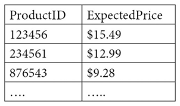

**图 7.1 产品报价表**

数据驱动测试的基本流程如下：

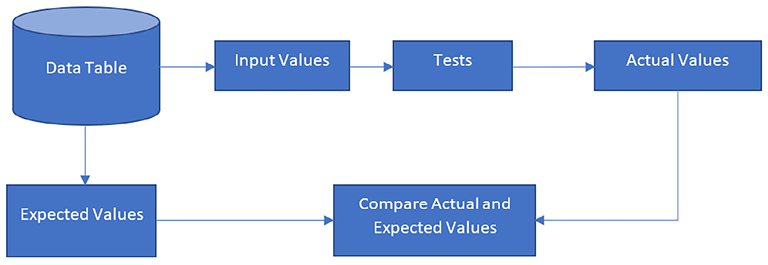

**图 7.2 数据驱动测试的基本流程**

值得注意的是，上图中的预期结果 **并不是必选操作**：预期结果也可以直接写到测试脚本中，例如验证产品报价是否均大于 0；而当每个输入对应的结果都不同时，才会考虑附上结果列，例如以用户 ID 为输入，测试对应的电子邮箱地址。

应用数据驱动测试前，为避免滥用该测试，最好先确认以下两个问题：

1. 是否需要多种输入？
   1. 如果每次请求返回的都是同一个数据，尝试不同输入则意义不大；
2. 各输入数据间是否极其相似？
   1. 如果多个输入间均为同一性质的数据，且不符合等价类划分原则，则意义不大；


## 7.2 关于数据驱动测试的输入与输入

DDT 的输入应该根据 **等价类划分** 技术[^1] 仔细设计，尽量优化输入参数并减少不必要的迭代次数。等价类划分技术在处理数值计算或数学函数时比较容易，但也可以应用于文本型输入，问题的关键在于确定具体的划分依据，尽可能全面考虑可能出现的情况。

DDT 的输出也应该提前规划，表中的预期结果应该相对容器计算，避免过于复杂（反例：[牛顿 API 接口](https://github.com/aunyks/newton-api)）；此外，还应该考虑不同结果和输入之间的比较方式（逐行对比？还是通过脚本分类对比？）


## 7.3 在 Postman 中实现数据驱动测试（不含结果列）

方法：借助 `Collection` 集合中的 **Run collection** 功能。

其操作界面与上一章类似，主要区别在于，数据驱动测试需要上传一个 `CSV` 格式的映射表：

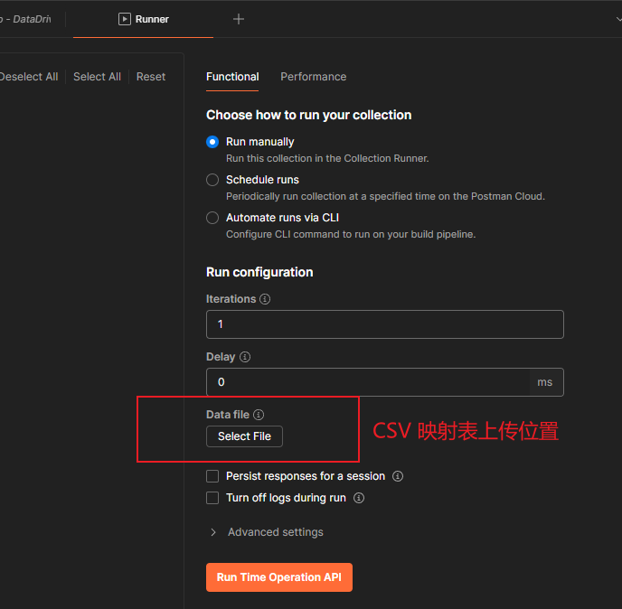

**图 7.3 Postman 应用数据驱动测试时需要用到的 Collection Runner 操作界面**

一个典型的映射表如下图所示：

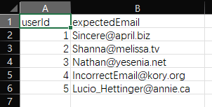

**图 7.4 用 Excel 打开的一个典型的 CSV 格式映射表（userInputs.csv）**

映射表上传后，**Postman** 会自动解析出文件类型（`application/json` / `text/csv`）以及需要迭代的次数（即图 7.3 中的 `Iterations` 输入框）。然后对测试接口进行改造（定义并嵌入变量、编写测试脚本等），之后就可以运行该集合工具了。

具体演示步骤如下：

1. 新建一个集合 `JSON API`；

2. 在该集合下添加一个名为 `Users` 的 GET 请求，URL：`http://jsonplaceholder.typicode.com/users/{{userId}}`；

3. 然后编辑测试脚本，验证每个响应 `JSON` 的 `email` 属性值都包含一个 `@` 字符：

   ```js
   pm.test("Validate Email Address From File", function () {
     const jsonData = pm.response.json();
     pm.expect(jsonData.email).to.contain("@");
   });
   ```

这是设置完毕后效果图：

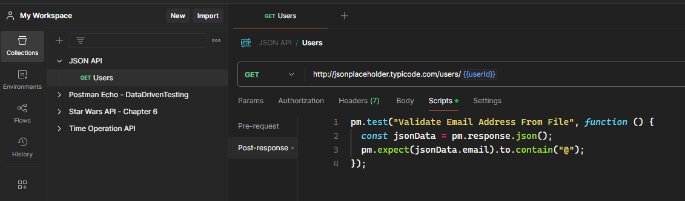

**图 7.5 定义测试请求 Users 并创建测试脚本**

4. 接着创建一个名为 `JSON API Env` 的环境，并在该环境中定义一个变量 `userId`，赋初值为 `1`；

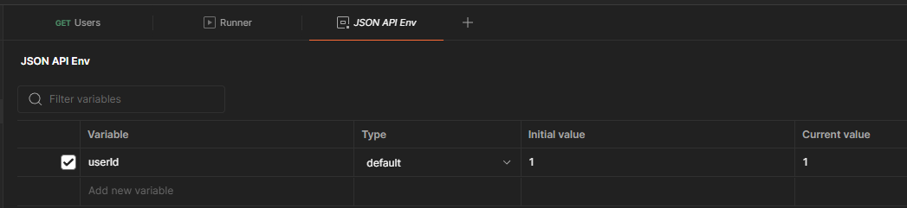

5. 指定测试环境：从 `Postman` 右上角的下拉框中选中该环境，将其与 `JSON API` 集合进行关联；

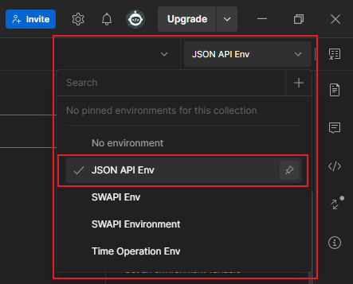

6. 然后保存所有设置，打开 `Collection Runner` 设置界面，完成 CSV 文件上传并运行该集合测试。

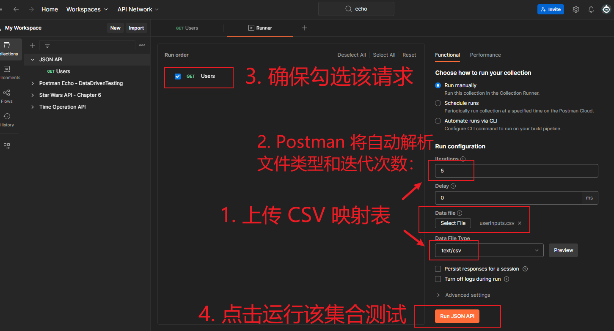

运行情况实测：

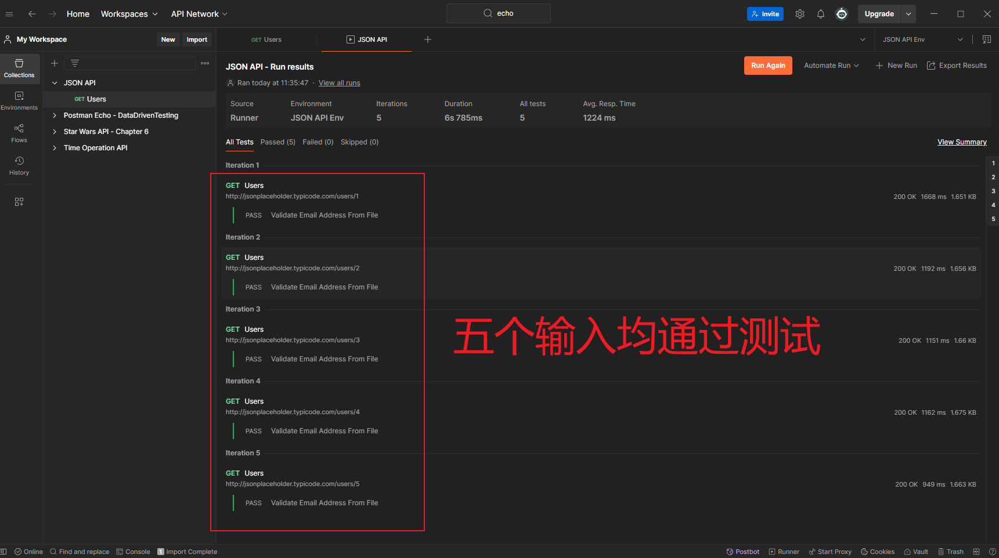

**图 7.6 在 Postman 中应用数据驱动测试的实测效果图（五个用户 ID 均通过测试）**


## 7.4 在 Postman 中实现数据驱动测试（包含结果列）

上述演示中不包含结果列数据。若将测试接口略作修改，即可包含结果列 `expectedEmail`。

将 `Users` 请求的测试脚本改为：

```js
pm.test("Validate Email Address From File", function () {
  const jsonData = pm.response.json();
  // pm.expect(jsonData.email).to.contain("@");
  const expectedEmail = pm.variables.replaceIn('{{expectedEmail}}')
  pm.expect(jsonData.email).to.eql(expectedEmail);
});
```

注意：第 4 行代码为固定写法，通过 `pm.variables.replaceIn('{{expectedEmail}}')` 可以访问到 `CSV` 文件中对应名称的字段列数据。

保存上述设置，再次运行 `Collection Runner`，由于在第四个测试用例中故意设置了一个错误结果，因此运行结果为 4 个通过、1 个不通过（符合预期）：

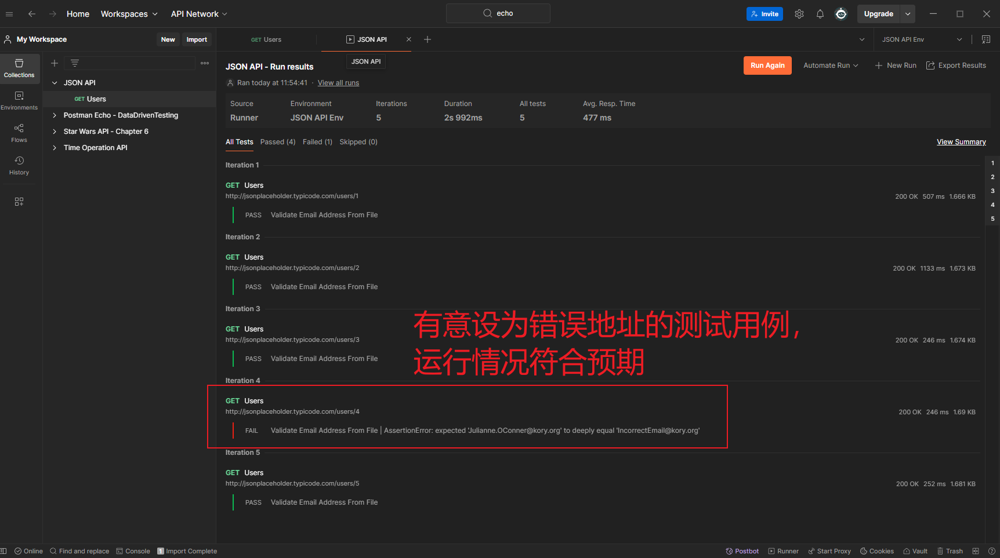

**图 7.7 包含期望结果列的数据驱动测试实测结果**


## 7.5 拓展训练：数据驱动下的多 API 接口测试

前面演示的两个案例都过于简单，唯独最后留给读者练手的拓展项目难度直线上升。实测过程中还进行了适当拓展，居然偶然测出了这两个接口均存在的 `Bug`。


### 7.5.1 项目需求

利用 `Postman` 官方模板 [Echo API](https://www.postman.com/postman/published-postman-templates/documentation/ucvy59g/postman-echo?entity=request-33232-985b34c7-c3c9-40cd-845e-1ae973d16ed8) 中的两个时间请求接口 [Time addition](https://www.postman.com/postman/published-postman-templates/request/cpye43s/time-addition) 和 [Time subtraction](https://www.postman.com/postman/published-postman-templates/request/j9rlc4o/time-subtraction)，设计一套同时包含这两个接口的集合测试流程。要求对每一组测试用例，先用指定的初始时间和时间段调用 **Time addition** 接口；拿到结果后，再用该结果和同样的时间段调用 **Time subtraction** 接口；最后验证相减后的时间和初始时间是否一致。整个过程涉及四类参数：

- 初始时间戳：为了方便和相减后的结果作对比，必须按指定格式传入，例如：`Sat Oct 12 2024 00:00:00 GMT+0000`；
- 增量时间单位：支持的参数名如下：`years`、`months`、`days`、`hours`、`minutes`、`seconds`、`milliseconds`；
- 增量时间数值：任意正整数值，如 `10`、`50` 等；
- 结果时间戳：格式同初始时间戳，每个接口返回的 `JSON` 字段各不相同：
  - 相加：`{"sum": "Mon Feb 03 2025 00:00:00 GMT+0000"}`
  - 相减：`{"difference": "Fri Jan 24 2025 00:00:00 GMT+0000"}`

测试要求：在多个初始时间、多个增量时间段（包括多个时间数值、多个时间单位）的情况下，分别先后完成时间相加、然后相减的结果校验测试。


### 7.5.2 熟悉接口文档

先来了解一下这两个官方测试接口的文档和具体结构：

1. **时间相加接口 Time addition**：

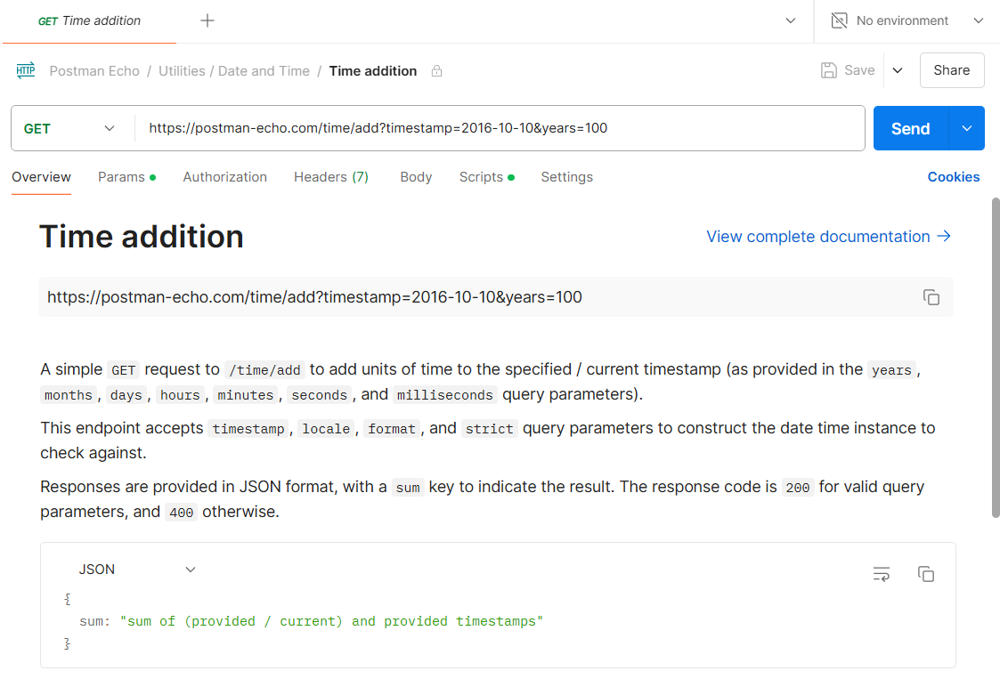

**图 7.8 Time addition 接口的官方文档截图**

本地实测结果：

```powershell
> curl --location 'https://postman-echo.com/time/add?timestamp=2016-10-10&years=100'
{
  "sum": "Sat Oct 10 2116 00:00:00 GMT+0000"
}
```


2. **时间相减接口 Time subtraction**：

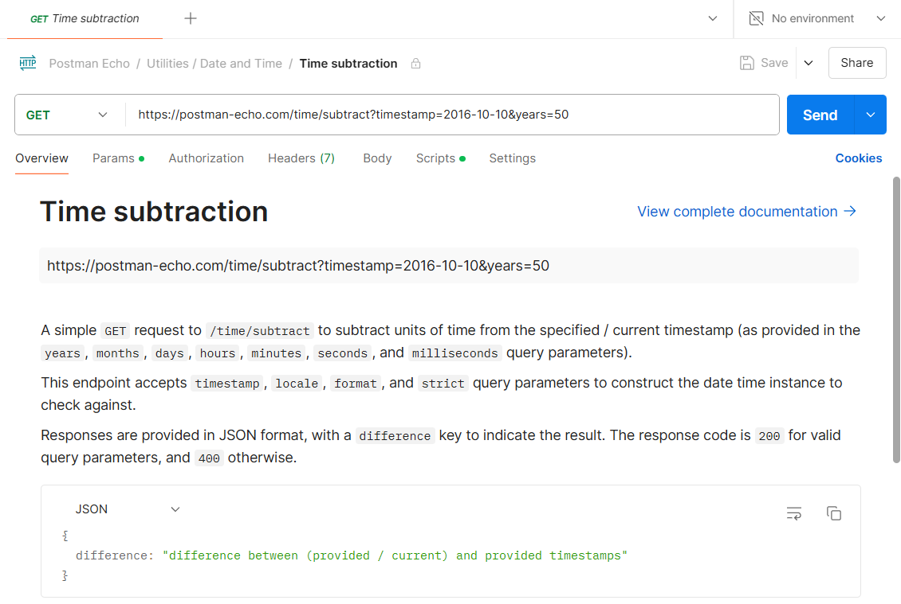

**图 7.9 Time subtraction 接口的官方文档截图**

本地实测结果：

```powershell
> curl --location 'https://postman-echo.com/time/subtract?timestamp=2016-10-10&years=50'
{
  "difference": "Mon Oct 10 1966 00:00:00 GMT+0000"
}
```


### 7.5.3 创建 CSV 映射表

根据项目需求和 `Postman` 官方文档，需要设计一个包含如下三个字段的映射表 `timeOps.csv`：

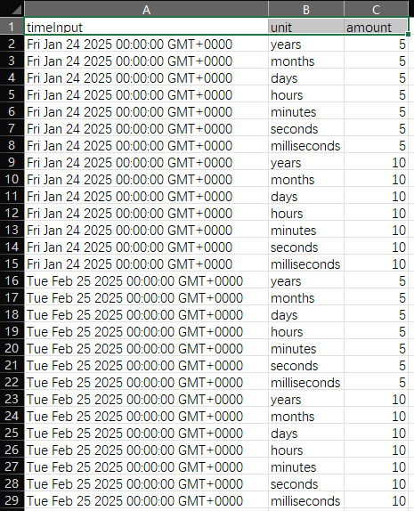

**图 7.10 按接口文档和测试需求构建的 CSV 映射表**

其中，输入时间设计了两个值（即 `2025-1-24` 和 `2025-2-25`），时间单位涉及 7 个，增量时间设计了两个，一共有 28 组测试数据（`= 2 × 7 × 2`）。


### 7.5.4 确定测试流程

按照需求，每一组测试的基本测试流程如下图所示：

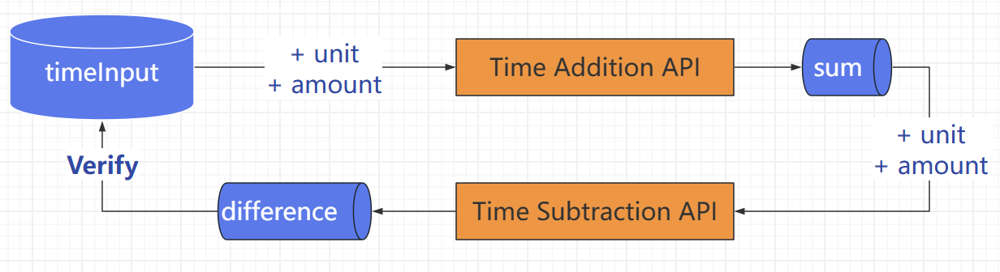

**图 7.11 按书中描述绘制的测试流程图**

这里的关键，在于 `sum` 值的处理：由于要作为下一个接口的入参，这里最好临时存放到一个环境变量（如 `timeOutput`），然后再结合时间单位 `unit` 和增量时间 `amount` 去调 `Time Subtraction API` 接口。为了简化测试脚本的编写，作者建议 `timeInput` 的格式也最好和 `sum`、`difference` 保持一致（否则还需要用 `JavaScript` 处理格式）。


### 7.5.5 具体步骤

1. 新建测试集合 `Time Operation API`；
1. 新建测试环境 `Time Operation Env` 并关联到 `Time Operation API` 集合（为了验证 `Postman` 会自动从上传的 `CSV` 文件解析相关变量，这里特意 **不初始化** 任何环境变量）；
1. 在 `Time Operation API` 集合下创建请求 `Time Addition`：

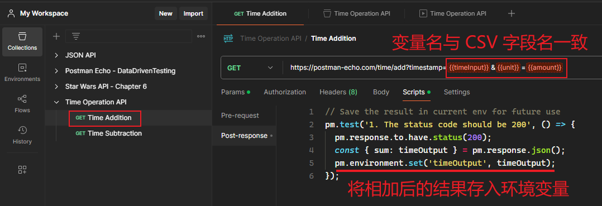

测试脚本如下：

```js
// Save the result in current env for future use
pm.test('1. The status code should be 200', () => {
  pm.response.to.have.status(200);
  const { sum: timeOutput } = pm.response.json();
  pm.environment.set('timeOutput', timeOutput);
});
```

3. 接着在 `Time Operation API` 集合下创建第二个请求 `Time Subtraction`：

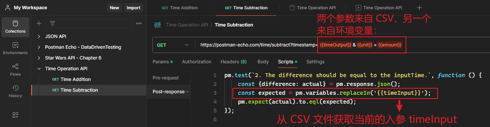

对应的测试脚本如下：

```js
pm.test(`2. The difference should be equal to the inputTime.`, function () {
    const {difference: actual} = pm.response.json();
    const expected = pm.variables.replaceIn('{{timeInput}}');
    pm.expect(actual).to.eql(expected);
});
```

4. 从 `Time Operation API` 集合的 `Collection Runner` 上传 `CSV` 格式的映射文件 `timeOps.csv`：

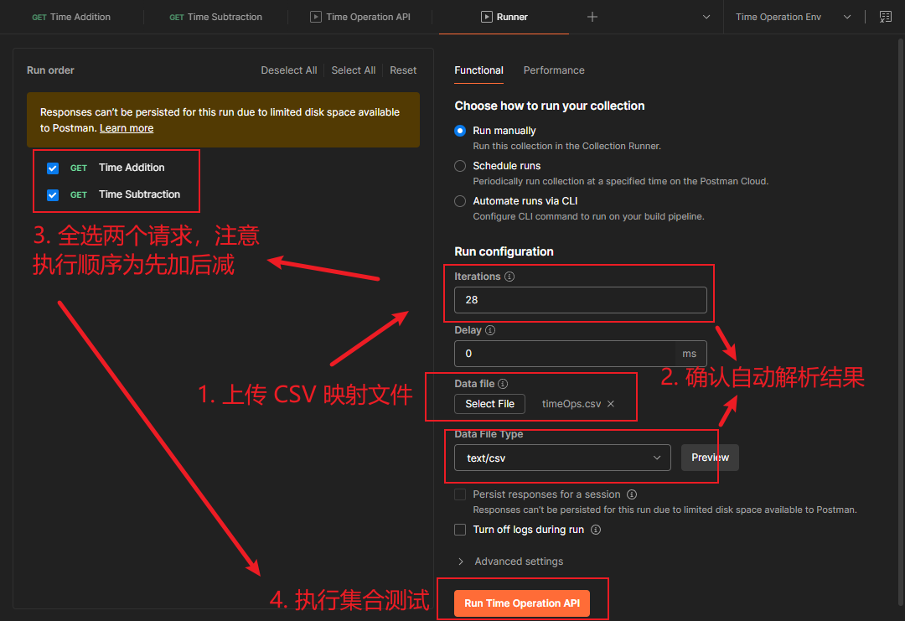

5. 运行集合测试工具，发现 28 组测试中，有四组测试未通过：

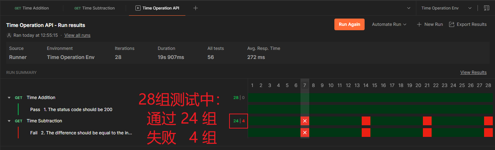


### 7.5.6 结果分析

点开右边的 `View Results` 查看报错详情，发现都是在时间段为毫秒时验证失败的：

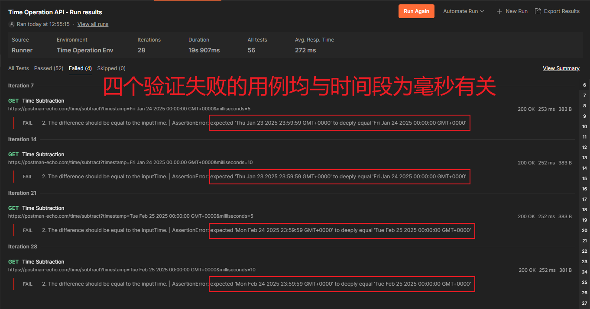

至此，拓展训练的目的已经达到了。对于存在多参数、且存在前后依赖关系的多请求下的数据驱动测试，`Postman` 均能正常执行；整个流程需要的各种变量，`Postman` 也能从上传的 `CSV` 文件自动解析，我们要做的只是确保参数名和字段名一一对应即可。

由于只在测试脚本中手动设置过一个环境变量：`pm.environment.set('timeOutput', timeOutput);`，因此查看 `Time Operation Env` 环境的最终结果，也只有一个变量 `timeOutput`：

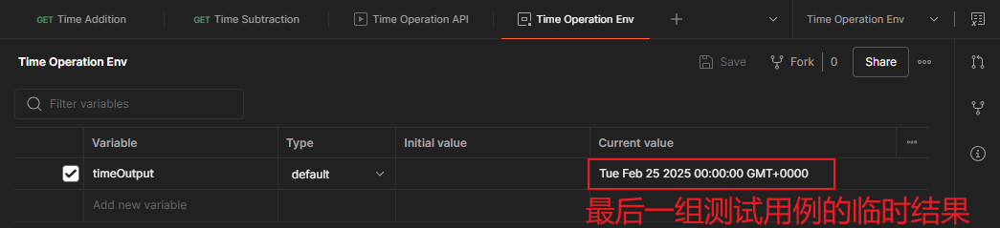

**图 7.12 查看最终存入 Time Operation Env 环境的变量（仅 timeOutput 一个值，符合预期）**

从上图中不难看出，最后一组测试用例存放的 `timeOutput` 值是有问题的第 28 组。对输入时间 `Tue Feb 25 2025 00:00:00 GMT+0000` 增加 `10ms` 的增量时间段，得到结果的精度并没有显示到毫秒级，而是只精确到了秒。为进一步验证这两个接口用的是截尾取整，我又做了两组测试：

```powershell
# 1.1. add 5000ms
> curl --location 'https://postman-echo.com/time/add?timestamp=Tue%20Feb%2025%202025%2000:00:00%20GMT+0000&milliseconds=5000'
{
  "sum": "Tue Feb 25 2025 00:00:05 GMT+0000"
}
# 1.2. add 5300ms
> curl --location 'https://postman-echo.com/time/add?timestamp=Tue%20Feb%2025%202025%2000:00:00%20GMT+0000&milliseconds=5300'
{
  "sum": "Tue Feb 25 2025 00:00:05 GMT+0000"
}
# 1.3. add 5900ms
> curl --location 'https://postman-echo.com/time/add?timestamp=Tue%20Feb%2025%202025%2000:00:00%20GMT+0000&milliseconds=5900'
{
  "sum": "Tue Feb 25 2025 00:00:05 GMT+0000"
}
# 2.1. subtract 5000ms
> curl --location 'https://postman-echo.com/time/subtract?timestamp=Tue%20Feb%2025%202025%2000:00:00%20GMT+0000&milliseconds=5000'
{
  "difference": "Mon Feb 24 2025 23:59:55 GMT+0000"
}
# 2.2. subtract 5300ms
> curl --location 'https://postman-echo.com/time/subtract?timestamp=Tue%20Feb%2025%202025%2000:00:00%20GMT+0000&milliseconds=5300'
{
  "difference": "Mon Feb 24 2025 23:59:54 GMT+0000"
}
# 2.3. subtract 5900ms
> curl --location 'https://postman-echo.com/time/subtract?timestamp=Tue%20Feb%2025%202025%2000:00:00%20GMT+0000&milliseconds=5900'
{
  "difference": "Mon Feb 24 2025 23:59:54 GMT+0000"
}
```

可见，这两个接口确实用的是截尾取整。这也是涉及毫秒的四组用例报错的真正原因。


### 7.5.7 DIY 拓展思考

其实书中这个 “挑战级” 数据驱动测试方案是有瑕疵的：

1. 只对第二个接口编写测试脚本，报错后无法确定是哪个接口报的错。
2. 用同一套运算逻辑进行结果校验，并不能说明每个接口的逻辑一定正确。

对于第一个问题，需要对每个接口都编写测试用例，以便锁定报错接口；

如果第一个测试不通过，则第二个接口也不用再调用了；

而对于第二个问题，则需要利用其他手段验证接口返回的每一次结果，例如原生 `JavaScript` 方法对日期和时间的处理，`Postman` 的私有模块功能恰好可以满足需求。

根据这个思路，我有重新做了如下改造：

1. 创建私有模块 `time-add-sub`：

```js
const fnMap = (sign = 1) => new Map([
  ['years', function(date, amount) {
    date.setFullYear(date.getFullYear() + amount * sign);
    return date;
  }],
  ['months', function(date, amount) {
    date.setMonth(date.getMonth() + amount * sign);
    return date;
  }],
  ['days', function(date, amount) {
    date.setDate(date.getDate() + amount * sign);
    return date;
  }],
  ['hours', function(date, amount) {
    date.setHours(date.getHours() + amount * sign);
    return date;
  }],
  ['minutes', function(date, amount) {
    date.setMinutes(date.getMinutes() + amount * sign);
    return date;
  }],
  ['seconds', function(date, amount) {
    date.setSeconds(date.getSeconds() + amount * sign);
    return date;
  }],
  ['milliseconds', (date, amount) => {
    date.setMilliseconds(date.getMilliseconds() + amount * sign);
    return date;
  }],
]);

// 创建一个通用的日期操作函数
const createTimeFunction = (sign) => (dt, amnt, unit) => {
  const key = unit.toLowerCase();
  const handler = fnMap(sign).get(key);
  if (!handler) {
    throw new Error(`Invalid unit: ${unit}`);
  }
  const date = new Date(dt);
  const amount = parseInt(amnt, 10);
  return handler.call(null, date, amount);
};


// 使用通用函数创建 timeAdd 和 timeSub
const timeAdd = createTimeFunction(1);
const timeSub = createTimeFunction(-1);

module.exports = {
  timeAdd, 
  timeSub
}
```

具体操作情况如下：

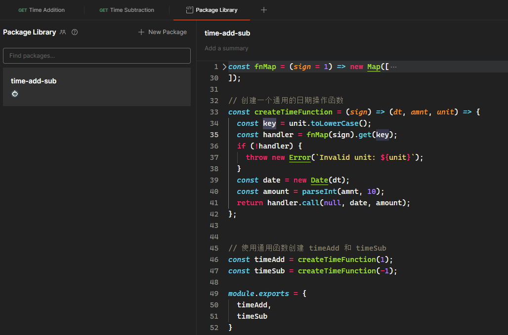

2. 改造 `Time Addition` 的测试逻辑：

```js
const { timeAdd } = pm.require('time-add-sub');

// Save the result in current env for future use
pm.test('1.1 The status code should be 200', () => {
  pm.response.to.have.status(200);
});

pm.test('1.2. The sum result should be correct', function() {
  const timeInput = pm.variables.replaceIn('{{timeInput}}');
  const unit = pm.variables.replaceIn('{{unit}}');
  const amount = pm.variables.replaceIn('{{amount}}');
  const expected = timeAdd(timeInput, amount, unit).getTime();

  const { sum: timeOutput } = pm.response.json();
  const actual = new Date(timeOutput).getTime();
  
  pm.expect(actual).to.eql(expected);

  pm.environment.set('timeOutput', (actual === expected ? timeOutput : undefined));
});
```

3. 改造 `Time Subtraction` 的测试逻辑：

```js
// (in Pre-request)
// Check the environment variable timeOutput before request
const timeOutput = pm.environment.get('timeOutput');
if(!timeOutput) {
  pm.execution.skipRequest()
}

// (in Post-response)
const { timeSub } = pm.require('time-add-sub');

const {difference: result} = pm.response.json();

pm.test(`2.1. The difference should be correct.`, function () {
    const timeOutput = pm.variables.replaceIn('{{timeOutput}}');
    const unit = pm.variables.replaceIn('{{unit}}');
    const amount = pm.variables.replaceIn('{{amount}}');
    const expected = timeSub(timeOutput, amount, unit);

    const actual = new Date(result);

    pm.expect(actual.getTime()).to.equal(expected.getTime());
    pm.environment.set('timeOutput', undefined);
});

pm.test(`2.2. The difference should be equal to the inputTime.`, function () {
    const timeInput = pm.variables.replaceIn('{{timeInput}}');
    pm.expect(result).to.equal(timeInput);
});

```

4. 最后重新运行 `Collection Runner`，实现了上述所有改造要求：

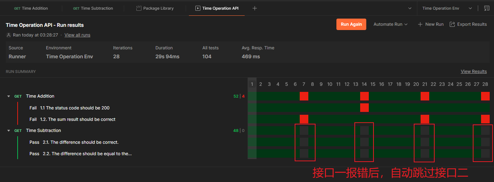

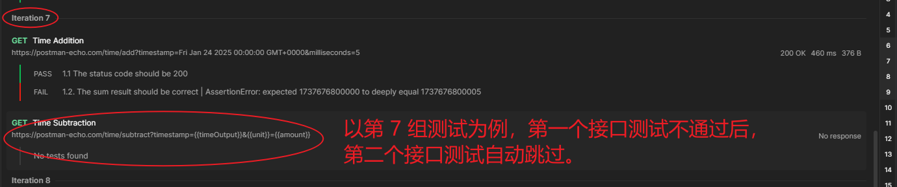


## 7.6 本章小结

- 数据驱动测试需要精心规划测试输入与输出，避免 `DDT` 滥用；
- `Postman` 会根据上传的 `CSV` 映射表自动解析总迭代次数、文件类型、以及每轮迭代需要的各变量；
- 参与测试的请求参数名需要和 `CSV` 映射表的字段名（列名）保持一致；
- 上传映射表也支持 `JSON` 格式文件（待实测）；
- 有前后依赖关系的多请求集合测试，需要分接口校验响应结果；
- 扩展训练中，不可完全依赖接口逻辑来校验结果（即，根据 `Time Subtraction` 的结果反过来和入参作对比）；
- 可以利用 `Postman` 的私有模块封装底层运算逻辑；
- 第一个测试失败后，可利用环境变量标志位（`timeOutput`）决定是否执行后续请求；
- 判定第二个接口是否继续执行的脚本必须写到该接口的 `Pre-request` 中 —— 
  - 若正常执行，还需要重置本轮测试设置的环境变量，否则会干扰到下一轮判定；
  - 若无需执行，则直接用 `pm.execution.skipRequest()` 跳过该请求。
- `Collection Runner` 每月仅有 25 次免费运行额度，私有模块的总数也只有 3 个，因此运行测试前最好先检查相关流程，尽量一次性通过测试。


---

[^1]: **等价类划分（Equivalence Class Partitioning，ECP）** 是一种黑盒测试设计技术，用于将输入数据划分为若干个等价的子集（等价类），每个子集内的数据在测试场景中具有相同的行为或结果。通过从每个等价类中选择少量具有代表性的测试数据，可以减少测试用例的数量，同时确保测试的覆盖范围和有效性。


