# 第八章 工作流测试 Workflow Testing

---

> **本章概要**
>
> - 工作流测试的不同类型
> - 利用 `Postman` 的 `Flows` 实现工作流测试的方法
> - 创建工作流测试的建议


## 8.0 概述

本章为第二版新增章节，主要介绍了强大的 `Postman Flows` 最基础的用法，但也仅限 **最基础** 这三个字；本章只是最后蜻蜓点水地演示了一个例子，更多实战技巧还得老老实实泡论坛、看官方文档。为了笔记的完整，还是把一些比较重要的知识点捞出来，以便后续查阅。


## 8.1 准备工作

本章需要用到作者用 `Python` 写的一个 `ToDoList` 应用。环境搭建步骤如下：

1. 登录 `GitHub` 帐号；
2. 使用 `Gitpod` 运行该项目（`Python` 基础好的话，可以尝试 [离线部署](https://github.com/djwester/todo-list-testing) 到本地）：
   1. 在浏览器中打开链接 `https://gitpod.io/#https://github.com/djwester/todo-list-testing`，授权当前用户并打开一个工作空间（Workspace）；
   2. 在打开的线上 `VSCode IDE` 环境中，找到下方命令行，执行命令：`make run-dev`；
   3. 在弹出的询问窗口中点击 `Make Public` 按钮启用公共访问模式；
   4. 在 `PORTS` 标签中找到托管的项目主页 `URL`，并在浏览器中打开。
3. 最终看到的界面如下：

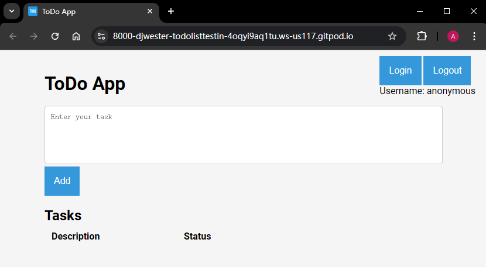

**图 8.1 本章演示所需的 ToDoList 项目的首页情况**


## 8.2 工作流测试的类型

主要分两大类：

- 线性工作流（linear workflows）：各接口按先后顺序依次执行，各请求间存在依赖关系（如先有购物车，后有商品添加操作）
- 业务工作流（business workflows）：旨在实现某个业务目标。可能涉及多系统集成和特定设置，一般比单纯的接口测试复杂，需要借助 `Selenium` 等专业工具。

业务工作流举例：

某数据处理系统，需要先从外部来源导入一些数据，然后需要等待一段时间进行数据处理，接着对其进行查询、测试等操作。可能涉及的数据接口包括：

1. 数据导入接口；
2. 查询导入状态的接口（需轮询）；
3. 导入完毕、启动数据处理的接口；
4. 实时获取数据处理状态的接口（需轮询）；
5. 数据处理完毕、启用数据验证的接口；

……

整个过程涉及延迟、轮询、触发机制，利用 `Collection Runner` 完成测试难度不小。此时可以尝试可视化的 `Postman Flows` 模块稍稍降低难度。


## 8.3 Postman Flows 用法演示


### 8.3.1 演示流程

`Postman Flows` 将要演示的工作流流程如下：

1. 获取所有待办事项（todos）；
2. 遍历每个待办事项，并将 “状态” 字段 `status` 为 `Draft` 的数据项，调用修改接口改为 `In Progress` 状态；
3. 对已更新事项进行记录。


### 8.3.2 示例集合的创建

为实现上述工作流，需要先创建一个包含相关接口的示例 `Collection` 集合 `Flow Requests`：

1. 创建示例集合 `Flow Requests`；

2. 创建示例环境 `ToDo Env`，并定义环境变量 `base_url` 的值为当前示例项目的 `URL`：`https://8000-djwester-todolisttestin-4oqyi9aq1tu.ws-us117.gitpod.io`；最后关联到 `Flow Requests` 集合；

3. 创建三个请求：

   1. 新增待办事项接口 `POST {{base_url}}/tasks`：命名为 `Create ToDo`，发送的 `JSON` 数据为：`{"description": "Finish reading this book", "status": "Draft"}`；

   2. 查询待办列表接口 `GET {{base_url}}/tasks`：命名为 `Get all Todos`，用于返回从接口或页面创建的所有待办事项列表；

   3. 修改待办列表接口 `PUT {{base_url}}/tasks/{{task_id}}`：命名为 `Update Status`，发送的 `JSON` 数据为：`{"description": "{{description}}", "status": "In Progress"}`。这里的 `task_id` 需要在新增接口调用成功后，用测试脚本接入集合变量 `task_id`：

      ```js
      const { id } = pm.response.json();
      pm.collectionVariables.set("task_id", id);
      ```

      但发送数据中的 `{{description}}` 不用考虑，该变量会从工作流中设置。

以修改接口为例，最终创建的示例集合如下图所示：

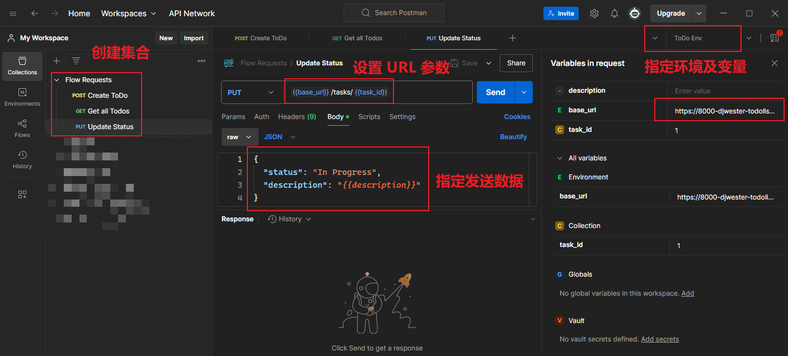

**图 8.2 示例集合 Flows Requests（仅显示 Update Status 接口）**


### 8.3.3 Postman Flows 工作流的创建

在 `Postman` 中任意位置按 <kbd>Ctrl</kbd> + <kbd>N</kbd> 新建一个 `Flows` 工作流：

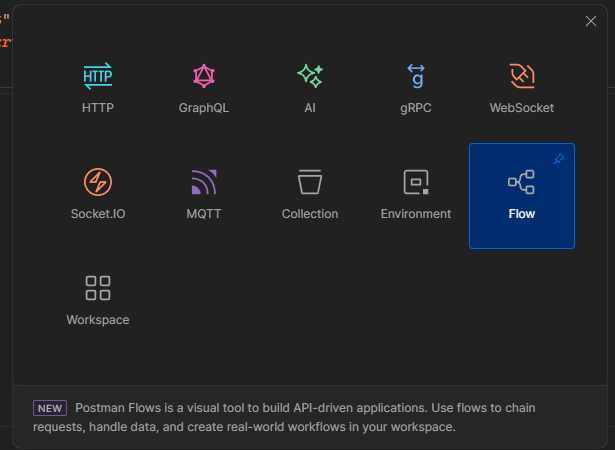

**图 8.3 从新建窗口创建一个 Flows 工作流** [^1]

稍等片刻可以看到一个初始化的 `Flows` 画布，上面有一个启动模块（Start）：

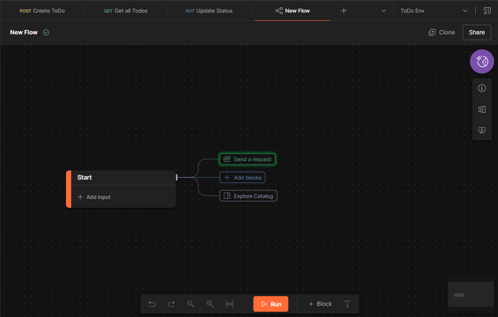

**图 8.4 初始加载完毕看到的 Flows 界面效果**

留意上图中的中间第三个分支 `Explore Catalog`，点击后可以看到官方发布的热门 `Flows` 示例：

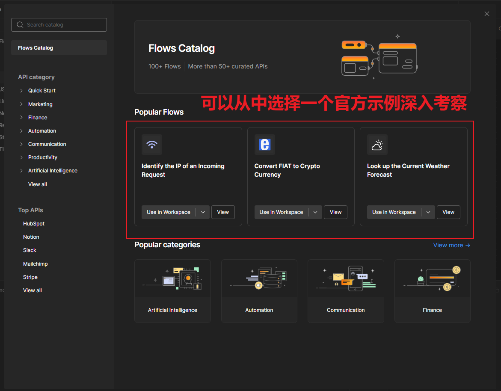

**图 8.5 点击 Explore Catalog 打开的 Postman 官方推荐的 Flows 应用集锦模块截图**

接着，点击绿色的 `Send a request` 方框，自动关联一个流程区块，根据提示选择测试请求 `Get all Todos`，右下方再选中 `ToDo Env` 环境，请求用到的变量会自动加载，无需手动修改：

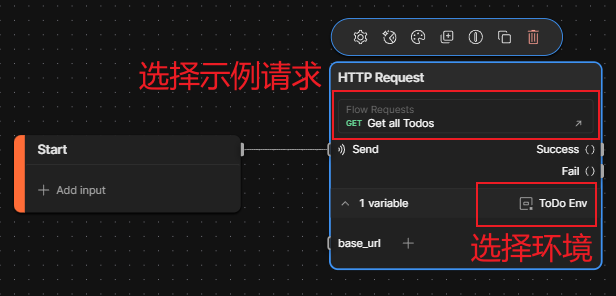

然后从 `Success()` 右边的灰色接口拖出另一个新区块，并输入 `select` 快速筛选、创建一个数据块：

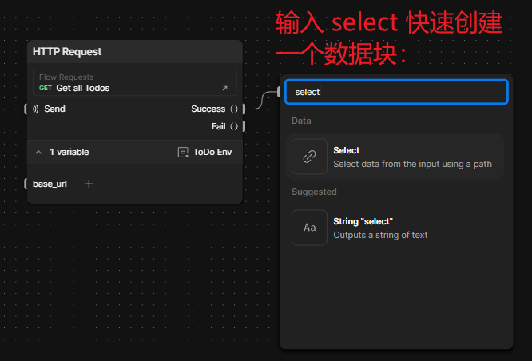

然后根据提示，在文本框中输入 `body`，表示提取响应的 `body` 正文部分：

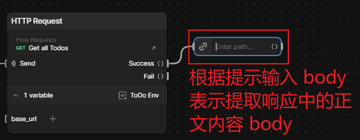

拿到 `body` 的内容后，需要遍历待办列表，因此需要关联一个 `For` 节点：

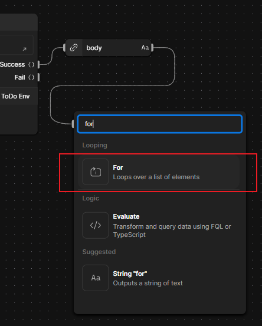

再从 `For` 节点衍生一个 `If` 块，以便设置筛选条件：

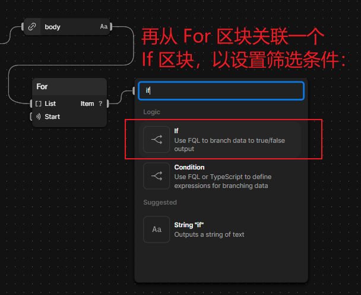

然后设置筛选条件，并建立循环变量 `Item` 和 `status` 键的关联关系：

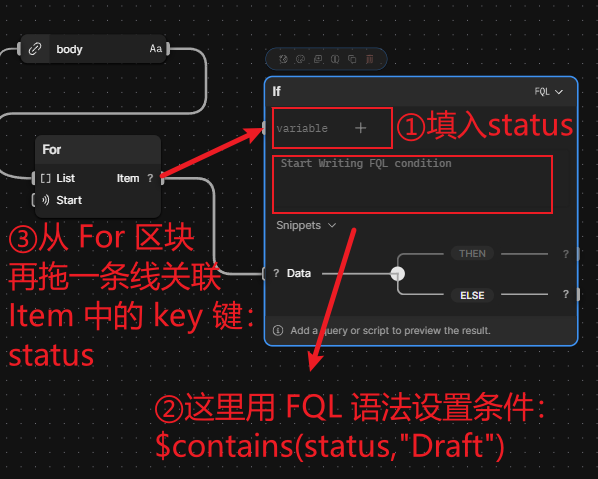

设置后的 `If` 块如下所示：

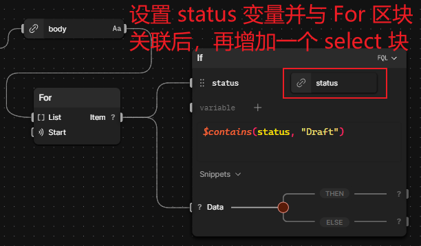

接着如法炮制，从满足条件的 `THEN` 分支关联一个 `HTTP Request` 节点，并完成如下设置：

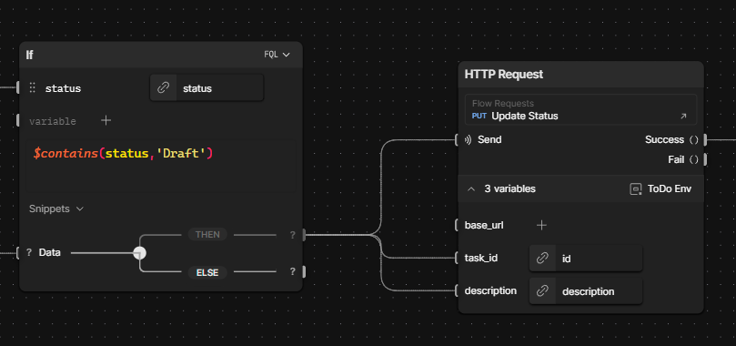

最后，从 `Success()` 右边的出口关联一个输出节点 `Output`，就大功告成了：

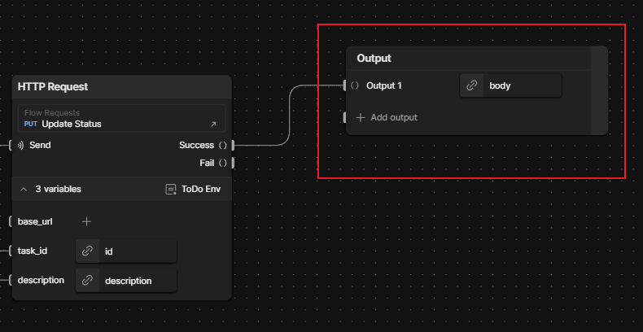

最终的完整流程图实测如下：

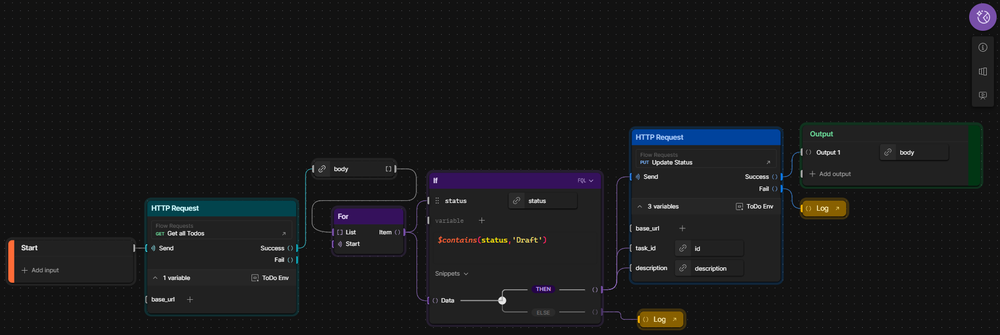

**图 8.6 根据演示要求在本地实现的 Postman Flow 工作流程图**

接着初始化三条示例数据：

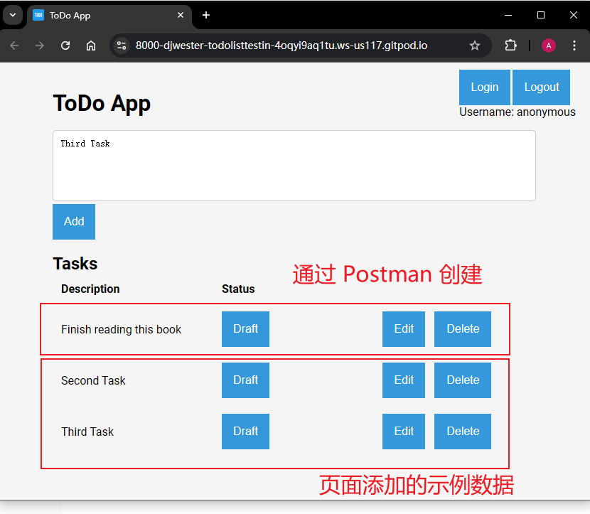

切回 `Postman`。点击 `Flows` 界面下方的 `Start` 按钮启动工作流测试。结果发现示例项目每次 **最多只能同时修改两个待办事项**，超过两个就会自动死锁：

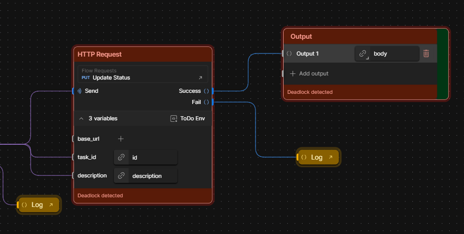

死锁具体原因尚不清楚，但每死锁一次，`Flows` 的每月 50 次的免费运行额度就减少一次；但如果在死锁前中止工作流，则不消耗额度。

由于第三个待办只能重新运行 `Flows` 进行修改，此时前两个状态已经改为 `In Progress`，不满足第二轮的筛选条件，因此会走 `If` 块的 `ELSE` 分支。又因为没有创建对应的处理逻辑，`Flows` 会提示缺东西。于是我又补了两个 `Log` 日志模块（如下图所示），这样底部的控制台就能看到被剔除的两个待办项了，符合预期：

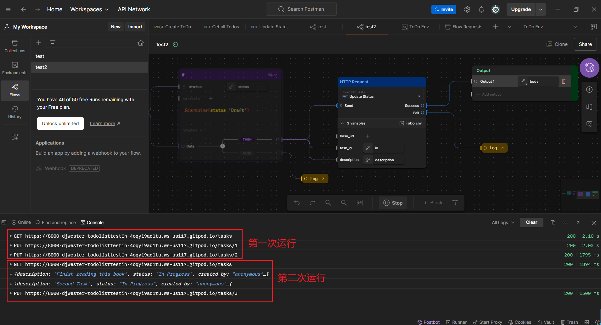


## 8.4 创建工作流的建议

主要涉及两个方面：

- 对复杂工作流的检查：
  - 测试复杂流程需要时间和经验积累；
  - 不仅要看接口细节，更要检查接口支撑的业务逻辑；
  - 如有可能，多与业务人员或客户沟通；
  - 一次不要设计多条复杂工作流，一两个足矣；
- 对 `Postman` 周边事项的检查：
  - 自动化虽然有用，但不是万能的。仅实现部分自动化也值得肯定；
  - 切换工作节点前记好相关日志；
  - 完全自动化往往需要定制测试脚手架和相关基础设施，确需实现时，不要刻意回避问题，避重就轻。


[^1]: 实测发现，时隔仅半年，`Postman` 又更新了新建窗口，加入了 AI 工作流，可以直接在 `Postman` 客户端实现与多个大模型的提示词交互。


