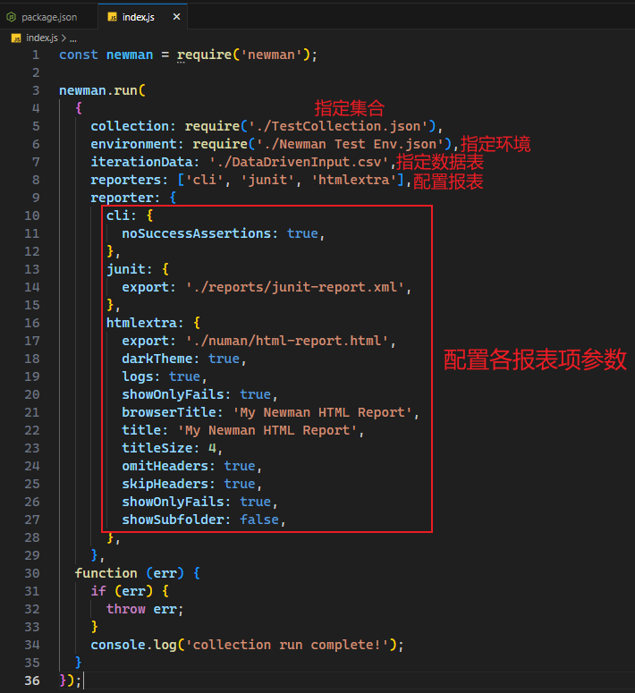
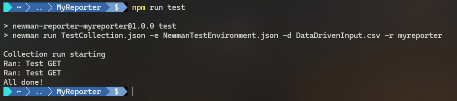
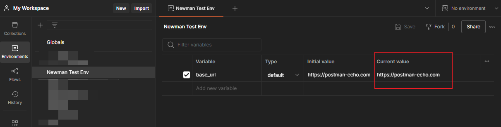
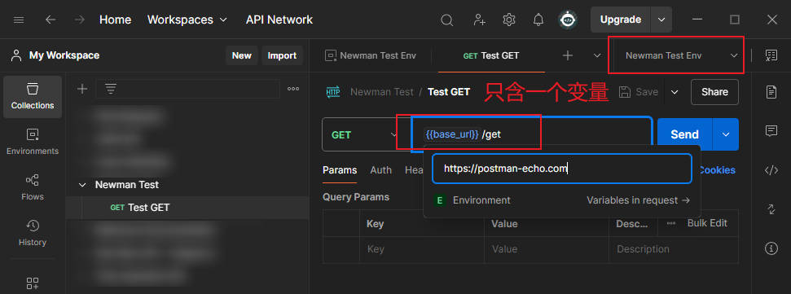
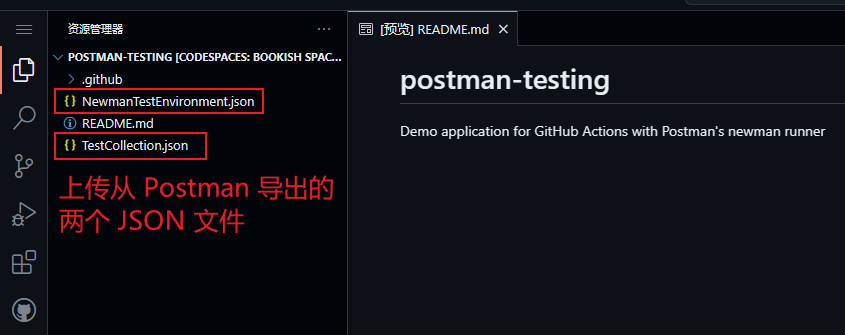
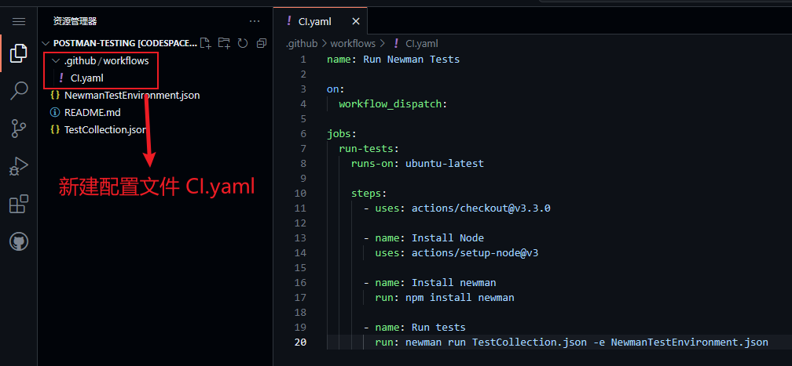
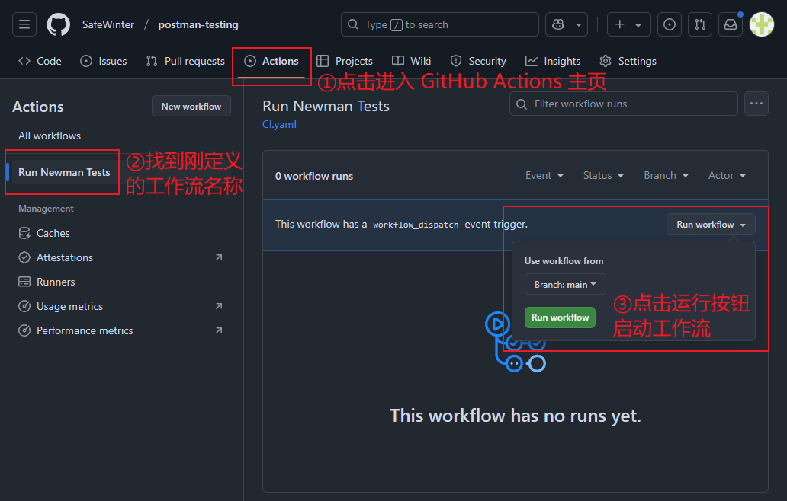
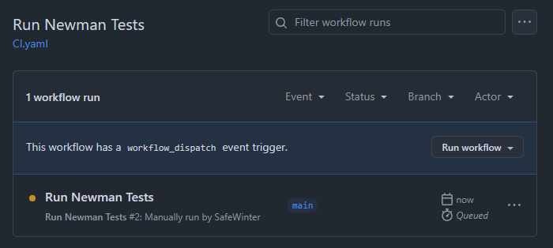
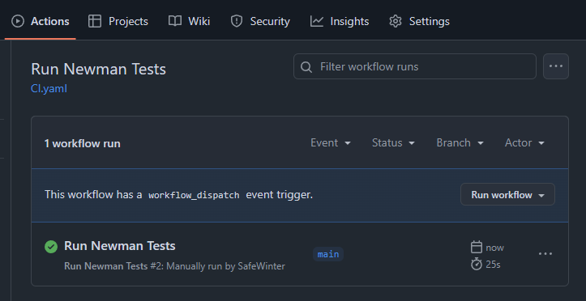
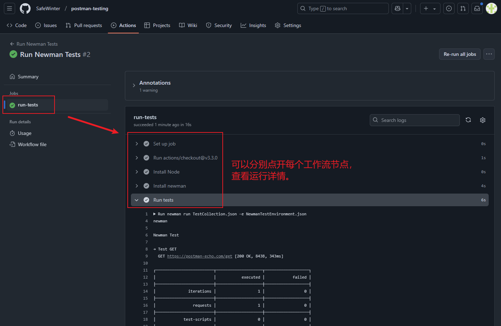

# 第九章 在命令行用 Newman 实现接口测试

---

> **本章概要**
>
> - `Newman` 的用法
> - 理解 `Newman` 运行的配置参数
> - `Newman` 测试报告的配置
> - 将 `Newman` 集成到 CI/CD 工作流的方法

本章示例代码位置：`https://github.com/PacktPublishing/API-Testing-and-Development-with-Postman-Second-Edition/tree/master/Chapter09`。


## 9.1 Newman 的安装与启动

与在熟悉的 `Postman` 客户端做接口测试不同，`Newman` 可以在命令行环境轻松实现绝大部分接口测试。实测发现，在 `Newman` 中运行类似 `Collection Runner` 的集合测试并不会扣减每月免费额度。加之 `Newman` 在 `npm` 社区的功能不断完善，可以轻松高效地完成很多测试任务。

`Newman` 的安装只需一步（前提是先装好 `Node.js`）：

```bash
npm i -g newman
```

这里采用全局安装，主要是让 `newman` 能像 `npm` 那样直接在命令行中运行。


> [!tip]
>
> 全局安装的 `npm` 依赖项，其默认路径通常在系统盘 `C` 盘，如果后期无需使用，也可以考虑卸载：
>
> ```bash
> npm uninstall -g newman
> ```
>
> 确认是否删除成功，可以找到对应的安装路径：
>
> ```bash
> npm root -g
> ```
>
> 若要查看某个具体的全局依赖包的路径：
>
> ```bash
> npm list -g --depth=0
> ```


`Newman` 是通过导出的集合 `JSON` 文件进行测试的，命令格式为：

```shell
# Syntax: newman run <collection> [options]
newman run path/to/your/collection/JSON/file.json
```

若该集合带有某个环境，则需导出该环境 `JSON` 文件，并用参数 `-e` 进行指定：

```markdown
newman run path/to/your/collection/JSON/file.json -e path/to/your/environment/JSON/file.json
```

若该集合还涉及上传 CSV 文件的数据驱动测试，则需要使用 `-d` 参数指定：

```markdown
newman run path/to/your/collection/file.json -e path/to/your/environment/file.json -d path/to/your/CSV/file.csv
```

此外，对于集合中缺失的一两个环境变量，也可以用 `--env-var` 参数手动定义，不必导出环境 `JSON` 文件：

```bash
newman run path/to/your/collection/file.json --env-var "param1=value1"
```

另外，如果缺了两个参数，则要写两次 `--env-var`：

```bash
newman run path/to/your/collection/file.json --env-var "param1=value1" --env-var "param2=value2"
```


### 实测1：带两个变量的测试集合

```bash
# URL: {{base_url}}/{{param}}?test=true
# collection: TestCollection.json
newman run TestCollection.json --env-var "base_url=https://postman-echo.com/" --env-var "param=get"

newman

Newman Test

→ Test GET
  GET https://postman-echo.com/get?test=true [200 OK, 247B, 1111ms]

┌─────────────────────────┬─────────────────────┬─────────────────────┐
│                         │            executed │              failed │
├─────────────────────────┼─────────────────────┼─────────────────────┤
│              iterations │                   1 │                   0 │
├─────────────────────────┼─────────────────────┼─────────────────────┤
│                requests │                   1 │                   0 │
├─────────────────────────┼─────────────────────┼─────────────────────┤
│            test-scripts │                   0 │                   0 │
├─────────────────────────┼─────────────────────┼─────────────────────┤
│      prerequest-scripts │                   0 │                   0 │
├─────────────────────────┼─────────────────────┼─────────────────────┤
│              assertions │                   0 │                   0 │
├─────────────────────────┴─────────────────────┴─────────────────────┤
│ total run duration: 1195ms                                          │
├─────────────────────────────────────────────────────────────────────┤
│ total data received: 0B (approx)                                    │
├─────────────────────────────────────────────────────────────────────┤
│ average response time: 1111ms [min: 1111ms, max: 1111ms, s.d.: 0µs] │
└─────────────────────────────────────────────────────────────────────┘
```


### 实测2：带环境 JSON 和 CSV 映射文件的测试集合

先在 `Postman` 中新建一个测试集合 `Newman Test`，并在该集合下新建测试 GET 请求 `Test GET`，`URL` 为：`{{base_url}}/get?{{queryParam}}={{queryParamVal}}`；然后导出 `JSON` 文件备用：`TestCollection.json`。

再新建测试环境 `Newman Test Env`，并定义变量 `base_url` 的值为 `https://postman-echo.com`；然后导出 `JSON` 文件备用：`NewmanTestEnvironment.json`。

执行下列 `PowerShell` 命令，在桌面上生成一个示例 `CSV` 文件 `DataDrivenInput.csv`：

```powershell
$csvPath = '~/Desktop/DataDrivenInput.csv'
$data = @(@{queryParam="test"; queryParamVal="true"},@{queryParam="query"; queryParamVal="1"})
$data | Export-Csv -Path $csvPath -NoTypeInformation
```

用 `newman` 进行带环境参数的数据驱动测试：

```bash
> (pwd).Path
C:\Users\ad\Desktop
> newman run TestCollection.json -e NewmanTestEnvironment.json -d DataDrivenInput.csv
newman
                                                           Newman Test

Iteration 1/2

→ Test GET
  GET https://postman-echo.com/get?test=true [200 OK, 873B, 2.4s]

Iteration 2/2

→ Test GET
  GET https://postman-echo.com/get?query=1 [200 OK, 979B, 254ms]

┌─────────────────────────┬─────────────────────┬─────────────────────┐
│                         │            executed │              failed │
├─────────────────────────┼─────────────────────┼─────────────────────┤
│              iterations │                   2 │                   0 │
├─────────────────────────┼─────────────────────┼─────────────────────┤
│                requests │                   2 │                   0 │
├─────────────────────────┼─────────────────────┼─────────────────────┤
│            test-scripts │                   0 │                   0 │
├─────────────────────────┼─────────────────────┼─────────────────────┤
│      prerequest-scripts │                   0 │                   0 │
├─────────────────────────┼─────────────────────┼─────────────────────┤
│              assertions │                   0 │                   0 │
├─────────────────────────┴─────────────────────┴─────────────────────┤
│ total run duration: 2.8s                                            │
├─────────────────────────────────────────────────────────────────────┤
│ total data received: 1.19kB (approx)                                │
├─────────────────────────────────────────────────────────────────────┤
│ average response time: 1331ms [min: 254ms, max: 2.4s, s.d.: 1077ms] │
└─────────────────────────────────────────────────────────────────────┘
```


## 9.2 Newman 的其他运行配置参数

查看 `newman` 内置帮助文档：

```bash
newman run -h
```

对应的官方 [GitHub](https://github.com/postmanlabs/newman#command-line-options) 文档位置：`https://github.com/postmanlabs/newman#command-line-options`

这里强调如下参数：

- 限定范围：
  - `--folder`：用于指定在 Postman 集合中要运行的特定文件夹。这样可以只运行集合中的某个部分，而不是整个集合，例如：`newman run MyCollection.json --folder "User Tests"`
- 延迟、超时相关：
  - `--delay-request`：用于在每个请求之间引入延迟（以毫秒为单位）。这在进行负载测试或当请求需要一定时间间隔时非常有用。例如：`newman run MyCollection.json --delay-request 2000`
  - `--timeout`：用于设置整个请求的超时时间（以毫秒为单位）。如果请求在指定时间内未完成，Newman 将终止该请求。如：`newman run MyCollection.json --timeout 5000`
  - `--timeout-request`：用于设置单个请求的超时时间（以毫秒为单位）。这与 `--timeout` 相似，但仅适用于每个请求。如：`newman run MyCollection.json --timeout-request 3000`
  - `--timeout-script`：用于设置脚本执行的超时时间（以毫秒为单位）。如果脚本在指定时间内未完成，Newman 将终止该脚本执行。如：`newman run MyCollection.json --timeout-script 2000`
- 测试失败相关：
  - `--bail`：用于在测试执行中遇到第一个失败的请求时，立即停止后续测试。这在调试和快速反馈时非常有用，可以避免浪费时间在后续的无效请求上。例如：`newman run MyCollection.json --bail`
- 协议相关：
  - `-k`：用于在请求中忽略 SSL 证书错误。这个参数可以在你与自签名证书的服务器交互时非常有用。例如：`newman run MyCollection.json -k`。
- 重定向相关：
  - `--ignore-redirects`：用于控制请求是否跟随 HTTP 重定向。默认情况下，Newman 会自动跟随重定向，但使用此参数可以选择不跟随，从而允许你手动处理重定向响应。例如：`newman run MyCollection.json --ignore-redirects`


## 9.3 Newman 测试报表的配置

### 9.3.1 内置报表的配置

`Newman` 支持四类内置报表，并通过 `-r` 参数进行设置（默认按命令行输出报表，即 `cli`）：

- `json`：导出一个 `JSON` 文件，默认放到当前路径下的 `newman` 文件夹；
- `junit`：导出一个适配 `JUnit` 框架的 `XML` 文件；
- `progress`：可在测试报告中显示每个测试用例的进度条；
- `emojitrain`：以表情符号来表示各用例的最终状态，用得不多。

实测 `cli` + `emojitrain` 运行导出的示例集合 `Newman Test` [^1]：

```powershell
> newman run TestCollection.json -e NewmanTestEnvironment.json -d DataDrivenInput.csv -r 'cli,emojitrain'
newman: cli, emojitrain reporters might not work well together.
newman

Newman Test

Iteration 1/2

→ Test GET
  GET https://postman-echo.com/get?test=true [200 OK, 871B, 1404ms]
😀
Iteration 2/2

→ Test GET
  GET https://postman-echo.com/get?query=1 [200 OK, 981B, 254ms]
😀
┌─────────────────────────┬─────────────────────┬─────────────────────┐
│                         │            executed │              failed │
├─────────────────────────┼─────────────────────┼─────────────────────┤
│              iterations │                   2 │                   0 │
├─────────────────────────┼─────────────────────┼─────────────────────┤
│                requests │                   2 │                   0 │
├─────────────────────────┼─────────────────────┼─────────────────────┤
│            test-scripts │                   0 │                   0 │
├─────────────────────────┼─────────────────────┼─────────────────────┤
│      prerequest-scripts │                   0 │                   0 │
├─────────────────────────┼─────────────────────┼─────────────────────┤
│              assertions │                   0 │                   0 │
├─────────────────────────┴─────────────────────┴─────────────────────┤
│ total run duration: 1824ms                                          │
├─────────────────────────────────────────────────────────────────────┤
│ total data received: 1.19kB (approx)                                │
├─────────────────────────────────────────────────────────────────────┤
│ average response time: 829ms [min: 254ms, max: 1404ms, s.d.: 575ms] │
└─────────────────────────────────────────────────────────────────────┘
 😍
```

仅用表情符号输出测试结果：

```powershell
> newman run TestCollection.json -e NewmanTestEnvironment.json -d DataDrivenInput.csv -r 'emojitrain'
😀 😀  😍
```

同时，针对不同的报表配置，还可以作进一步定制。例如：

设置在运行时关闭成功断言的输出，写作：`-r cli --reporter-cli-no-success-assertions`；

要将 `JUnit` 报表存到名为 `reports` 的文件夹中，写作：`-r junit --reporter-junit-export reports`；

更多配置，详见 [GitHub 官方文档](https://github.com/postmanlabs/newman#reporters)。

> [!tip]
>
> **DIY 拓展**
>
> `Newman` 还可以通过 `Node.js` 模块的方式集成到前端 `JavaScript` 项目中：
>
> ```js
> // index.js
> const newman = require("newman");
> 
> newman.run(
>   {
>     collection: require("./TestCollection.json"),
>     environment: require("./Newman Test Env.json"),
>     iterationData: "./DataDrivenInput.csv",
>     reporters: ['emojitrain', 'progress'],
>   },
>   function (err) {
>     if (err) {
>       throw err;
>     }
>     console.log("collection run complete!");
>   }
> );
> ```
>
> 然后创建 `start` 脚本：
>
> ```json
> {
>   "scripts": {
>     "start": "node index.js"
>   },
>   "dependencies": {
>     "newman": "^6.2.1"
>   }
> }
> ```
>
> 最后通过 `npm start` 启动测试：
>
> ```bash
> $ npm start
> 
> > start
> > node index.js
> 
> newman: emojitrain, progress reporters might not work well together.
> progress [========================================] 100% | ETA: 0s | 2/2 😍
> 
> collection run complete!
> ```


### 9.3.2 第三方报表的配置

以 `htmlextra` 为例，按命令行模式运行：

```bash
# 全局安装 htmlextra 报表依赖
> npm i -g newman-reporter-htmlextra
# 运行测试
> newman run TestCollection.json -e NewmanTestEnvironment.json -d DataDrivenInput.csv –r htmlextra
> 
```

此时会在桌面自动创建一个 `newman` 文件夹，里面又刚生成的网页格式的测试报表，确实比官方默认的插件精美很多：


**图 9.1 使用 Postman 第三方报表插件 htmlextra 生成的测试报告页效果图**

但是对于 `htmlextra` 的深度定制，命令行就很不方便了。此时可以借助 `Node` 模块，配合 `htmlextra` 插件 [文档](https://github.com/DannyDainton/newman-reporter-htmlextra) 轻松实现各种定制（而且还不用全局安装，跟随项目安装即可）：



**图 9.2 在前端项目中通过 node 模块进行第三方插件的深度定制**

这是最后生成的不同类型的报表文件：


**图 9.3 通过运行 npm 脚本实现两个不同类型报表插件 junit 和 htmlextra 的自定义导出**


### 9.3.3 自定义报表模块的配置

没想到报表这部分讲得这么细，最后还给出了自定义报表插件的构建方法。只是有些内容过于基础，需要简化一下。

准备工作：

1. 测试集合 `JSON` 文件 `TestCollection.json`：

```json
{
	"info": {
		"_postman_id": "27fab226-d194-44c2-9303-b275365ecd1b",
		"name": "Newman Test",
		"schema": "https://schema.getpostman.com/json/collection/v2.1.0/collection.json",
		"_exporter_id": "39815626"
	},
	"item": [
		{
			"name": "Test GET",
			"request": {
				"method": "GET",
				"header": [],
				"url": {
					"raw": "{{base_url}}/get?{{queryParam}}={{queryParamVal}}",
					"host": [
						"{{base_url}}"
					],
					"path": [
						"get"
					],
					"query": [
						{
							"key": "{{queryParam}}",
							"value": "{{queryParamVal}}"
						}
					]
				}
			},
			"response": []
		}
	]
}
```

2. 测试环境 `JSON` 文件 `NewmanTestEnvironment.json`：

```json
{
	"id": "aad1b6f5-5908-4d16-a77c-61716b70040f",
	"name": "Newman Test Env",
	"values": [
		{
			"key": "base_url",
			"value": "https://postman-echo.com",
			"type": "default",
			"enabled": true
		}
	],
	"_postman_variable_scope": "environment",
	"_postman_exported_at": "2025-01-26T16:27:32.087Z",
	"_postman_exported_using": "Postman/11.29.5"
}
```

3. 测试 `CSV` 映射数据文件 `DataDrivenInput.csv`：

```markdown
"queryParam","queryParamVal"
"test","true"
"query","1"
```


具体实现代码如下：

```powershell
> (pwd).Path
C:\Users\ad\Desktop
> mkdir MyReporter | Out-Null ; cd MyReporter; (pwd).Path
C:\Users\ad\Desktop\MyReporter
# 将刚才创建的三个文件复制到当前文件夹
> cp ~/Desktop/DataDrivenInput.csv .
> cp ~/Desktop/NewmanTestEnvironment.json .
> cp ~/Desktop/TestCollection.json .
# 初始化 Node.js 项目
# 除了项目名称（name）手动指定为固定写法 newman-reporter-myreporter 外，
# 其余全部为默认配置
> npm init
> cat package.json
{
  "name": "newman-reporter-myreporter",
  "version": "1.0.0",
  "description": "",
  "main": "index.js",
  "scripts": {
    "test": "echo \"Error: no test specified\" && exit 1"
  },
  "author": "",
  "license": "ISC"
}
# 创建自定义插件模块
> echo '' > index.js
```

然后在 `index.js` 中输入以下内容：

```js
function MyCustomNewmanReporter (newman, reporterOptions, collectionRunOptions) {  
    newman.on('start', function (err) {
        if (err) { return; }
        console.log('Collection run starting')
    });
    newman.on('item', function (err, args) {
        console.log('Ran: ' + args.item.name)
    });
    newman.on('done', function () {
        console.log('all done!')
    });
}
module.exports = MyCustomNewmanReporter
```

然后执行以下操作，完成模块打包、安装：

```powershell
# 模块打包
> npm pack
npm notice
npm notice package: newman-reporter-myreporter@1.0.0
npm notice === Tarball Contents ===
npm notice 427B index.js
npm notice 222B package.json
npm notice === Tarball Details ===
npm notice name:          newman-reporter-myreporter
npm notice version:       1.0.0
npm notice filename:      newman-reporter-myreporter-1.0.0.tgz
npm notice package size:  450 B
npm notice unpacked size: 649 B
npm notice shasum:        0b040c11ff844bbaccf6c441731af21f5f9282d4
npm notice integrity:     sha512-9XsT+8GA0y2kq[...]Mehie7GSlW7uQ==
npm notice total files:   2
npm notice
newman-reporter-myreporter-1.0.0.tgz
# 全局安装自定义报表模块
> npm i -g newman-reporter-myreporter-1.0.0.tgz

added 1 package in 478ms
> 
```

然后，在 `package.json` 中的 `test` 脚本改为要执行的集合测试命令（第 7 行）：

```json
{
  "name": "newman-reporter-myreporter",
  "version": "1.0.0",
  "description": "",
  "main": "index.js",
  "scripts": {
    "test": "newman run TestCollection.json -e NewmanTestEnvironment.json -d DataDrivenInput.csv -r myreporter"
  },
  "author": "",
  "license": "ISC"
}
```

最后执行命令 `npm run test` 启动测试。实测结果如下：



**图 9.4 自定义报表插件 myreporter 的实测运行结果**


## 9.4 Newman 与 CI/CD 工作流的集成

本章的最后，作者还留了一个彩蛋，演示了 `Newman` 集成到 `GitHub Actions` 的具体操作。

为了方便演示，示例集合 `Newman Test` 改为只包含一个变量 `base_url`，并由示例环境 `Newman Test Env` 提供变量值：`https://postman-echo.com`：





然后分别导出 `JSON` 文件 `TestCollection.json` 和 `NewmanTestEnvironment.json` 备用。

接着，在 `GitHub` 上新建一个代码仓库 `postman-testing`，打开线上的 `Codespaces` 上传这两个 `JSON` 文件：



**图 9.5 在 GitHub 的 Codespaces 空间上传从 Postman 导出的集合与环境 JSON 文件**

再新建一个 `GitHub Actions` 配置文件 `.github/workflows/CI.yaml`（文件名自拟）：



配置文件 `CI.yaml` 内容如下：

```yaml
name: Run Newman Tests

on:
  workflow_dispatch:

jobs:
  run-tests:
    runs-on: ubuntu-latest

    steps:
      - uses: actions/checkout@v3.3.0

      - name: Install Node
        uses: actions/setup-node@v3

      - name: Install newman
        run: npm install newman

      - name: Run tests
        run: newman run TestCollection.json -e NewmanTestEnvironment.json
```

提交所有变更后，就可以进入该仓库的 `Actions` 主页，找到刚定义的工作流名称 `Run Newman Tests`，手动运行该工作流：



工作流启动后，窗口随即显示当前运行状态：



稍等片刻后，工作流执行完毕：



点击查看任务详情，此时可对照右边的节点查看每个操作步骤的运行详情：




### 集成 GitHub Actions 注意事项

- 安装 `newman` 前先安装 `Node` 环境；
- 安装 `Node` 环境前先要签出（check out）当前源代码到 `Codespaces` 空间；
- 注意每步（step）的命令写法，先后顺序不能乱；
- 后期可根据需要对工作流进行扩展；
- 演示使用的触发器为 `workflow_dispatch` 手动触发，实际工作中还可以是 `push`、`pull_request` 等；
- 运行工作流前务必先提交所有代码；
- `Codespaces` 用完后应及时关闭。


---

[^1]: 在 `PowerShell` 环境下，用 `-r` 参数指定报表类型需要加引号，否则命令行不能正常解析。


