# 第十章 用 Postman 监控 API 接口

> **本章概要**
>
> - 监视器（Monitor）在 Postman 中的设置方法
> - 监控结果的查看方法

---

## 1 为何要使用监控工具

因为一个人很难想到与自己截然不同的做事与思维方式。

- 主观上：人们永远无法全部理解并准确预测与软件交互的用户会做的 **所有事情**；
- 客观上：软件本身的复杂度和多样性也让测试人员无法穷尽所有可能出错的情况；

## 2 搭建一个简易的接口监视器

以下操作可在 Postman 创建一个简易监视器，用于判定请求的响应时间是否在 400 毫秒内：

1. 创建测试集合 `Monitor SWAPI`；
2. 向该集合添加一个名为 `Get People` 的 GET 请求，URL：`https://swapi.dev/api/people`；
3. 测试脚本从右侧 `Postman` 提供的代码片段直接生成，这里需要用到 `Status code: Code is 200` 模板；
4. 再生成一个测试模板 `Response time is less than 200ms`，然后将时间段改为 400 毫秒；
5. 保存该请求。

请求的测试脚本界面如下图所示：

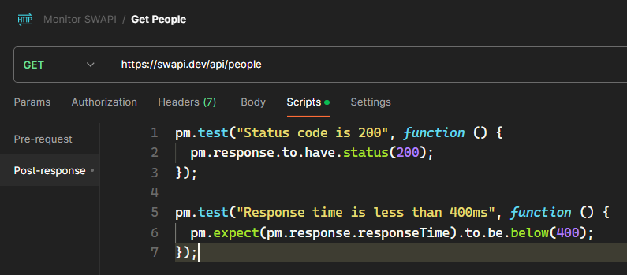

**图 10.1 示例请求 Get People 最终的测试脚本标签页截图**

然后从左侧边栏点开监控器管理界面。如果没有显示则通过下图开启：

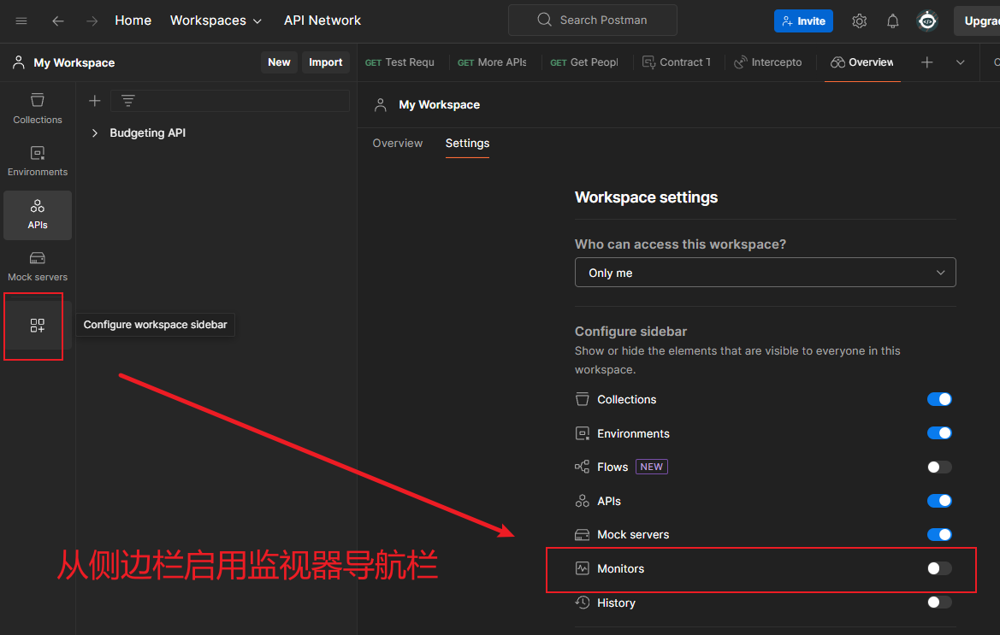

**图 10.2 手动开启 Monitors 监控器管理页的操作步骤**

接着，按如下步骤新建一个监视器 `My Test Monitor`，用于监控示例请求 `Get People` 的响应时间：

1. 从监视器管理页左上角的加号图标新建监视器，并命名为 `My Test Monitor`；
2. 第二栏测试集合选刚建好的 `Monitor SWAPI`；
3. 其余选项（如生效地区、通知邮箱、请求重试次数、请求延迟等）均保留默认值 [^1]
4. 点击新建页面下方的 `Create Monitor` 按钮完成创建。

相关配置选项如下所示：

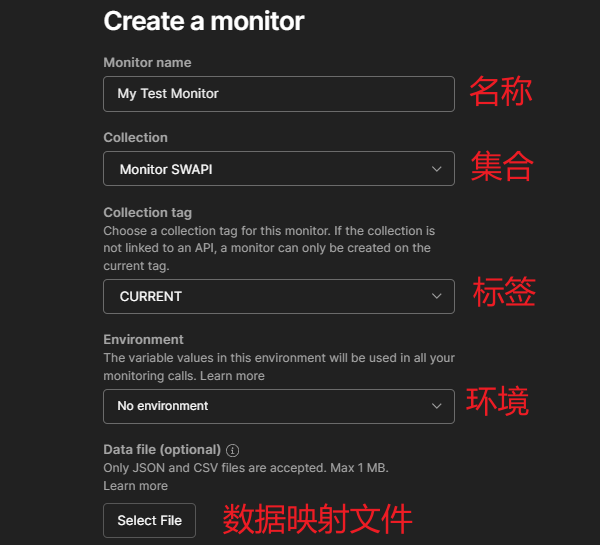

**图 10.3 监视器配置选项（一）**

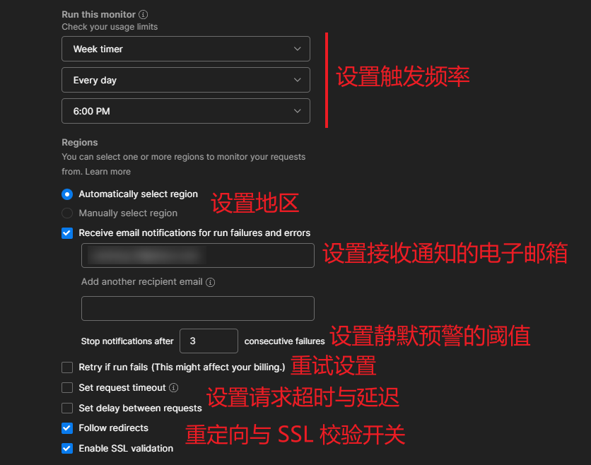

**图 10.4 监视器配置选项（二）**

## 3 设置推送邮箱

设置邮箱后，若自然触发监视器运行，或者直接手动运行，对应邮箱将会收到此次监测的结果：

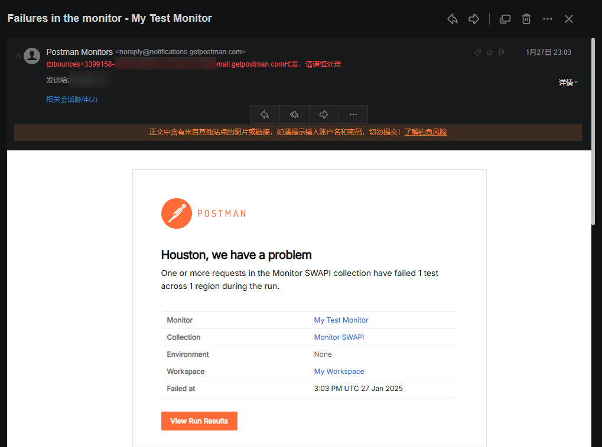

**图 10.5 设置接收通知的邮箱后，Postman 会把执行结果发送到该邮箱**

## 4 监控失败后的重试次数设置

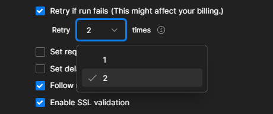

**图 10.6 监控失败后的重试次数设置界面**

如图所示，勾选重试多选框后，可以指定该监视器重试的次数。需要注意的是，重试成功与否都会消耗免费运行次数。

## 5 超时设置

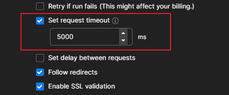

**图 10.7 监视器的超时设置界面**

在 `Postman` 中，默认的最大超时时间为 10 分钟，通过截图中的配置项也可手动指定超时时长，单位为毫秒。

## 6 重定向设置

重定向配置选项可用于身份校验等鉴权场景下，比如登录成功后，授权服务器可能会将用户界面重定向到应用服务器；若要对授权服务器进行监控，此时只需判定该授权服务器是否收到响应即可，而无需跟随系统重定向到应用服务器。因此就应该取消勾选。

## 7 启用 SSL 验证

开发接口时通常会禁用 `SSL` 验证，但系统一旦正式投入使用，应该确保其开启。

## 8 监视器测试用例的添加

监视器的测试用例切忌大而全，应该有所侧重。

监控阈值的选择往往与软件本身无关：既不过过于严苛，以免报警疲劳（alert fatigue）；也不过过于宽松，以免形同虚设。

在生产环境中进行测试，务必要考虑周全，测试数据用完后一定要及时清除。

## 9 监视器运行结果的查看

单击创建好的 `Postman` 监视器，右边就会展示近段时间的运行指标可视化图表：

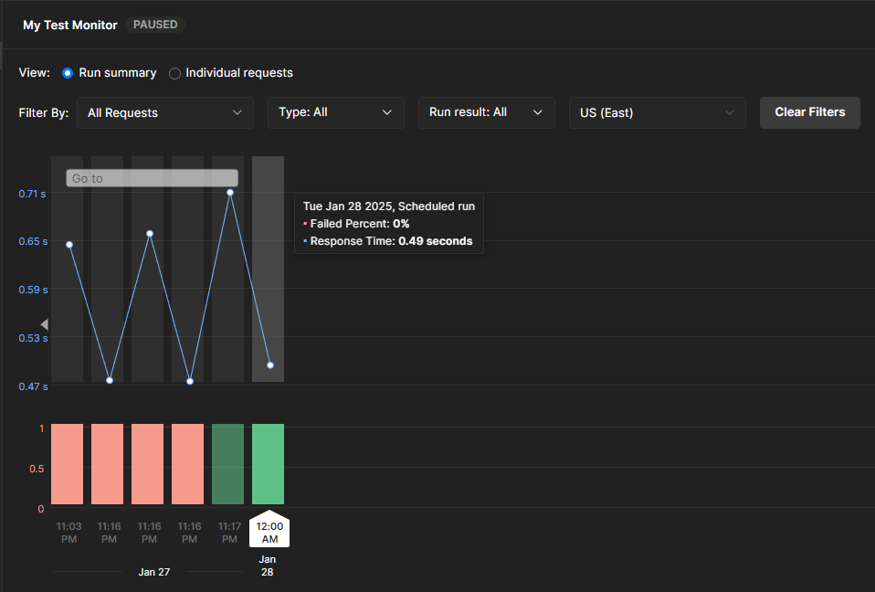

**图 10.8 监视器近期运行结果可视化图表**

每点击一个运行记录，下方还会显示具体的测试用例运行结果：

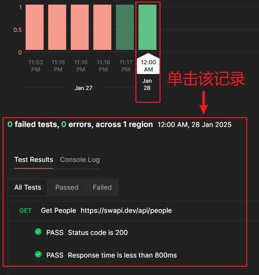

**图 10.9 单击某个运行记录，下方会展示当次运行的测试详情**

同时还可以查看当时的运行日志：

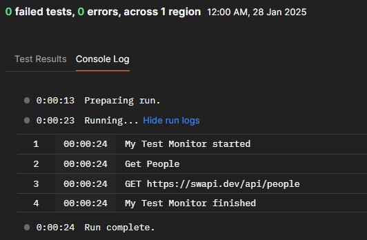

**图 10.10 单击某个运行记录，下方会展示当次请求的相关日志**

另外，配合图表区上方的筛选条件栏，还可以快速定位需要关注的运行记录：

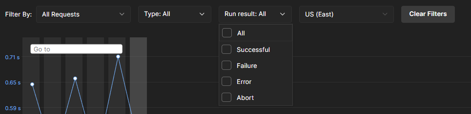

**图 10.11 可以利用筛选条件栏快速定位相关运行记录**

最后，图表区中的 `Go to` 区域还可以快速定位某天的运行记录：

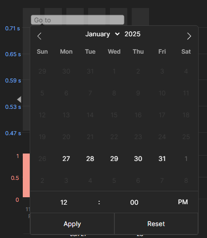

**图 10.12 图表区上的日期筛选工具示意图**

## 10 监视器的删除与暂停

如果长期不使用，也可以随时暂停或删除监视器。具体菜单项位于主界面右上角：

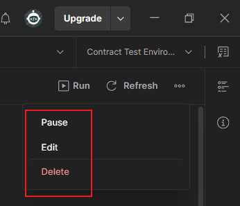

**图 10.13 可从主界面右上角的隐藏菜单中随时暂停（或恢复）、修改配置或删除该监视器**

> [!tip]
>
> **提示**
>
> Postman 客户端并未提供监视器的免费额度使用情况，具体需要到官网查看个人信息中的资源用量统计，入口如下所示：
>
> 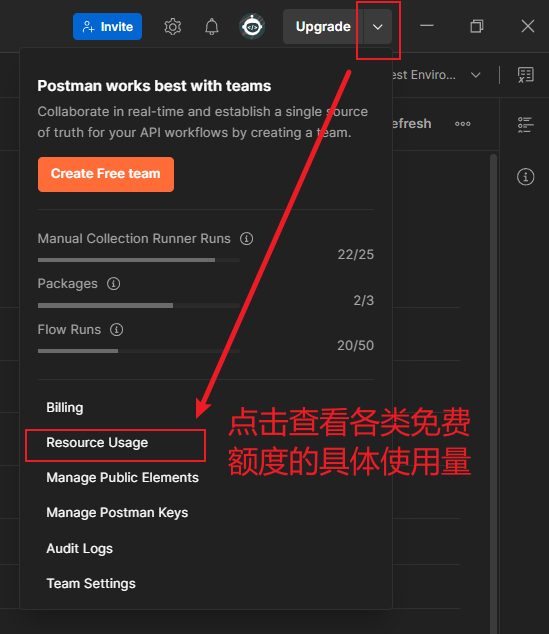
>
> **图 10.14 查看监视器免费运行次数的用量入口位置**

---

[^1]: 地区选择只对付费用户开放，免费用户只能由 `Postman` 自动分配区域；同时，`Postman` 免费用户仅有 1000 次免费运行次数限制，使用时务必留意。

