# 第十一章 测试现有的 API 接口


> **本章概要**
>
> - 在 API 接口中查找 Bug 的方法
> - API 测试的自动化
> - 自动化 API 测试演示
> - Postman 测试集合的共享设置

尽管每天都有很多 API 接口问世，但实际上很多接口的测试工作都做得不够充分。

本章将围绕示例项目 `todo-list-testing` [^1] 演示 API 接口自动化的相关配置与测试实践，其中包括在测试脚本中调用其他请求、完成接口鉴权等操作，具有一定的参考价值。

---


## 1 在 API 接口中查找 Bug 的方法

拿到一套 API 接口，应该先探索该接口，并尝试找出当中的漏洞（Bug）。这样做肯定很难，但 **感觉困难的时候也往往是学东西的时候**（深以为然）——

> ***It’s OK to feel a bit frustrated and lost sometimes as that is often when the most learning is happening!***

为此，作者还建议大家尝试一下，能否只通过接口调用让服务端返回 500 报错（别说还真有点难度）。

主动找 Bug 常问的几个问题（可自行扩充）：

- 哪些输入可能会对系统造成破坏？
- 如果修改或变更一个不存在的对象，会发生什么？
- 是否还有任何无效的、或意想不到的方式与该接口交互？
- 用户可能会有哪些意料外的操作？

接着，作者介绍了示例项目 `ToDo App` 的搭建过程、获取登录令牌的方法以及重置数据等操作。


### 1.1 示例项目搭建

通过 `GitPod` 在线运行该演示项目 ——

1. 启动线上 IDE：https://gitpod.io/#https://github.com/djwester/todo-list-testing；

2. 用 `GitHub` 帐号完成授权：

   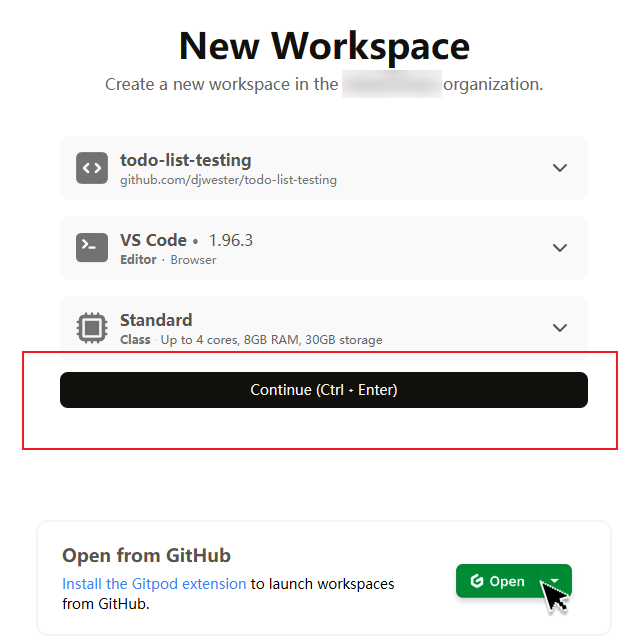

3. 启动项目：项目加载完毕后，在命令行运行 `make run-dev` 命令启动项目：

   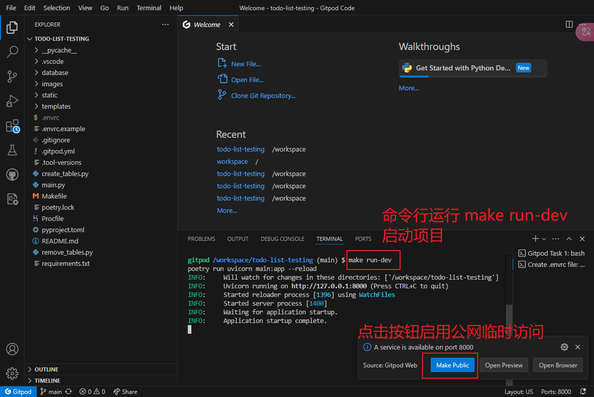

4. 然后切到 `PORTS` 标签，用临时生成的公网链接打开项目首页：

   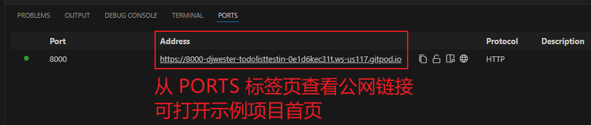

5. 实测项目首页效果如下：

   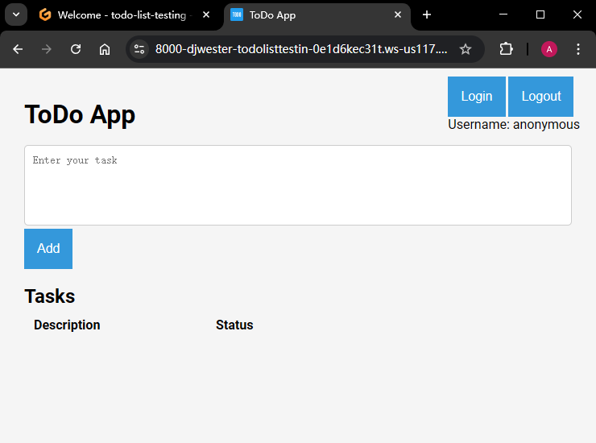

**图 11.1 示例项目 ToDo App 启动后的首页效果截图**


### 1.2 用 Postman 演示 CRUD 操作

接下来，作者演示了示例项目 CRUD 基础操作。`CRUD` 即待办项的新增（`Create`）、读取（`Retrieve`）、修改（`Update`）与删除（`Delete`）。具体操作步骤如下：

1. `Postman` 集合初始化：新建集合 `ToDo List API`，并定义集合变量 `base_url`，其值为当前项目的首页 URL（注意末尾不要带 `/`）：

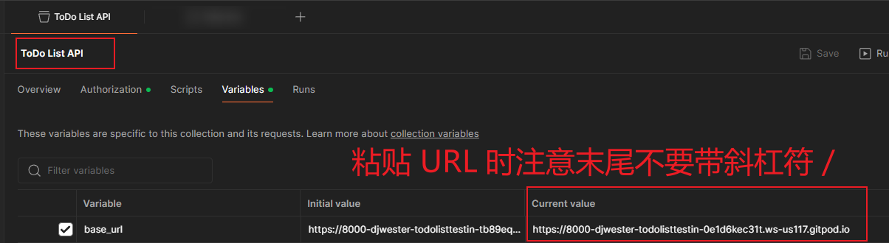

2. 读取（查询）演示：在测试集合下新建一个 `GET` 请求 `Get Tasks`，URL 填 `{{base_url}}/tasks`，发送后得到一个空数组：

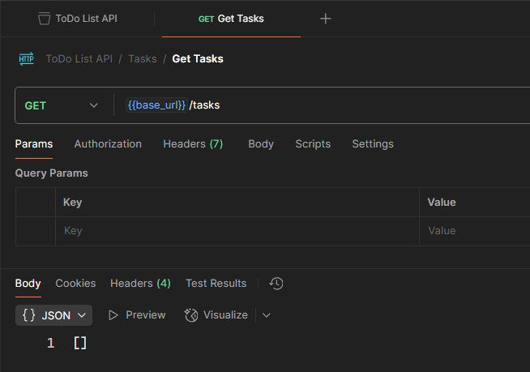

3. 新增演示：要新增一个待办事项，只需将 `GET` 请求直接改为 `POST`，并在请求 `Body` 中传入下列 `JSON` 内容即可：

```json
{
  "description": "Read this book",
  "status": "Draft",
  "created_by": "user1"
}
```

4. 添加成功后，再次用 `GET` 请求获取待办列表，获取新增待办任务的 ID 值（`1`）：

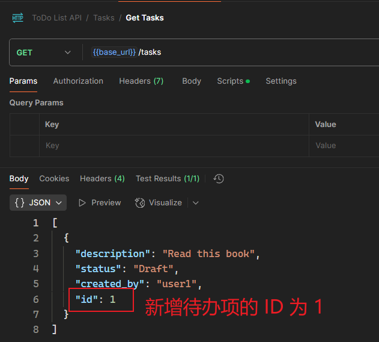

5. 任务修改演示：待办事项的修改通过 `PUT` 请求实现：先将 `URL` 改为 `{{base_url}}/tasks/1`，再把 `Body` 变为以下 `JSON` 内容，此时应该会得到一个 `422` 的报错响应（可能是 `Status` 的笔误，也可能是故意为之）：

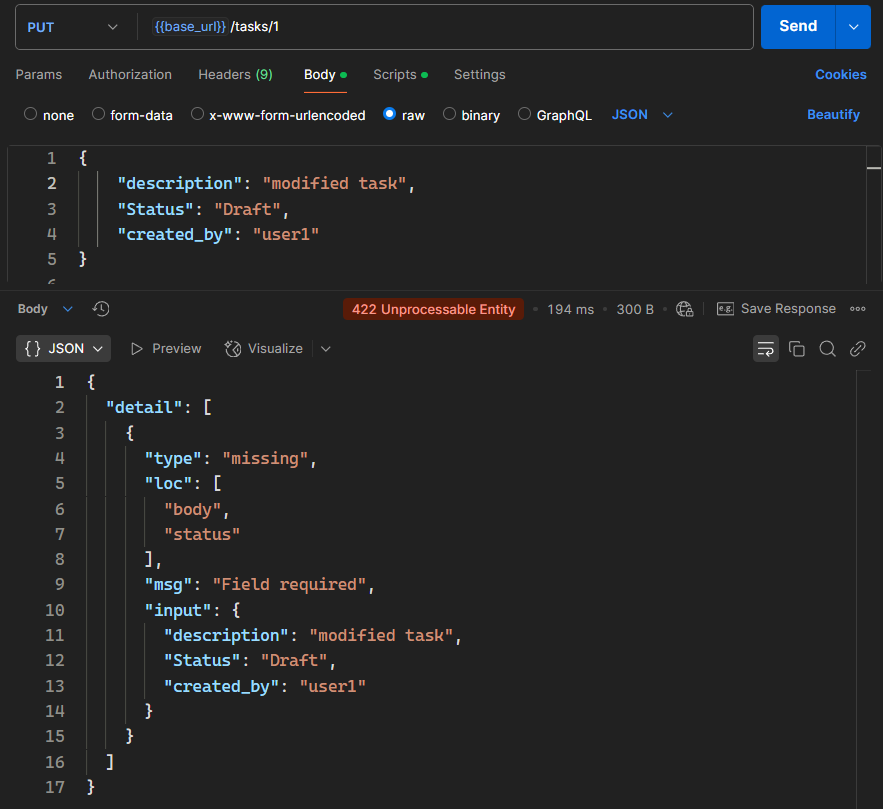

如果正确拼写 `status`，则会返回正常结果，待办项的描述和状态都修改成功了：

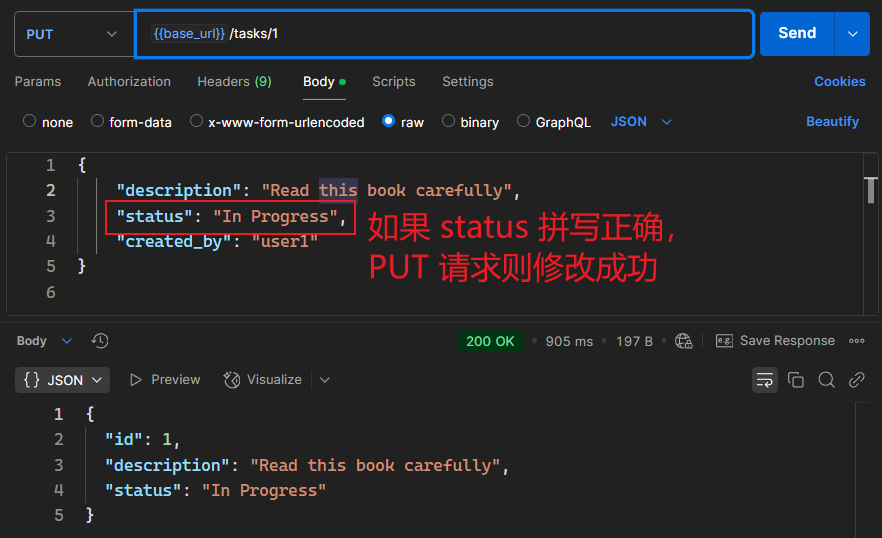

> [!note]
>
> **注意**
>
> 严格来说，`PUT` 请求会整体替换掉现有 `JSON`，即便要修改的只有一个字段；若要实现部分字段的修改，应该用 `PATCH` 请求。示例项目为了方便演示，并未对此加以区分。


6. 删除演示：按照作者的设计，任务删除前需要先登录，这可以通过 `PSOT /token` 接口实现——

   1. 创建一个 `POST` 请求 `Get Token`，`URL` 填 `{{base_url}}/token`；

   2. 请求参数为表单参数 `username=user1, password=12345`：

      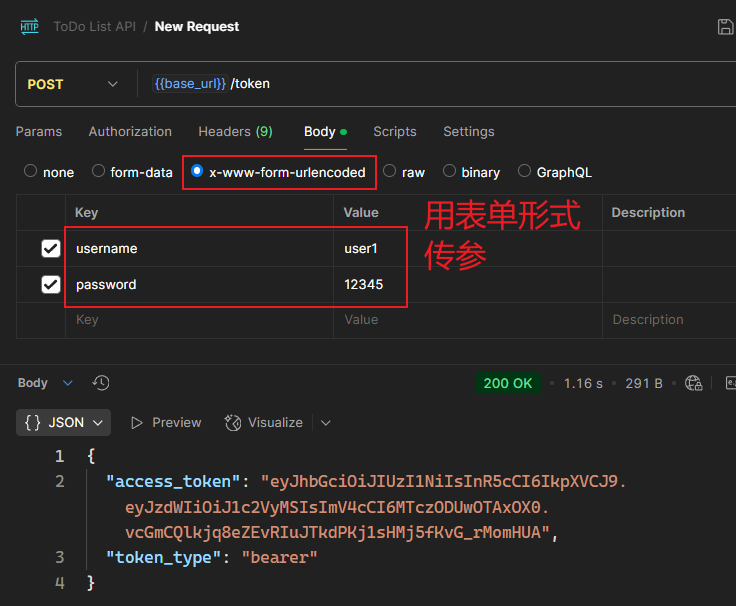

   3. 然后将得到的登录令牌粘贴到 `Postman` 的鉴权标签（`Authorization`），将请求方法改为 `DELETE`，再将 `URL` 改为 `{{base_url}}/tasks/1`，点击发送按钮，将会看到 `ID` 为 `1` 的待办项已经被成功删除了：

      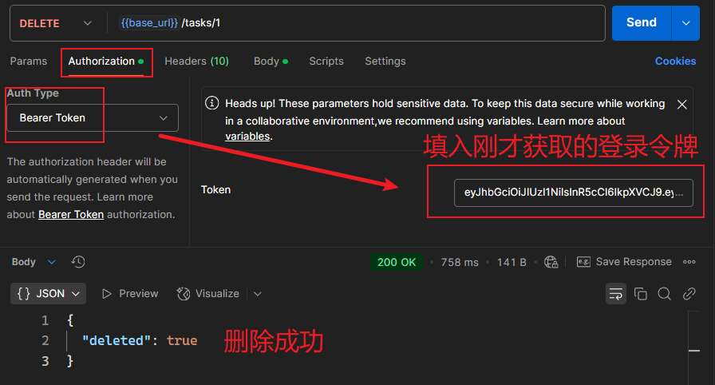

如果不携带登录令牌，则删除失败，提示未鉴权：

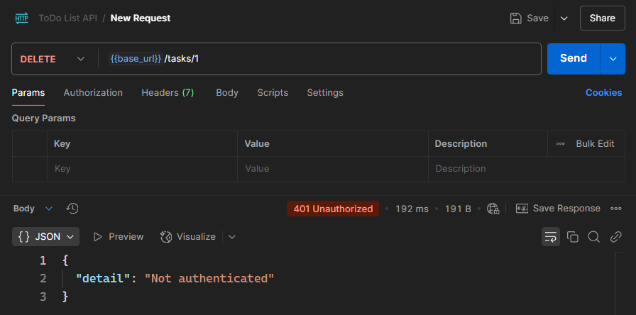


### 1.3 示例项目的重置方法

要一次性清空项目中的测试数据，需要先退出项目（<kbd>Ctrl</kbd> + <kbd>C</kbd>），再运行以下命令重置项目：

```bash
poetry run python remove_tables.py
```

实测如下：

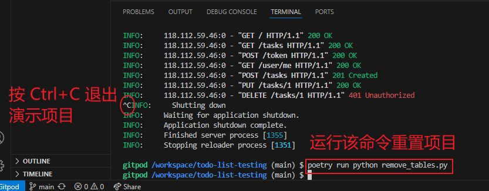

**图 11.2 示例项目 ToDo App 的数据重置方法演示**


### 1.4 查看示例项目的接口文档页

该示例项目还提供了基于最新 `OpenAPI 3.1` 规范的接口文档页。获取到首页的临时 URL 后，在后面追加 `/docs` 即可查看：

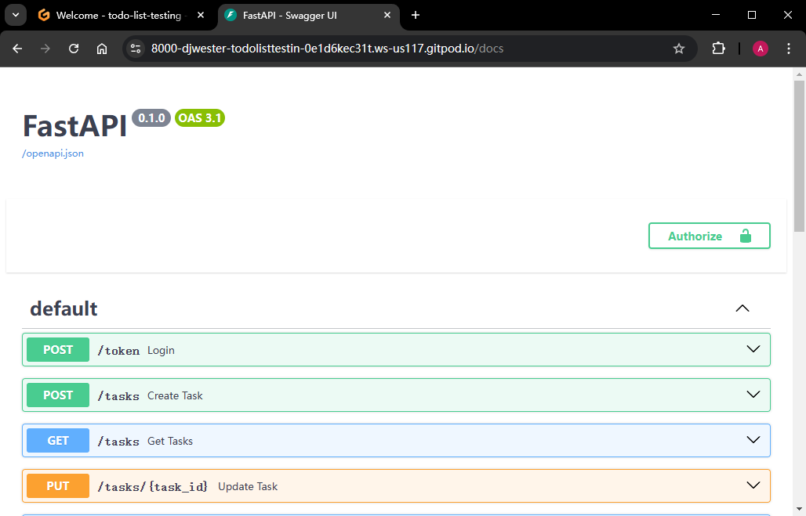

**图 11.3 示例项目 ToDo App 的配套接口文档页（基础 OpenAPI v3.1 规范）**


### 1.5 让后台报 500 错误的示例

最终，作者给出了让服务端报 500 错误的一个可能的情况：试图修改已删除或不存在的待办事项 ——

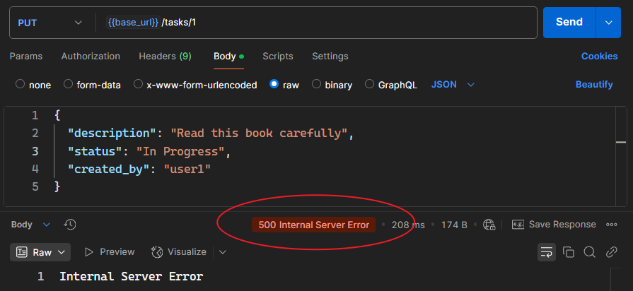

**图 11.4 通过修改并不存在的待办事项，示例项目后台将报 500 错误**


## 2 接口自动化测试的设计要领

本章精华在第三节接口自动化测试实战，在此之前，作者先介绍了一些核心设计原则。


### 2.1 自动化测试的重要性

- **测试覆盖**：确保每次代码变更后 API 的核心功能仍然正常工作。
- **测试类型**：
  - **冒烟测试**：快速验证 API 的基本功能是否正常。
  - **数据驱动测试**：通过 `CSV` 映射文件提供多组输入，减少重复测试脚本。


### 2.2 创建 Postman 集合

**集合结构的设计**：

- 按 API 端点（`Endpoint`）组织请求：`GET /tasks`、`POST /tasks`、`PUT /tasks/{id}` 等。
- 使用 **文件夹** 对不同测试进行分组，确保结构清晰，以便后续分组执行测试脚本。


**环境变量的设计**：

- 使用 `base_url` 变量存储 API 的基础 URL，便于在不同环境（如开发环境、生产环境）中切换。
- 使用 `task_id` 变量存储任务 ID，便于在多个请求中共享该数据。


### 2.3 编写测试脚本

**测试验证**：

- 检查响应状态码（如 `200`、`201`）。
- 验证响应体中的字段是否符合预期（如 `id`、`description`、`status` 等）。
- 使用 `pm.expect` 进行断言，确保 API 行为符合预期。


**共享测试逻辑**：

- 将通用测试逻辑（如字段检查）封装为函数，存储在 `Postman` 的私有模块（即 `package library`）中。
- 通过 `pm.require` 导入共享模块，减少代码重复。


### 2.4 清理测试数据

- **删除测试数据**：
  - 在 `POST` 请求的 `Post-response` 脚本中，使用 `pm.sendRequest` 调用 `DELETE` 请求，删除刚创建的任务。
  - 确保每次测试运行后，系统状态保持一致。


## 3 接口自动化测试实战

这部分是全章的精华，演示了作者实现接口自动化测试的大致流程。

首先是根据自己对接口的前期理解，绘制示例接口的工作原理图：

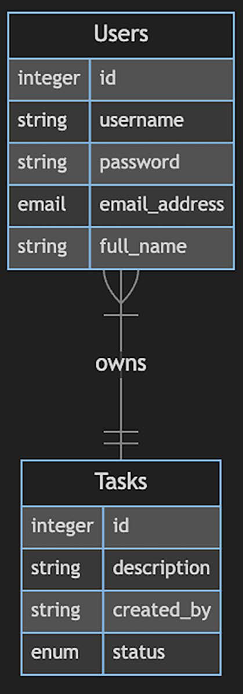

**图 11.5 作者根据接口文档页和自主探索确定的 API 接口工作原理图**

接着根据原理图分别列出相关的接口：

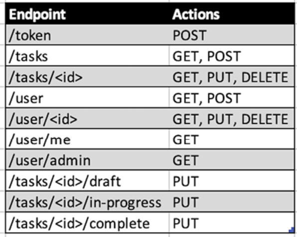

**图 11.6 根据 API 工作原理图确定的各待测端点（Endpoints）**

值得注意的是，最后三个端点是作者通过浏览器的开发者工具发现的，即 `Network` 标签页捕获到的隐藏接口。这充分说明了前期自主探索接口的必要性。

除了静态的单个端点需要测试，作者还针对可能出现的连续操作设置了专门的 `Workflows` 工作流文件夹，这一点值得借鉴。

最后给出的 `Postman` 测试集合结构如下：

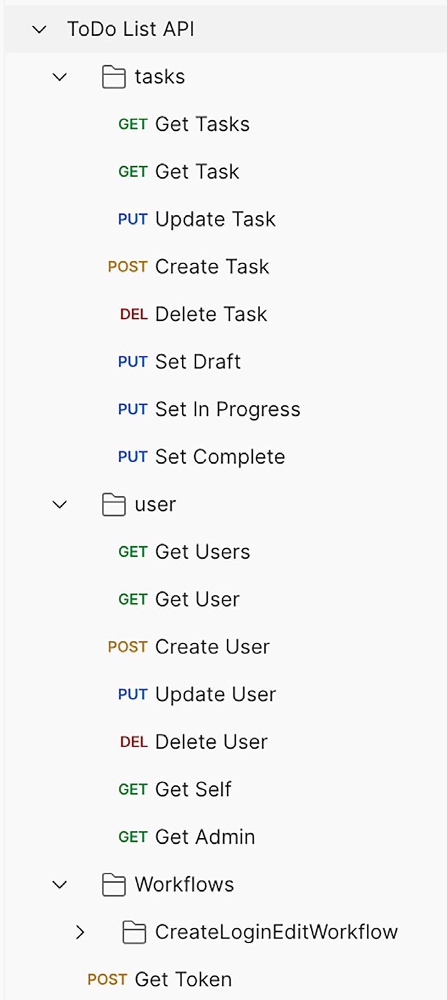

**图 11.7 用于接口自动化测试的 Postman 集合最终结构**


---

[^1]: 详见 `GitHub` 仓库：https://github.com/djwester/todo-list-testing。本地启动该项目需要一定的 Python 基础和 Django 框架基础，我实测时完全按 REAME 操作，但还是运行失败了，最终只能显示接口文档页，其他页面均报 500 错误，待后期 Python 基础打牢后再尝试离线部署。


