# 第十一章 测试现成的 API 接口


> **本章概要**
>
> - 在 API 接口中查找 Bug 的方法
> - API 测试的自动化
> - 自动化 API 测试演示
> - Postman 测试集合的共享设置

尽管每天都有很多 API 接口问世，但实际上很多接口的测试工作都做得不够充分。

本章将围绕示例项目 `todo-list-testing` [^1] 演示 API 接口自动化的相关配置与测试实践，其中包括在测试脚本中调用其他请求、完成接口鉴权等操作，具有一定的参考价值。

---


## 1 在 API 接口中查找 Bug 的方法

拿到一套 API 接口，应该先探索该接口，并尝试找出当中的漏洞（Bug）。这样做肯定很难，但 **感觉困难的时候也往往是学东西的时候**（深以为然）——

> ***It’s OK to feel a bit frustrated and lost sometimes as that is often when the most learning is happening!***

为此，作者还建议大家尝试一下，能否只通过接口调用让服务端返回 500 报错（别说还真有点难度）。

主动找 Bug 常问的几个问题（可自行扩充）：

- 哪些输入可能会对系统造成破坏？
- 如果修改或变更一个不存在的对象，会发生什么？
- 是否还有任何无效的、或意想不到的方式与该接口交互？
- 用户可能会有哪些意料外的操作？

接着，作者介绍了示例项目 `ToDo App` 的搭建过程、获取登录令牌的方法以及重置数据等操作。


### 1.1 示例项目搭建

通过 `GitPod` 在线运行该演示项目 ——

1. 启动线上 IDE：https://gitpod.io/#https://github.com/djwester/todo-list-testing；

2. 用 `GitHub` 帐号完成授权：

   

3. 启动项目：项目加载完毕后，在命令行运行 `make run-dev` 命令启动项目：

   

4. 然后切到 `PORTS` 标签，用临时生成的公网链接打开项目首页：

   

5. 实测项目首页效果如下：

   

**图 11.1 示例项目 ToDo App 启动后的首页效果截图**


### 1.2 用 Postman 演示 CRUD 操作

接下来，作者演示了示例项目 CRUD 基础操作。`CRUD` 即待办项的新增（`Create`）、读取（`Retrieve`）、修改（`Update`）与删除（`Delete`）。具体操作步骤如下：

1. `Postman` 集合初始化：新建集合 `ToDo List API`，并定义集合变量 `base_url`，其值为当前项目的首页 URL（注意末尾不要带 `/`）：


2. 读取（查询）演示：在测试集合下新建一个 `GET` 请求 `Get Tasks`，URL 填 `{{base_url}}/tasks`，发送后得到一个空数组：


3. 新增演示：要新增一个待办事项，只需将 `GET` 请求直接改为 `POST`，并在请求 `Body` 中传入下列 `JSON` 内容即可：

```json
{
  "description": "Read this book",
  "status": "Draft",
  "created_by": "user1"
}
```

4. 添加成功后，再次用 `GET` 请求获取待办列表，获取新增待办任务的 ID 值（`1`）：


5. 任务修改演示：待办事项的修改通过 `PUT` 请求实现：先将 `URL` 改为 `{{base_url}}/tasks/1`，再把 `Body` 变为以下 `JSON` 内容，此时应该会得到一个 `422` 的报错响应（可能是 `Status` 的笔误，也可能是故意为之）：


如果正确拼写 `status`，则会返回正常结果，待办项的描述和状态都修改成功了：


> [!note]
>
> **注意**
>
> 严格来说，`PUT` 请求会整体替换掉现有 `JSON`，即便要修改的只有一个字段；若要实现部分字段的修改，应该用 `PATCH` 请求。示例项目为了方便演示，并未对此加以区分。


6. 删除演示：按照作者的设计，任务删除前需要先登录，这可以通过 `PSOT /token` 接口实现——

   1. 创建一个 `POST` 请求 `Get Token`，`URL` 填 `{{base_url}}/token`；

   2. 请求参数为表单参数 `username=user1, password=12345`：

      

   3. 然后将得到的登录令牌粘贴到 `Postman` 的鉴权标签（`Authorization`），将请求方法改为 `DELETE`，再将 `URL` 改为 `{{base_url}}/tasks/1`，点击发送按钮，将会看到 `ID` 为 `1` 的待办项已经被成功删除了：

      

如果不携带登录令牌，则删除失败，提示未鉴权：


### 1.3 示例项目的重置方法

要一次性清空项目中的测试数据，需要先退出项目（<kbd>Ctrl</kbd> + <kbd>C</kbd>），再运行以下命令重置项目：

```bash
poetry run python remove_tables.py
```

实测如下：


**图 11.2 示例项目 ToDo App 的数据重置方法演示**


### 1.4 查看示例项目的接口文档页

该示例项目还提供了基于最新 `OpenAPI 3.1` 规范的接口文档页。获取到首页的临时 URL 后，在后面追加 `/docs` 即可查看：


**图 11.3 示例项目 ToDo App 的配套接口文档页（基础 OpenAPI v3.1 规范）**


### 1.5 让后台报 500 错误的示例

最终，作者给出了让服务端报 500 错误的一个可能的情况：试图修改已删除或不存在的待办事项 ——


**图 11.4 通过修改并不存在的待办事项，示例项目后台将报 500 错误**


## 2 接口自动化测试的设计要领

本章精华在第三节接口自动化测试实战，在此之前，作者先介绍了一些核心设计原则。


### 2.1 自动化测试的重要性

- **测试覆盖**：确保每次代码变更后 API 的核心功能仍然正常工作。
- **测试类型**：
  - **冒烟测试**：快速验证 API 的基本功能是否正常。
  - **数据驱动测试**：通过 `CSV` 映射文件提供多组输入，减少重复测试脚本。


### 2.2 创建 Postman 集合

**集合结构的设计**：

- 按 API 端点（`Endpoint`）组织请求：`GET /tasks`、`POST /tasks`、`PUT /tasks/{id}` 等。
- 使用 **文件夹** 对不同测试进行分组，确保结构清晰，以便后续分组执行测试脚本。


**环境变量的设计**：

- 使用 `base_url` 变量存储 API 的基础 URL，便于在不同环境（如开发环境、生产环境）中切换。
- 使用 `task_id` 变量存储任务 ID，便于在多个请求中共享该数据。


### 2.3 编写测试脚本

**测试验证**：

- 检查响应状态码（如 `200`、`201`）。
- 验证响应体中的字段是否符合预期（如 `id`、`description`、`status` 等）。
- 使用 `pm.expect` 进行断言，确保 API 行为符合预期。


**共享测试逻辑**：

- 将通用测试逻辑（如字段检查）封装为函数，存储在 `Postman` 的私有模块（即 `package library`）中。
- 通过 `pm.require` 导入共享模块，减少代码重复。


### 2.4 清理测试数据

- **删除测试数据**：
  - 在 `POST` 请求的 `Post-response` 脚本中，使用 `pm.sendRequest` 调用 `DELETE` 请求，删除刚创建的任务。
  - 确保每次测试运行后，系统状态保持一致。


## 3 接口自动化测试实战

这部分是全章的精华，演示了作者实现接口自动化测试的大致流程。

首先是根据自己对接口的前期理解，绘制示例接口的工作原理图：


**图 11.5 作者根据接口文档页和自主探索确定的 API 接口工作原理图**

接着根据原理图分别列出相关的接口：


**图 11.6 根据 API 工作原理图确定的各待测端点（Endpoints）**

值得注意的是，最后三个端点是作者通过浏览器的开发者工具发现的，即 `Network` 标签页捕获到的隐藏接口。这充分说明了前期自主探索接口的必要性。

除了静态的单个端点需要测试，作者还针对可能出现的连续操作设置了专门的 `Workflows` 工作流文件夹，这一点值得借鉴。

最后给出的 `Postman` 测试集合结构如下：


**图 11.7 用于接口自动化测试的 Postman 集合最终结构**


### 3.1 测试环境的改造

根据前面的设计，下一步应该逐一输入每个接口的 `URL`、请求参数等等。为方便管理，应该将通用参数放到放到专门的测试环境中，其中包括：

- `base_url`：从集合变量迁移到专门的环境中，便于统一管理；
- `task_id`：待测试的单个待办项 ID。其值随着测试的进行，很可能不为 1；
- `CALL`：这是两个版本中都有提及、却未能补充说明的一个神秘变量。经本人实测，应该是方便后期临时新建某个请求，并通过该变量实现请求方式而动态切换，相当于解耦请求方法。例如按如下方式对 `CALL` 变量赋初值 `GET`：

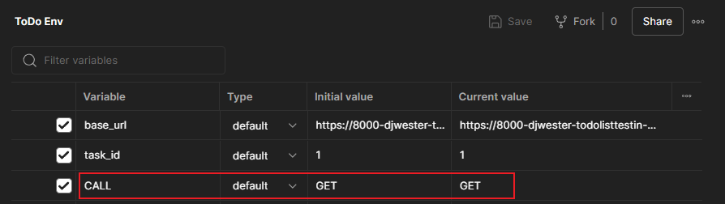

CALL 变量的用法如下所示：

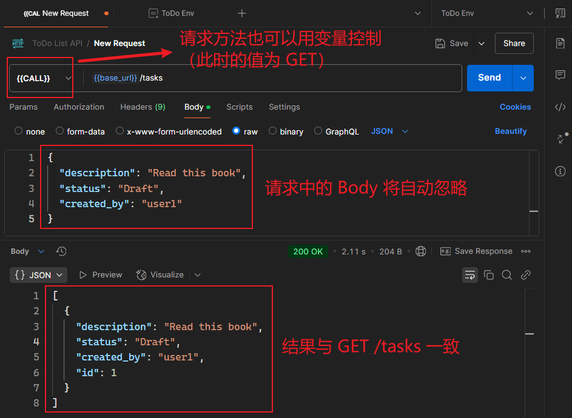

不过，这种动态调用方式可能有违 `Postman` 接口测试最佳实践，在本书的两个版本中都没有做进一步说明。

> [!important]
>
> **关于测试环境的几点重要说明**
>
> 1. 对请求方法使用变量：经实测，在 `Postman` 的请求方法上使用变量时，
>
>    1. 该变量名必须全部大写（`CALL`）；
>    2. 但是变量的值可以是小写（`get` / `post` 均可）；
>
> 2. 变量的初始值与当前值的区别：
>
>    1. 根据书中观点，初始值仅用于给人们提供参考，使用时只用当前值（没说到点子上）；
>    2. 而根据 `Postman` [官方文档](https://learning.postman.com/docs/sending-requests/variables/variables/#initial-and-current-values)，初始值（`Initial value`）会同步到 `Postman` 服务器，因此不宜存放敏感信息。确需共享敏感信息，建议将其类型设为 `secret`；
>    3. 当前值（`Current value`）不会同步到 `Postman` 服务器，这些值仅在本地持久化，数据会相对安全些。
>    4. 如果后期需要频繁使用敏感信息，建议还是将变量放入 `vault` 作用域，这样可实现加密存储，以确保敏感数据的安全性。例如：
>
>    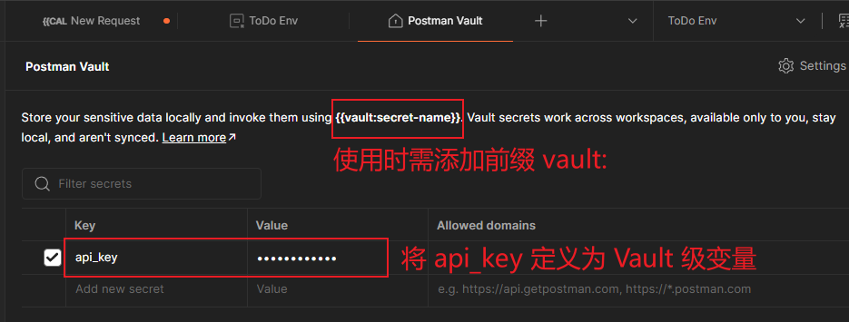
>
>    **图 11.8 利用 Vault 级变量实现数据的加密存储，甚至可以限定域名，且不会同步到 Postman 服务器**


### 3.2 对列表查询接口的测试

接口测试不宜大而全，而应该小步走、多迭代。

对于列表查询类接口 `GET /tasks`，可以先硬编码，然后再重构成较灵活的形式。例如先对第一个元素进行检查：

```js
const tasks = pm.response.json();
const firstTask = {
    "id": 77,
    "description": "Learn API Testing",
    "status": "Complete",
    "created_by": "user1"
}
pm.test("Check first task data", function () {   
    // Assume that the first task won't change
    pm.expect(tasks[0]).to.eql(firstTask);
});
```

上述测试存在明显硬伤：列表的第一个待办项很可能会变化。于是可以略作调整，由元素值绝对相等改为对 `key` 集的检查：

```js
pm.test("Check that the first task has required fields", function () {
    const taskKeys = Object.keys(jsonData[0]);
    pm.expect(taskKeys).to.have.members(
        ['id','description', 'status','created_by']);
});
```


### 3.3 对查询单个实例的测试

对于单个待办事项的查询接口 `GET /tasks/{{task_id}}`，其测试逻辑与列表类似，都需要对目标对象的 `key` 集进行检查。这就涉及重复代码的共享，此时可以将通用脚本放到同一个 **文件夹** 的 `Post-response` 层。但示例项目的特殊性在于，列表返回的是一个集合对象（数组）、单个查询只返回一个元素，不能简单共享所有脚本。

此时就不能用文件夹共享脚本了，但可以利用 `Postman` 全新的私有仓库（`package library`）导出一个私有的 `package` 包，例如命名为 `common-tests`：

```js
// in common-tests module
function checkTaskFields(task) {
  const taskKeys = Object.keys(task);
  pm.expect(taskKeys).to.have.members([
    'id', 'status', 'description', 'created_by'
  ]);
}
module.exports = {
  checkTaskFields
}

// in Post-response tag
const { checkTaskFields } = pm.require('common-tests');

const [task] = pm.response.json();
pm.test("Check first task field", function () {
    checkTaskFields(task);
});
```


### 3.4 对新增接口的测试

对于新增接口 `POST /tasks`，与查询接口最大的不同在于，出于测试目的新增的临时数据，需要在完成测试后及时清空，即调用删除接口。这样就需要先获取登录令牌。调用登录接口 `POST /token` 后，需将获取的令牌存入环境变量（例如 `token`）：

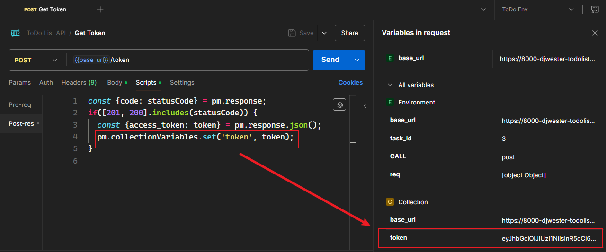

**图 11.9 调用登录接口后，将获取的令牌存入 token 变量**

注意，这里的 `token` 作用域无论是集合层还是环境层都行，只是放到集合层的语义更好（测试环境可以指定给其他集合，容易引发不必要的冲突）。

这样新增接口就暗含一个前提：需要提前登录换取令牌（也很合理）。

于是，新增接口的测试脚本可以这样写：

```js
const { checkTaskFields } = pm.require('common-tests');

// check for task keys
const task = pm.response.json();
pm.test('Task has a id', function() {
  checkTaskFields(task);
});

// clean up test data
const base_url = pm.environment.get('base_url');
const {id: task_id} = task;
const token = pm.environment.get('token');
const auth = {
  type: 'bearer',
  bearer: [{
    key: 'token',
    value: `${token}`,
    type: 'string'
  }]
};
pm.sendRequest({
  url: `${base_url}/tasks/${task_id}`,
  method: 'DELETE',
  auth
}, function(err, response) {
  if(err) {
    console.error(err);
    return;
  }
  pm.expect(response.status).to.eql('OK');
});
```

实测结果：

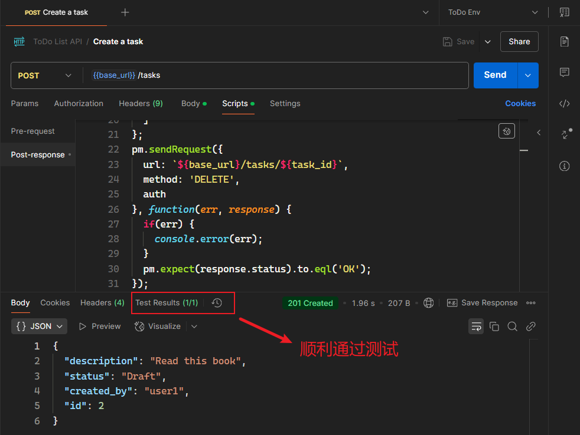

**图 11.10 包含数据清理逻辑的新增接口实测结果**

为了验证上图中新增的 `ID` 为 `2` 任务已被成功删除，可以再查一次列表：

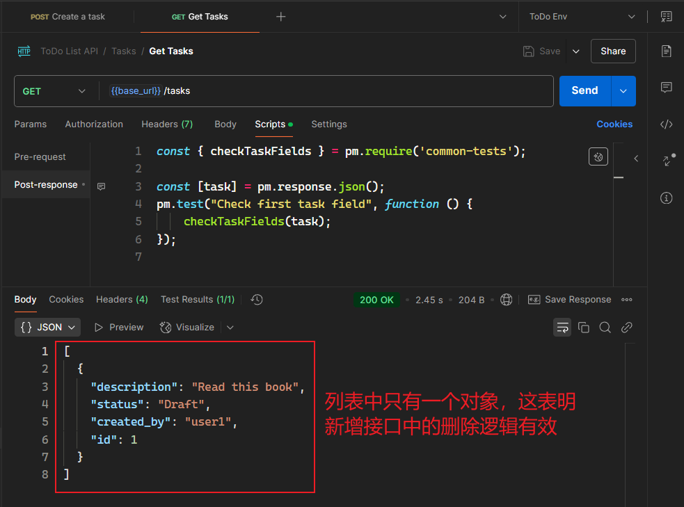

**图 11.11 测试完新增接口，再次调用查询接口，以验证新增接口中的数据清空逻辑是否生效（确已生效）**

最后还需要注意，在新增接口的 `Authorization` 标签中配置登录令牌，表示只有登录成功的用户才可新增待办事项：

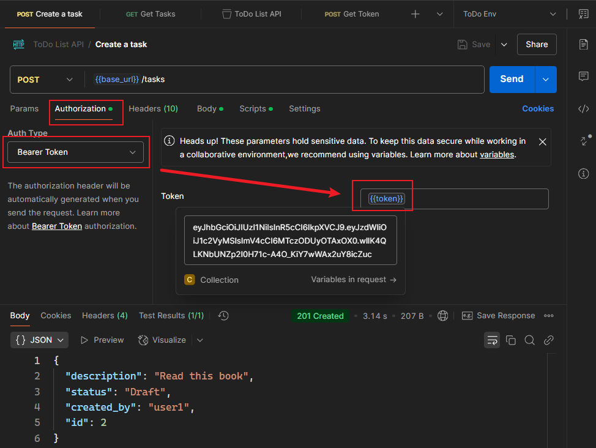

**图 11.12 根据获取到的 token 配置新增接口的鉴权类型**


### 3.5 对修改接口的测试

而对于修改接口 `PUT /tasks/{{task_id}}` 的测试，则需要先满足两个前提：

- 用户已登录；
- 已生成转为修改接口新增的测试数据；

第一项很好实现，直接配置 `Authorization` 标签即可。

第二项则需要先调新增接口，成功后再对临时新增的数据进行修改。怎样复用新增接口中的创建任务逻辑、同时又不触发新增接口中的测试脚本呢？

这里作者采用了一个非常巧妙的设计：在新增接口的测试脚本末尾，将当前请求直接存入一个环境变量（`req`）：

```js
pm.environment.set('req', pm.request)
```

实际效果如下图所示：

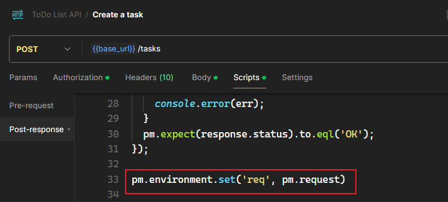

**图 11.13 改造新增接口的测试逻辑，在末尾将本次请求直接存入变量 req 中**

然后转到修改接口的 `Pre-request` 选项卡，读取 `req` 的值并通过脚本调用新增接口，新增结束后，再将任务 `ID` 更新到 `task_id` 中：

```js
// use the 'Create a task' to create a task & set its task_id
pm.sendRequest(
  pm.environment.get('req'),
  function(err, resp) {
    if(err) {
      console.error(err);
      return;
    }
    const {id: task_id} = resp.json();
    pm.environment.set('task_id', task_id);
  }
)
```

最后切到 `Post-response` 选项卡，对修改后的内容进行测试：

```js
pm.test('Description matches what was set', function() {
  const { description } = pm.response.json();
  pm.expect(description).to.eql('modified task')
});
```

实测效果：

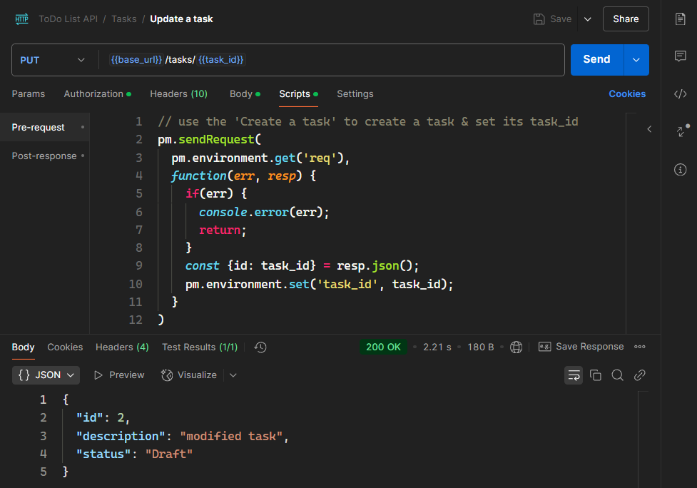

**图 11.14 包含提前新增数据的修改接口测试结果截图**

也可以在浏览器中查看修改结果：

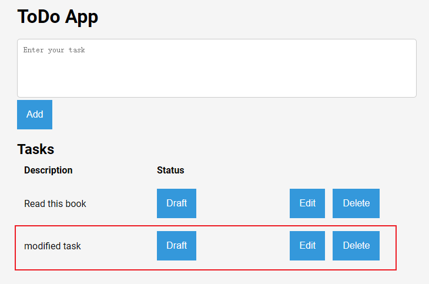

**图 11.15 从浏览器再次验证修改接口的测试逻辑（先新增一条，再进行修改。符合预期）**


### 3.6 对删除接口的测试

延用修改接口的测试思路，删除接口 `DELETE /tasks/{{task_id}}` 的测试流程设计如下：

1. 配置 `Authorization` 鉴权选项；（与新增、修改接口一致）
2. 发送请求前先新增一条临时数据，并将其 ID 更新到 `task_id` 变量中；（与修改接口一致）
3. 执行删除后，检查响应码是否正常；
4. 随即利用 `task_id` 调用单个实例的查询接口，验证是否删除成功。

首先配置登录令牌：

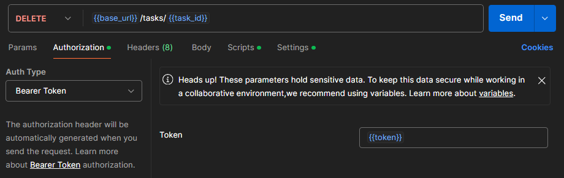

**图 11.16 为删除接口配置登录令牌**

然后设置请求前脚本：

```js
pm.sendRequest(
  pm.environment.get('req'),
  function(err, resp) {
    if(err) {
      console.error(err);
      return;
    }
    const { id: task_id } = resp.json();
    pm.environment.set('task_id', task_id);
  }
);
```

接着是删除请求响应后的测试脚本：

```js
pm.test("Status code is 201 or 200", function () {
    pm.expect(pm.response.code).to.be.oneOf([200, 201]);
});

const base_url = pm.environment.get('base_url');
const task_id = pm.environment.get('task_id');
pm.sendRequest({
  url: `${base_url}/tasks/${task_id}`,
  method: 'GET'
}, function(err, resp) {
  if(err) {
    console.error(err);
    return;
  }
  console.log(`resp.status: ${resp.status}`);
  pm.expect(resp.status).to.eql('Not Found');
});
```

实测结果如下：

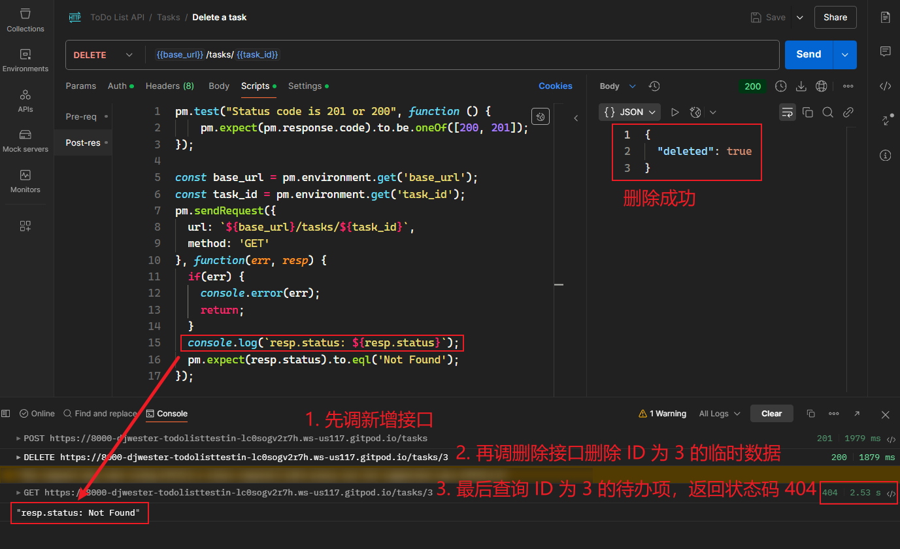

**图 11.17 先新增、再删除、最后再查询验证的删除接口实测效果图**

此外，也可以从线上的 `GitPod` 后台看到三次请求的日志信息：

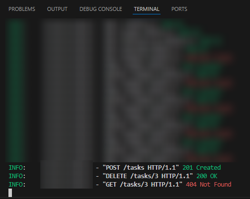

**图 11.18 从 GitPod 看到的删除接口实测日志信息截图**


## 4 测试集合的共享操作

### 4.1 分享 Postman 集合

**公开分享**：

- 将集合和环境移至公共工作区（public workspace）。
- 生成公共链接或嵌入代码，方便他人访问。

**注意事项**：

- 确保不泄露敏感信息（如 API 密钥、内部数据）。
- 遵循组织的安全政策。

> [!tip]
>
> **备注**
>
> 经本地实测，共享测试集合的操作非常简单，都是可视化的流程；只不过要是之前的工作区为 **仅本人可见**，则 `Postman` 会默认共享到某个小组，并让你输入组员帐号；否则需要先将该集合、环境移动到一个公共空间，再点共享：
>
> 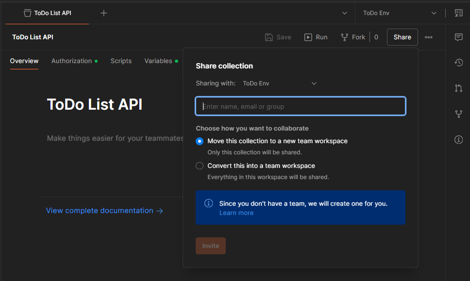
>
> 唯一需要注意的是，此前创建的私有模块、公共函数等脚本在共享时都将失效（私有模块暂不支持共享操作）。


### 4.2 使用 GitHub 展示

- **创建 GitHub 仓库**：
  - 上传 `Postman` 集合和环境文件。
  - 使用 `Markdown` 编写文档，说明测试用例和运行方法。


---

[^1]: 详见 `GitHub` 仓库：https://github.com/djwester/todo-list-testing。本地启动该项目需要一定的 Python 基础和 Django 框架基础，我实测时完全按 REAME 操作，但还是运行失败了，最终只能显示接口文档页，其他页面均报 500 错误，待后期 Python 基础打牢后再尝试离线部署。


