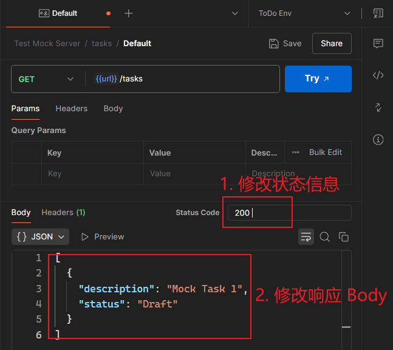

# 第十二章 模拟服务器（Mock servers）在 Postman 中的创建与用法


> **本章概要**
>
> - 模拟服务器的概念
> - 在 `Postman` 创建模拟服务器的方法
> - 在 `Postman` 设置模拟数据的方法

`Postman` 中的模拟服务器（mock server）经过不断地完善，现在已经比刚推出时好用很多了。本章内容看似很多，其实核心知识点只有几个。重点把握模拟服务器的工作原理和常见的数据模拟方法即可。

---


## 1 模拟服务器的概念

**基本概念**：

- 本书中的模拟服务器（mock server），特指 API 接口的模拟服务器；
- 主要用途：模拟真实 API 服务器，可返回预设的 **硬编码** 响应。
- 既可以模拟单一端点（简单），也可以模拟多个端点（复杂），复杂程度取决于要测试的目标。

**Mock 服务器的常见应用场景：**

1. 目标应用引入了第三方 API，但又不想为了测试专门去调该接口；
2. 前端需要测试，但后端接口尚未就绪时；
3. 进行与后端隔开的 UI 测试时（假设架构支持），通过 Mock 服务器提高测试速度与稳定性；
4. 需要模拟特定错误场景来测试前端的响应时。

**其他注意事项：**

- Mock 服务器需要定期更新，以保持与真实服务的一致性。
- 要确保模拟数据的准确性，避免测试结果出现偏差。


## 2 模拟服务器的创建

### 2.1 开启侧边栏

首先开启 `Mock servers` 侧边栏：


**图 12.1 点击侧边栏配置图标，并开启 Postman 模拟服务器侧边栏**


### 2.2 模拟服务器的两种创建方式

创建模拟服务器的方法主要有 **两种**：

1. 从专门的 `Mock servers` 侧边栏创建：

   

2. 从 `Collection` 测试集合中创建：

   

具体创建根据界面提示进行即可，都没有什么难度。


书中演示的是第一种，并且是从同步创建一个新的 `Collection` 集合开始：


**图 12.2 Postman 模拟服务器创建页面详解**


### 2.3 私有模拟器的 API 秘钥的用法

最后一项可将该模拟服务器变为私有服务器，除非提供有效的 API 秘钥，否则任何人都无法访问。API 秘钥通过个人帐号的设置页（`https://web.postman.co/settings/me/api-keys`）创建：


**图 12.3 设置私有模拟服务器时需要的 API 秘钥的创建页面截图**

创建好后，将秘钥存为一个变量（如 `api_key`），然后在测试请求的 `Authorization` 标签作如下配置即可：


**图 12.4 用于访问私有模拟服务器的 API 秘钥的具体用法示例**


## 3 常见的模拟服务器用法演示


### 3.1 Mock 服务器的工作原理

按照刚才的流程创建出 Mock 服务器后，`Postman` 会自动生成一个同名的 `Collection` 测试集合，并在该集合下创建一个名为 `url` 的变量存放其基础 URL，操作起来很轻松（`Mock server` 和 `Collection` 尽管同名，但各自的图标有所不同）：


**图 12.5 创建好 Mock 服务器后，Postman 会自动创建同名集合与 url 变量**

在 `Postman` 中使用 Mock 服务器，其实就是通过对 **请求示例** 的各种配置，实现各种想要的 **响应效果**：


**图 12.8 在 Postman 使用 Mock 服务器的基本流程**


### 3.2 模拟 GET 请求：生成指定的响应内容

通过修改请求示例的状态码和响应正文（`Body`），可以模拟想要的响应内容：



**图 12.9 修改请求示例的响应内容截图**

注意，修改示例后 **一定要保存，否则修改内容无法生效**！

另外，响应正文的 `JSON` 代码也支持 <kbd>Alt</kbd> + <kbd>Shift</kbd> + <kbd>F</kbd> 格式化，与 `VSCode` 一致，非常贴心。


### 3.3 模拟报 500 错误码的请求

除了模拟正常情况，还可以新增一个示例，模拟请求报 500 错误的情况。方法只需两步：

1. 新建一个示例（Example），状态码改为 500，响应内容自拟；
2. 在测试请求的请求头添加 `x-mock-response-code` 属性，值设为 `500` 即可；

示例的设置如下：


对应的请求设置及测试结果如下：


### 3.4 模拟路径参数

需求：从路径中获取 `task_id`，并将该信息放入响应正文中。

方法：

1. 定义示例：

   1. URL 改为 `{{url}}/tasks/{{task_id}}`；

   2. 状态码暂定 200；

   3. 在响应正文中通过以下语法引用 `task_id`：

      ```json
      {
        "description":"Mock Task {{task_id}}",
        "status":"Draft"
      }
      ```

2. 修改测试请求：URL 直接写 `{{url}}/tasks/{{task_id}}` 即可。

实测情况：


**图 12.10 路径参数的定义和获取该参数的写法示例**


**图 12.11 实测请求参数的定义与捕获情况（符合预期）**

