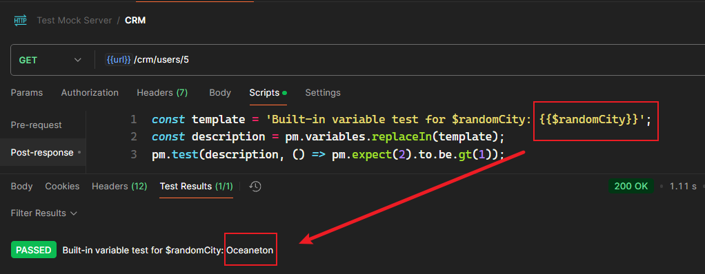

# 第十二章 模拟服务器（Mock servers）在 Postman 中的创建与用法


> **本章概要**
>
> - 模拟服务器的概念
> - 在 `Postman` 创建模拟服务器的方法
> - 在 `Postman` 设置模拟数据的方法

`Postman` 中的模拟服务器（mock server）经过不断地完善，现在已经比刚推出时好用很多了。本章内容看似很多，其实核心知识点只有几个。重点把握模拟服务器的工作原理和常见的数据模拟方法即可。

---


## 1 模拟服务器的概念

**基本概念**：

- 本书中的模拟服务器（mock server），特指 API 接口的模拟服务器；
- 主要用途：模拟真实 API 服务器，可返回预设的 **硬编码** 响应。
- 既可以模拟单一端点（简单），也可以模拟多个端点（复杂），复杂程度取决于要测试的目标。

**Mock 服务器的常见应用场景：**

1. 目标应用引入了第三方 API，但又不想为了测试专门去调该接口；
2. 前端需要测试，但后端接口尚未就绪时；
3. 进行与后端隔开的 UI 测试时（假设架构支持），通过 Mock 服务器提高测试速度与稳定性；
4. 需要模拟特定错误场景来测试前端的响应时。

**其他注意事项：**

- Mock 服务器需要定期更新，以保持与真实服务的一致性。
- 要确保模拟数据的准确性，避免测试结果出现偏差。
- `Postman` 对普通用户仅提供每月累计 1000 次的模拟服务器总调用额度（注意：是对所有服务器的总调用次数），想要更多调用次数只能开通会员，或者换用其他免费帐号。


## 2 模拟服务器的创建

### 2.1 开启侧边栏

首先开启 `Mock servers` 侧边栏：


**图 12.1 点击侧边栏配置图标，并开启 Postman 模拟服务器侧边栏**


### 2.2 模拟服务器的两种创建方式

创建模拟服务器的方法主要有 **两种**：

1. 从专门的 `Mock servers` 侧边栏创建：

   

2. 从 `Collection` 测试集合中创建：

   

具体创建根据界面提示进行即可，都没有什么难度。


书中演示的是第一种，并且是从同步创建一个新的 `Collection` 集合开始：


**图 12.2 Postman 模拟服务器创建页面详解**


### 2.3 私有模拟器的 API 秘钥的用法

最后一项可将该模拟服务器变为私有服务器，除非提供有效的 API 秘钥，否则任何人都无法访问。API 秘钥通过个人帐号的设置页（`https://web.postman.co/settings/me/api-keys`）创建：


**图 12.3 设置私有模拟服务器时需要的 API 秘钥的创建页面截图**

创建好后，将秘钥存为一个变量（如 `api_key`），然后在测试请求的 `Authorization` 标签作如下配置即可：


**图 12.4 用于访问私有模拟服务器的 API 秘钥的具体用法示例**


## 3 常见的模拟服务器用法演示


### 3.1 Mock 服务器的工作原理

按照刚才的流程创建出 Mock 服务器后，`Postman` 会自动生成一个同名的 `Collection` 测试集合，并在该集合下创建一个名为 `url` 的变量存放其基础 URL，操作起来很轻松（`Mock server` 和 `Collection` 尽管同名，但各自的图标有所不同）：


**图 12.5 创建好 Mock 服务器后，Postman 会自动创建同名集合与 url 变量**

在 `Postman` 中使用 Mock 服务器，其实就是通过对 **请求示例** 的各种配置，实现各种想要的 **响应效果**：


**图 12.8 在 Postman 使用 Mock 服务器的基本流程**


### 3.2 模拟 GET 请求：生成指定的响应内容

通过修改请求示例的状态码和响应正文（`Body`），可以模拟想要的响应内容：


**图 12.9 修改请求示例的响应内容截图**

注意，修改示例后 **一定要保存，否则修改内容无法生效**！

另外，响应正文的 `JSON` 代码也支持 <kbd>Alt</kbd> + <kbd>Shift</kbd> + <kbd>F</kbd> 格式化，与 `VSCode` 一致，非常贴心。


### 3.3 模拟报 500 错误码的请求

除了模拟正常情况，还可以新增一个示例，模拟请求报 500 错误的情况。方法只需两步：

1. 新建一个示例（Example），状态码改为 500，响应内容自拟；
2. 在测试请求的请求头添加 `x-mock-response-code` 属性，值设为 `500` 即可；

示例的设置如下：


对应的请求设置及测试结果如下：


### 3.4 模拟路径参数

需求：从路径中获取 `task_id`，并将该信息放入响应正文中。

方法：

1. 定义示例：

   1. URL 改为 `{{url}}/tasks/{{task_id}}`；

   2. 状态码暂定 200；

   3. 在响应正文中通过以下语法引用 `task_id`：

      ```json
      {
        "description":"Mock Task {{task_id}}",
        "status":"Draft"
      }
      ```

2. 修改测试请求：URL 直接写 `{{url}}/tasks/{{task_id}}` 即可。

实测情况：


**图 12.10 路径参数的定义和获取该参数的写法示例**


**图 12.11 实测请求参数的定义与捕获情况（符合预期）**


### 3.5 模拟从请求 JSON 中提取信息

需求：从创建待办事项的 `POST` 请求体 `JSON` 中，提取 `description` 和 `status` 字段信息，并作为响应内容的一部分。

方法：

1. 创建一个名为 `Create Task` 的 `POST` 请求：`URL` 设为 `{{url}}/tasks`，状态栏填 `201 Created`，请求体的 `JSON` 内容如下：

   ```json
   {
     "description": "Read this book",
     "status": "Draft",
     "created_by": "user1"
   }
   ```

2. 再在该请求下创建一个同名示例 `Create Task`，其请求方式、`URL`、状态信息均与上述请求一致，唯独响应体内容不同：

   ```json
   {
     "description": "{{ $body 'description' }}",
     "status": "{{ $body 'status' }}"
   }
   ```

   

3. 保存示例，回到 `POST` 请求，发送请求即可看到如下效果：

   

> [!important]
>
> **重要提示**
>
> `$body` 是 Postman 引用请求体对象的固定写法；访问其中的某个属性要写成 `{{ $body 'key_name' }}` 的形式，并且为了返回正确的数据类型，括号两边必须加引号，这一点书中是忽略的，很容易出现类型报错。


### 3.6 模拟 PUT 请求

除了引用请求体的属性值，`Postman` 还支持对该属性设置默认值。例如，需要响应的 `JSON` 包含两个字段 `description` 和 `status`，示例还可以这样设置默认值：

```json
{
    "description": "{{$body 'description' 'Mock Task {{task_id}}'}}",
    "status": "{{$body 'status' 'Draft'}}"
}
```

上述代码中，如果请求体的 `description` 字段有效，则使用该字段值，否则以默认值 `"Mock Task {{task_id}}"` 进行响应，这里的 `{{task_id}}` 即上面演示过的路径参数。同理，如果 `status` 能拿到有效值，则响应时返回对应的 `status` 属性值，否则按默认值 `"Draft"` 处理。

实测示例：


实测请求1：两个属性值均有效


实测请求2：仅 `description` 有效


实测请求3：仅 `status` 有效


> [!tip]
>
> **注意**
>
> 经实测，`Postman` 判定某个字段是否有效的方法，其实就是看该字段是否存在。如果存在，但赋值为 `""`、`null`、`"undefined"`，都会被视为有效值，如果不符合 `JSON` 语法规范，则会直接报 400 错误：
>
> 
>
> **图 12.12 违反 JSON 语法规范强行发送请求，Postman 将按 400 报错处理**


### 3.7 模拟第三方接口返回随机数据

`Postman` 内置了大量随机变量，以应对各种需要设置随机值的情况，例如城市名称 `$randomCity`、基于 `uuid-v4` 的唯一标识字符串 `$guid` 等，底层参考的是著名的第三方前端随机模块 `Faker`（详见：[https://www.npmjs.com/package/@faker-js/faker](https://www.npmjs.com/package/@faker-js/faker)）。更多内置变量列表及用法，详见 `Postman` 官方文档：[https://learning.postman.com/docs/tests-and-scripts/write-scripts/variables-list/](https://learning.postman.com/docs/tests-and-scripts/write-scripts/variables-list/)。

书中给出的示例写法为：

```json
{
    "country": "US",
    "city": "{{$randomCity}}",
    "language": "en_US",
    "street": "{{$randomStreetAddress}}",
    "Currency": "USD",
    "id": "738964000000291009",
    "state": "New York",
    "first_name": "{{$randomFirstName}}",
    "email": "{{$randomEmail}}",
    "zip": 12345,
    "created_time": "{{$randomDateRecent}}",
    "last_name": "{{$randomLastName}}",
    "time_zone": "GMT",
    "phone": "{{$randomPhoneNumber}}",
    "dob": "{{$randomDatePast}}",
    "status": "active"
}
```

可以得到如下结果：

```json
{
  "country": "US",
  "city": "East Hardyshire",
  "language": "en_US",
  "street": "73801 Isadore Villages",
  "Currency": "USD",
  "id": "738964000000291009",
  "state": "New York",
  "first_name": "Kylie",
  "email": "Piper1@hotmail.com",
  "zip": 12345,
  "created_time": "Sun Feb 02 2025 20:49:40 GMT+0000 (Coordinated Universal Time)",
  "last_name": "Purdy",
  "time_zone": "GMT",
  "phone": "676-353-0567",
  "dob": "Thu Jan 09 2025 19:30:06 GMT+0000 (Coordinated Universal Time)",
  "status": "active"
}
```

实测截图：


> [!tip]
>
> **注意**
>
> `Postman` 中的内置随机变量还可以用在测试脚本中，通过 `pm.variables.replaceIn()` 函数进行访问，例如：`pm.variables.replaceIn('{{$randomFirstName}}')`。
>
> 
>
> **图 12.13 实测内置随机变量在 Post-response 测试脚本中的用法**
>
> 由此也可以看出引号的重要作用，千万不可忽略（感觉作者在这个细节上做得很不够，多次出现漏掉引号的情况）。

