# 第十三章 契约测试与 API 接口验证


> **本章概要**
>
> - 理解契约测试相关概念
> - 契约测试在 `Postman` 中的设置方法
> - 契约测试的执行与维护

---


## 1 契约测试的概念

定义：契约测试是确保两个不同的软件服务实现相互通信的一种方式。

API 接口其实就是一份契约：它规定了客户端调用后台服务时必须遵守的一套规则。

契约测试就是对该契约进行检查，确保不出岔子。


## 2 契约测试的工作原理

契约测试的意义在于，允许人们只验证契约本身是否正确，而无需包含完整的 API 调用。最好是让该契约通过像 `OpenAPI` 这样的规范完整记录下来 [^1]。

从本质上讲，Mock 服务器也是一个契约，可供前端或 API 消费端使用；但其缺陷也很明显：后端无法调用该契约。如果模拟服务器与真实的后端接口不一致，只能逐一排查 Mock 中的各个示例，既耗时又低效。

理想中的契约测试应该是接口供应方也能运行测试的一套 API 接口，可以验证其变更不影响、不破坏消费方的正常使用。例如，对比一个普通的端点测试：

```js
pm.test("Check the name", function () {
    const jsonData = pm.response.json();
    pm.expect(jsonData.name).to.eql("Bob");
});
```

上述代码换作契约测试，则更侧重于是否获取了正确的数据类型（字符串），以及 `name` 字段是否为响应对象的一级属性。


## 3 契约测试的分类

按照由哪一方制定契约，契约测试可分为两大类：

- **Consumer-driven contracts**：消费者驱动契约（CDC），由 API 消费者定义契约，明确其需求；
  - 优点：
    - 确保 API 提供对消费者有价值的功能；
    - 有助于了解消费者的使用习惯，避免破坏现有工作流。
  - 缺点：
    - 多个消费者的契约测试可能导致冗余和低效；
    - 消费者的特殊需求或将限制 API 的升级改造。
- **Provider-driven contracts**：提供者驱动契约（PDC），由 API 提供者定义契约，具有明确支持的数据格式和行为；
  - 优点：
    - 提供者可以明确限定接口用法，避免对未定义行为的依赖；
    - 扩展性更好，适用于存在大量用户的场景。
  - 缺点：
    - 缺乏消费者反馈，难以察觉用户的特有用法和操作习惯；
    - 可能更容易破坏用户所依赖的功能。

> [!tip]
>
> **知识拓展**
>
> 本节还提到了著名的 **海勒姆定律（Hyrum’s Law）**：
>
> > *With a sufficient number of users of an API, it does not matter what you promise in the contract: all observable behaviors of your system will be depended on by somebody.*
> > 如果一个 API 接口的用户足够多，那么在契约中承诺什么并不重要，因为系统可观测到的一切行为都将被某一部分用户所依赖。
> >
> > —— *Hyrum’s Law*
>
> 这就意味着：无论契约如何定义，用户总会以预料之外的方式使用 API，契约测试有助于减少破坏性变更。


## 4 DeepSeek 给出的契约测试相关背景

由于本章对契约测试的介绍还是过于基础，我又结合 `DeepSeek` 对契约测试的相关背景做了一番了解，一并整理如下：

> 1. **微服务架构的普及**
>
> - **背景**：随着微服务架构的广泛应用，系统被拆分为多个独立服务，服务间的通信变得复杂。
> - **挑战**：服务接口的频繁变更容易导致集成问题，传统的集成测试难以应对这种快速变化。
> - **解决方案**：契约测试通过定义服务间的接口契约，确保各服务在独立开发和部署时仍能正确交互。
>
> 2. **持续交付与 DevOps 的推广**
>
> - **背景**：持续交付和 `DevOps` 要求快速、频繁地发布软件，同时保持高质量。
> - **挑战**：传统测试方法耗时，难以满足快速发布的需求。
> - **解决方案**：契约测试作为自动化测试的一部分，能在开发早期发现问题，提升发布效率。
>
> 3. **分布式系统的复杂性增加**
>
> - **背景**：现代系统依赖大量第三方服务或云服务，增加了集成的复杂性。
> - **挑战**：依赖服务的变更可能导致系统故障，传统测试难以覆盖所有场景。
> - **解决方案**：契约测试通过模拟依赖服务的行为，确保系统在依赖变更时仍能正常工作。
>
> 4. **工具和框架的成熟**
>
> - **背景**：随着 `Pact`、`Spring Cloud Contract` 等工具的发展，契约测试变得更加易用。
> - **影响**：这些工具降低了实施契约测试的门槛，推动了其普及。
>
> 5. **行业最佳实践的推广**
>
> - **背景**：越来越多的公司通过博客、会议分享契约测试的成功经验。
> - **影响**：这些实践案例为其他团队提供了参考，进一步推动了契约测试的流行。
>
> 6. **测试左移的趋势**
>
> - **背景**：测试左移强调在开发早期进行测试，以减少后期修复成本。
> - **挑战**：传统测试方法难以在早期阶段有效实施。
> - **解决方案**：契约测试在开发初期定义接口契约，帮助团队尽早发现集成问题。
>
> **总结**
>
> 契约测试的流行是微服务架构、持续交付、分布式系统复杂性增加等多重因素共同作用的结果。随着工具和最佳实践的成熟，契约测试逐渐成为现代软件开发中不可或缺的一部分。


## 5 契约测试在 Postman 中的创建方法

接下来就开始了本章的填坑之旅——看似很丝滑的操作实测后才发现每一步都很艰难，因为作者漏掉了很多关键细节……

作者沿用了第 3 章制定的基于 `OpenAPI` 规范的预算管理 API 接口文件（即 `budgeting.yaml`，详见：[https://github.com/PacktPublishing/API-Testing-and-Development-with-Postman-Second-Edition/blob/main/Chapter13/budgeting.yaml](https://github.com/PacktPublishing/API-Testing-and-Development-with-Postman-Second-Edition/blob/main/Chapter13/budgeting.yaml)）。

先通过 `Postman` 左上角的 **Import** 按钮导入该文件：

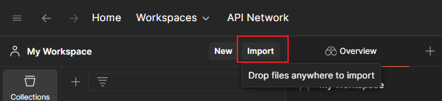

接着在弹出的窗口中拖入 `budgeting.yaml` 文件或点击上传：

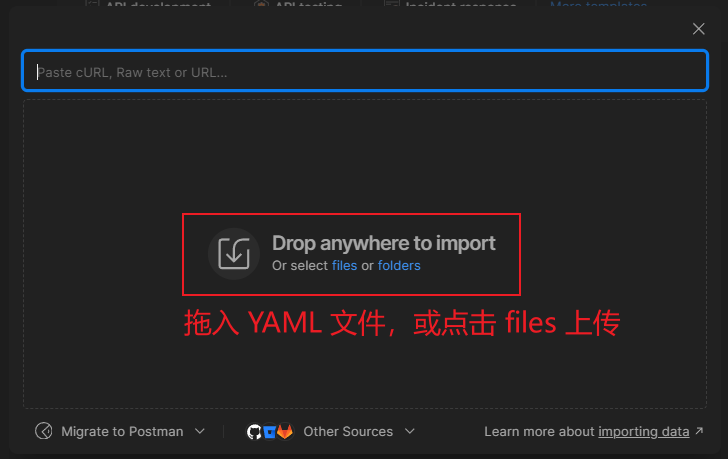

在弹出的新页面中确认选中 `OpenAPI` 这项，并且在下方的导入配置中，必须确认参数生成模式是按 `Schema` 生成的：

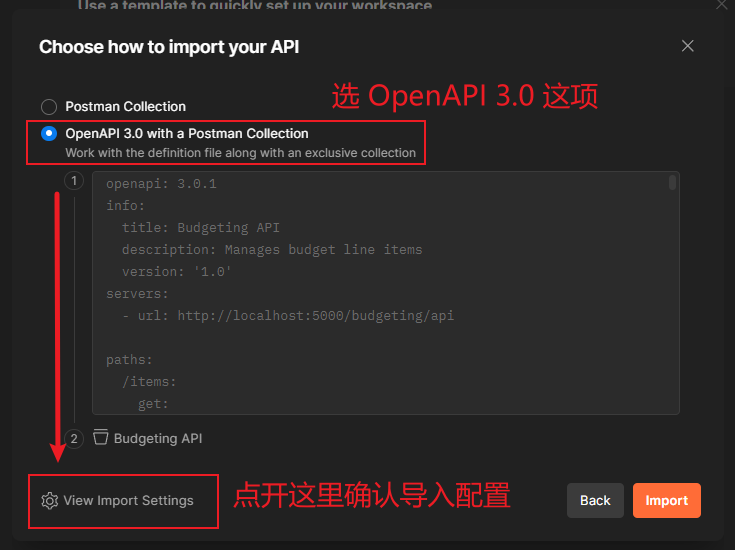

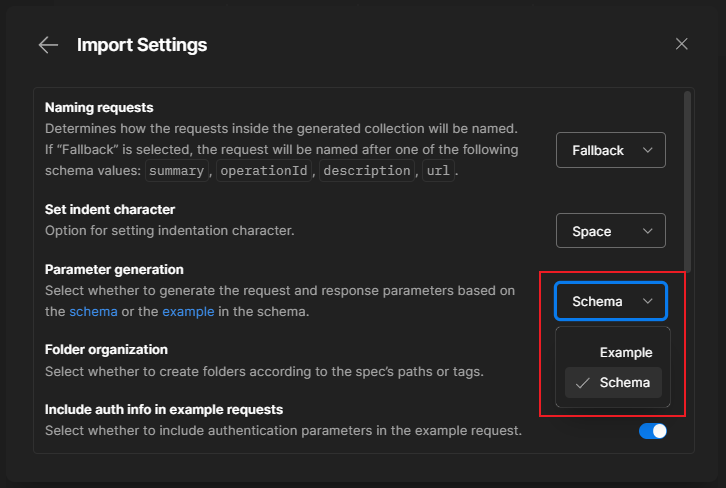

这样就会在 `Postman` 的 API 侧边栏看到用于演示本章契约测试的 API 实例：

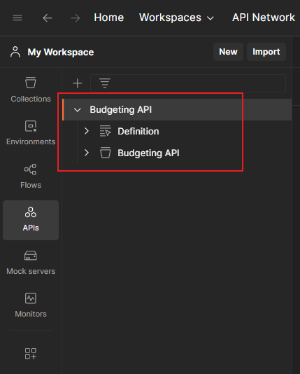

**图 13.1 初始导入 budgeting.yaml 文件后看到的契约测试 API 实例**


## 6 API 实例的基本用法

导入成功后，按照之前的配置，`Postman` 会根据 `YAML` 文件自动生成一个 `Definition` 定义层（用于存放导入的 `YAML` 文件），以及一个同名的测试集合层 `Budgeting API`：

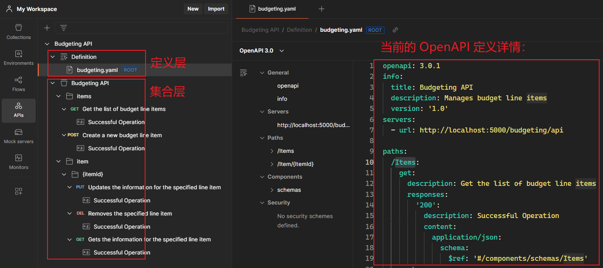

**图 13.2 基于导入的 OpenAPI 规范文件，由 Postman 自动生成的 API 实例结构**

该 API 实例的最大特点在于：定义层的任何内容变更，通过相关的同步设置，都将与下方的集合层保持一致。此外，侧边栏 `Collection` 标签中也会生成一个同名的测试集合。经实测，该集合的主要作用是创建契约测试所必需的 Mock 服务器，但并非主要关注对象；本章所有的核心操作都在 `API` 标签中。

开启定义层与集合层的同步方法如下图所示：

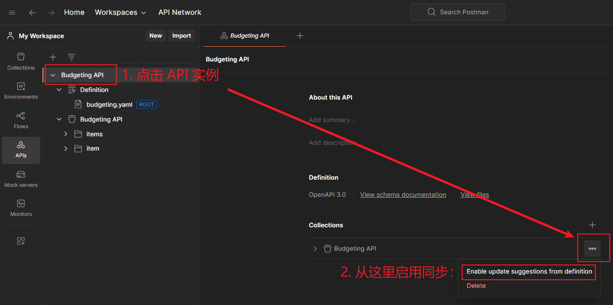

**图 13.3 定义层与集合层的变更同步配置启用方法**

DIY 实测：将定义层中的 `/items` 路径改为 `/changedItems`，观察集合层同步后的效果。

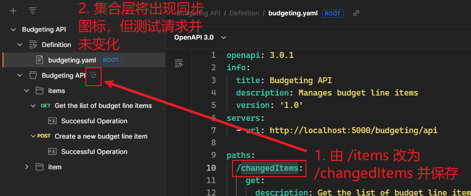

单击集合层，并在右边详情页单击该同步图标，会看到一个确认变更情况的中间页面：

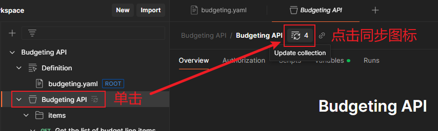

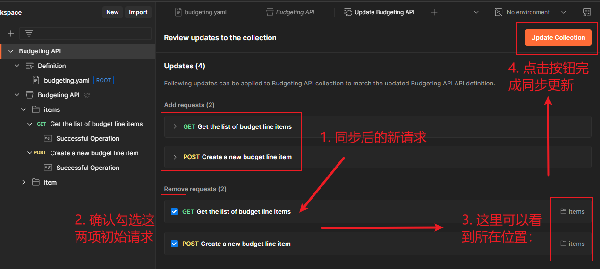

同步后的最终结果如下：

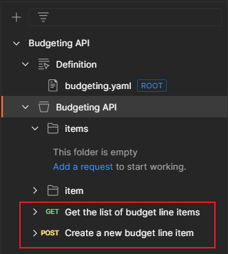

**图 13.4 通过自动同步新增的两个测试请求**

实测发现，同步只是将请求的 URL 更新了，但没有像书中说的那样，将它们移动到 `items` 文件夹下；即使改回原值，同步后也无法回到 `items` 文件夹中，并且同步设置无法关联到 `Collection` 侧边栏中的同名集合。这只能说明 `Postman` 在同步功能上还有瑕疵，目前仅支持导入时自动创建子文件夹；同步时仅在 `URL` 实现了与 `YAML` 定义层的同步，想要达到书中所说的 **完美还原**，还得手动操作。


## 7 API 实例的类型实时检查

另一个真正强大的地方在于，定义层与集合层真正实现了类型检查的实时同步：

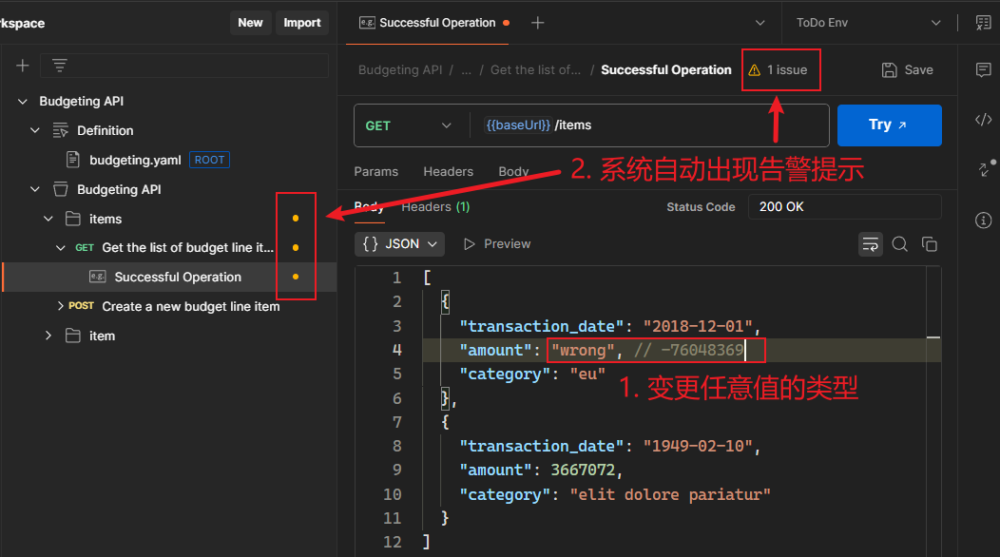

**图 13.5 任意变更示例中的属性值类型，Postman 会自动实时出现告警提示**

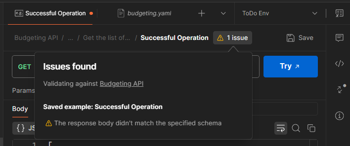

**图 13.6 单击请求上方的告警图标，还可以看到具体的报错原因**

同理，如果调整定义层中的字段类型，集合层中受影响的所有请都会出现告警图标。例如将 `item` 中的 `amount` 属性从 `integer` 改为 `number`，集合层中的三个请求都将提示类型问题：

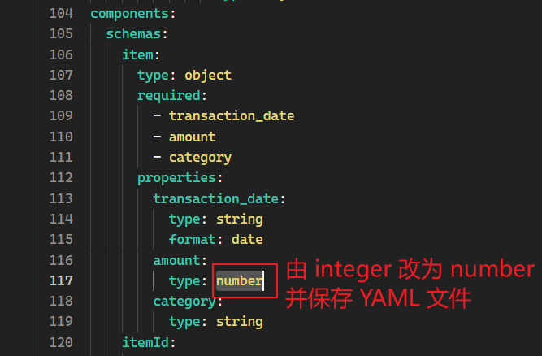 

**图 13.7 将定义层从的 amount 类型改为 number 并保存**

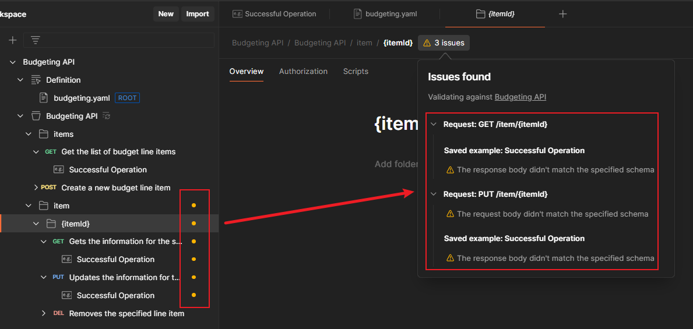

**图 13.8 amount 改为 number 类型后，受影响的测试请求都将校验失败**

但是，像这样的类型双向同步检查虽然强大，却并不是本章想要的契约测试。本章后续将通过一个专门的契约测试生成工具，实现目标集合的无侵入测试。但也是因为没有完整介绍新增的这部分内容，导致后期实测时走了很多弯路。


---

[^1]: 详见本书第三章内容（自学笔记正在整理中）


 