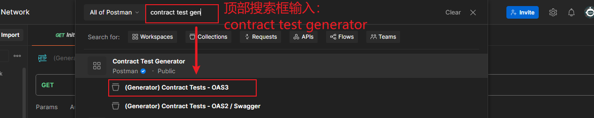
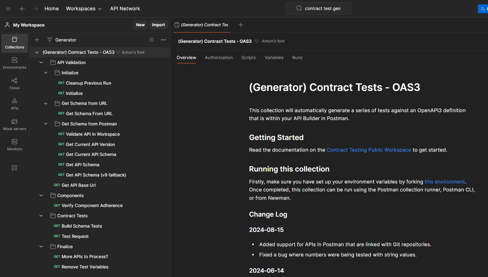
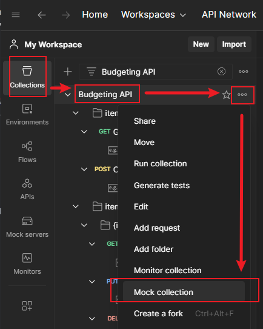
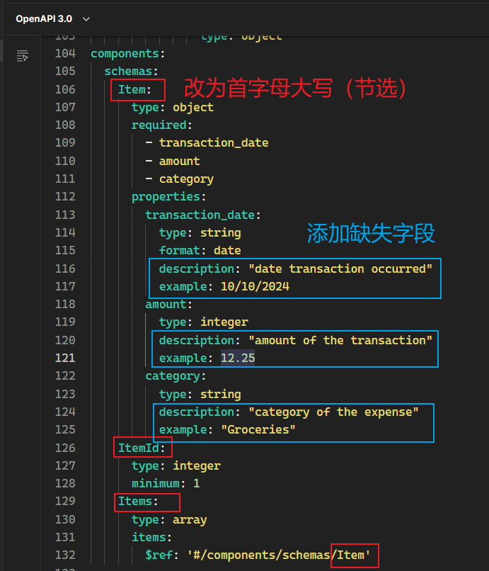

# 第十三章 契约测试与 API 接口验证


> **本章概要**
>
> - 理解契约测试相关概念
> - 契约测试在 `Postman` 中的设置方法
> - 契约测试的执行与维护

---


## 1 契约测试的概念

定义：契约测试是确保两个不同的软件服务实现相互通信的一种方式。

API 接口其实就是一份契约：它规定了客户端调用后台服务时必须遵守的一套规则。

契约测试就是对该契约进行检查，确保不出岔子。


## 2 契约测试的工作原理

契约测试的意义在于，允许人们只验证契约本身是否正确，而无需包含完整的 API 调用。最好是让该契约通过像 `OpenAPI` 这样的规范完整记录下来 [^1]。

从本质上讲，Mock 服务器也是一个契约，可供前端或 API 消费端使用；但其缺陷也很明显：后端无法调用该契约。如果模拟服务器与真实的后端接口不一致，只能逐一排查 Mock 中的各个示例，既耗时又低效。

理想中的契约测试应该是接口供应方也能运行测试的一套 API 接口，可以验证其变更不影响、不破坏消费方的正常使用。例如，对比一个普通的端点测试：

```js
pm.test("Check the name", function () {
    const jsonData = pm.response.json();
    pm.expect(jsonData.name).to.eql("Bob");
});
```

上述代码换作契约测试，则更侧重于是否获取了正确的数据类型（字符串），以及 `name` 字段是否为响应对象的一级属性。


## 3 契约测试的分类

按照由哪一方制定契约，契约测试可分为两大类：

- **Consumer-driven contracts**：消费者驱动契约（CDC），由 API 消费者定义契约，明确其需求；
  - 优点：
    - 确保 API 提供对消费者有价值的功能；
    - 有助于了解消费者的使用习惯，避免破坏现有工作流。
  - 缺点：
    - 多个消费者的契约测试可能导致冗余和低效；
    - 消费者的特殊需求或将限制 API 的升级改造。
- **Provider-driven contracts**：提供者驱动契约（PDC），由 API 提供者定义契约，具有明确支持的数据格式和行为；
  - 优点：
    - 提供者可以明确限定接口用法，避免对未定义行为的依赖；
    - 扩展性更好，适用于存在大量用户的场景。
  - 缺点：
    - 缺乏消费者反馈，难以察觉用户的特有用法和操作习惯；
    - 可能更容易破坏用户所依赖的功能。

> [!tip]
>
> **知识拓展**
>
> 本节还提到了著名的 **海勒姆定律（Hyrum’s Law）**：
>
> > *With a sufficient number of users of an API, it does not matter what you promise in the contract: all observable behaviors of your system will be depended on by somebody.*
> > 如果一个 API 接口的用户足够多，那么在契约中承诺什么并不重要，因为系统可观测到的一切行为都将被某一部分用户所依赖。
> >
> > —— *Hyrum’s Law*
>
> 这就意味着：无论契约如何定义，用户总会以预料之外的方式使用 API，契约测试有助于减少破坏性变更。


## 4 DeepSeek 给出的契约测试相关背景

由于本章对契约测试的介绍还是过于基础，我又结合 `DeepSeek` 对契约测试的相关背景做了一番了解，一并整理如下：

> 1. **微服务架构的普及**
>
> - **背景**：随着微服务架构的广泛应用，系统被拆分为多个独立服务，服务间的通信变得复杂。
> - **挑战**：服务接口的频繁变更容易导致集成问题，传统的集成测试难以应对这种快速变化。
> - **解决方案**：契约测试通过定义服务间的接口契约，确保各服务在独立开发和部署时仍能正确交互。
>
> 2. **持续交付与 DevOps 的推广**
>
> - **背景**：持续交付和 `DevOps` 要求快速、频繁地发布软件，同时保持高质量。
> - **挑战**：传统测试方法耗时，难以满足快速发布的需求。
> - **解决方案**：契约测试作为自动化测试的一部分，能在开发早期发现问题，提升发布效率。
>
> 3. **分布式系统的复杂性增加**
>
> - **背景**：现代系统依赖大量第三方服务或云服务，增加了集成的复杂性。
> - **挑战**：依赖服务的变更可能导致系统故障，传统测试难以覆盖所有场景。
> - **解决方案**：契约测试通过模拟依赖服务的行为，确保系统在依赖变更时仍能正常工作。
>
> 4. **工具和框架的成熟**
>
> - **背景**：随着 `Pact`、`Spring Cloud Contract` 等工具的发展，契约测试变得更加易用。
> - **影响**：这些工具降低了实施契约测试的门槛，推动了其普及。
>
> 5. **行业最佳实践的推广**
>
> - **背景**：越来越多的公司通过博客、会议分享契约测试的成功经验。
> - **影响**：这些实践案例为其他团队提供了参考，进一步推动了契约测试的流行。
>
> 6. **测试左移的趋势**
>
> - **背景**：测试左移强调在开发早期进行测试，以减少后期修复成本。
> - **挑战**：传统测试方法难以在早期阶段有效实施。
> - **解决方案**：契约测试在开发初期定义接口契约，帮助团队尽早发现集成问题。
>
> **总结**
>
> 契约测试的流行是微服务架构、持续交付、分布式系统复杂性增加等多重因素共同作用的结果。随着工具和最佳实践的成熟，契约测试逐渐成为现代软件开发中不可或缺的一部分。


## 5 契约测试在 Postman 中的创建方法

接下来就开始了本章的填坑之旅——看似很丝滑的操作实测后才发现每一步都很艰难，因为作者漏掉了很多关键细节……

作者沿用了第 3 章制定的基于 `OpenAPI` 规范的预算管理 API 接口文件（即 `budgeting.yaml`，详见：[https://github.com/PacktPublishing/API-Testing-and-Development-with-Postman-Second-Edition/blob/main/Chapter13/budgeting.yaml](https://github.com/PacktPublishing/API-Testing-and-Development-with-Postman-Second-Edition/blob/main/Chapter13/budgeting.yaml)）。

先通过 `Postman` 左上角的 **Import** 按钮导入该文件：


接着在弹出的窗口中拖入 `budgeting.yaml` 文件或点击上传：


在弹出的新页面中确认选中 `OpenAPI` 这项，并且在下方的导入配置中，必须确认参数生成模式是按 `Schema` 生成的：


这样就会在 `Postman` 的 API 侧边栏看到用于演示本章契约测试的 API 实例：


**图 13.1 初始导入 budgeting.yaml 文件后看到的契约测试 API 实例**


## 6 API 实例的基本用法

导入成功后，按照之前的配置，`Postman` 会根据 `YAML` 文件自动生成一个 `Definition` 定义层（用于存放导入的 `YAML` 文件），以及一个同名的测试集合层 `Budgeting API`：


**图 13.2 基于导入的 OpenAPI 规范文件，由 Postman 自动生成的 API 实例结构**

该 API 实例的最大特点在于：定义层的任何内容变更，通过相关的同步设置，都将与下方的集合层保持一致。此外，侧边栏 `Collection` 标签中也会生成一个同名的测试集合。经实测，该集合的主要作用是创建契约测试所必需的 Mock 服务器，但并非主要关注对象；本章所有的核心操作都在 `API` 标签中。

开启定义层与集合层的同步方法如下图所示：


**图 13.3 定义层与集合层的变更同步配置启用方法**

DIY 实测：将定义层中的 `/items` 路径改为 `/changedItems`，观察集合层同步后的效果。


单击集合层，并在右边详情页单击该同步图标，会看到一个确认变更情况的中间页面：


同步后的最终结果如下：


**图 13.4 通过自动同步新增的两个测试请求**

实测发现，同步只是将请求的 URL 更新了，但没有像书中说的那样，将它们移动到 `items` 文件夹下；即使改回原值，同步后也无法回到 `items` 文件夹中，并且同步设置无法关联到 `Collection` 侧边栏中的同名集合。这只能说明 `Postman` 在同步功能上还有瑕疵，目前仅支持导入时自动创建子文件夹；同步时仅在 `URL` 实现了与 `YAML` 定义层的同步，想要达到书中所说的 **完美还原**，还得手动操作。


## 7 API 实例的类型实时检查

另一个真正强大的地方在于，定义层与集合层真正实现了类型检查的实时同步：


**图 13.5 任意变更示例中的属性值类型，Postman 会自动实时出现告警提示**


**图 13.6 单击请求上方的告警图标，还可以看到具体的报错原因**

同理，如果调整定义层中的字段类型，集合层中受影响的所有请都会出现告警图标。例如将 `item` 中的 `amount` 属性从 `integer` 改为 `number`，集合层中的三个请求都将提示类型问题：

 

**图 13.7 将定义层从的 amount 类型改为 number 并保存**


**图 13.8 amount 改为 number 类型后，受影响的测试请求都将校验失败**

但是，像这样的类型双向同步检查虽然强大，却并不是本章想要的契约测试。本章后续将通过一个专门的契约测试生成工具，实现目标集合的无侵入测试。但也是因为没有完整介绍新增的这部分内容，导致后期实测时走了很多弯路。


## 8 导入官方契约测试集合

虽然 API 标签页中的接口实例已经实现了 `OpenAPI` 规范和集合层的双向检查，但真正的契约测试还需要在请求前后以测试用例的形式确保各个接口的定义和功能相契合，还得要开发者针对不同的 API 集合编写大量性质相同的定制化脚本。正如第一版中看到的那样，这一步看似轻松，实现起来却非常繁琐。

为此，`Postman` 官方发布了一个专门用于契约测试的公共集合 `Contract Test Generator`，经过这几年的不断更新迭代，目前已经能够实现对目标集合实施无侵入式的契约测试，极大地省去了从零开始手写契约测试脚本的麻烦。该集合的灵感最初来自 `GitHub` 社区开发者 **allenheltondev** 于 2020 年 10 月 9 日贡献的一个开源项目 [postman-contract-test-generator](https://github.com/allenheltondev/postman-contract-test-generator)，由于解了大家的燃眉之急，开源后不久就被 `Postman` 官方复刻到 [自己名下](https://github.com/postman-solutions-eng/postman-contract-test-generator) 进入长期维护并持续迭代。这就是开源的魅力——既方便了后来者，也让项目本身更加完善，同时也提高了开发者自身的影响力。本章唯一美中不足的，应该就是书中漏掉了大量的配置细节，实测时踩了不少的坑（当然也不排除从出书到实测这段时间差里，项目本身的更新迭代导致配置出现些许差异）。无论如何，我都将重新完整梳理一遍这个彩蛋级福利的用法，也算为开源社区略尽绵力吧。

首先从官方社区导入这个测试集合。在 `Postman` 顶部的搜索框中检索关键字 `Contract Test Generator` 就可以看到基于 `OpenAPI v3.x` 规范的测试集合 `(Generator) Contract Tests - OAS3`：



**图 13.9 在 Postman 的顶部搜索框检索契约测试生成工具**

点击后将打开对应的 API 首页，并通过右边的 Fork 按钮复刻到自己的帐号下：


**图 13.10 从生成工具的文档首页点击 Fork 复刻到自己帐号下**

然后在弹出的新页面确认 Fork 的相关配置，其中务必勾选与该集合关联的测试环境：


**图 13.11 Fork 操作时务必勾选对应的测试环境（非常重要）**

复制到自己名下后将在 `Collection` 导航页看到这样的结构：



**图 13.12 复刻到自己帐号下看到的契约测试集合结构**


## 9 契约测试集合的详细配置

该集合的工作原理也很简单，只要配置好测试环境中的相关参数，就能通过运行 `Collection Runner` 一次性得到目标集合的契约测试结果。当然，它只实现了契约测试最基本的校验逻辑，开发者可以在此基础上做进一步补充，比起从零开始编写已经好很多了。

以下是此次实测（截至 2025 年 2 月 5 日）需要补全的环境变量（先选中 `Contract Test Environment` 环境）：

|        变量名         |                            变量值                            |
| :-------------------: | :----------------------------------------------------------: |
|     `env-apiKey`      |               当前个人帐号生成的有效 API 秘钥                |
|   `env-workspaceId`   |                    当前工作空间的唯一标识                    |
|     `env-server`      | 目标集合的服务器基础 URL，也可以是该集合对应的 Mock 服务器的基础 URL |
|      `env-apiId`      |                     目标 API 的唯一标识                      |
| `env-apiDefinitionId` |                    目标 API 定义唯一标识                     |

书中只讲了前三个变量，其实还有很多隐含信息：

- 为了配置示例 API 的 `env-server`，需要 **先创建一个对应的 Mock 服务器**，并填入该 Mock 服务器的 `URL`；否则使用导入时默认的 `http://localhost:5000/budgeting/api` 会报错；
- 新版的 `Generator` 集合必须先发布一版 `API`，即指定一个 `API` 版本号，否则后面有个 `Validate API In Workspace` 请求也会报错；
- 契约测试脚本中大量使用旧版 `Postman` 的断言写法，需要逐一改为最新的版本，导入必要的 `npm` 模块（例如 `lodash` 等）；

下面逐一进行说明——

### 9.1  env-apiKey 的创建与设置

首先是 `env-apiKey`：为安全起见，生成的 Mock 服务器都设为私有服务器，用自己帐号生成的 API 秘钥进行加密。


**图 13.13 点开 Postman 右上角的个人帐号图标，从浏览器进入对应的设置页面**


**图 13.14 找到 API keys 导航页，按 Generate API Key 按钮生成秘钥**


**图 13.15 输入一个秘钥名称，以便后续管理（如 DemoContractTesting）**


**图 13.16 复制秘钥妥善保管（注意：新生成的 API 秘钥只有一次机会可供复制，错过后只能重新生成）**


**图 13.17 秘钥生成后，可在列表中找到该记录，可从右边的隐藏菜单中重新生成或删除**

然后就可以赋给 `env-apiKey` 变量（顺便将该变量的类型设为 `secret`）：


### 9.2 env-workspaceId 的设置

当前工作空间的 ID，从首页右侧的隐藏菜单项 `Workspace info` 获取：


### 9.3 Mock 服务器及 env-server 的配置

找到 `Collection` 侧边栏，从测试集合 `Budgeting API` 的隐藏菜单中创建 Mock 服务器：




然后填入环境变量：


最后别忘了还要将该 `URL` 更新到 API 实例中的 `YAML` 定义文件中：


以及最初导入 `YAML` 文件时自动创建的测试集合变量 `baseUrl`（这个坑非常隐蔽，浪费了很多次 `Collection Runner` 免费额度才发现问题）：

 


### 9.4 API 测试实例的配置

根据契约测试生成工具的最新版本，目标 API 实例需要先发布一个版本，具体操作如下：


发布后的 API 实例首页如下图所示：


接着，点击上图右侧的图标，找到 API 对应的唯一标识，以及 API 定义层的唯一标识（后续契约测试有用）：


**图 13.18 从 API 实例的详情信息栏找到对应 API 唯一标识与定义层标识**

然后粘贴到环境变量中：


### 9.5 契约测试脚本的调试

完成测试环境 `Contract Test Environment` 的配置后，为了提高 `Collection Runner` 的一次性通过率，接下来需要手动发送一遍契约测试集合中的每个请求，一边学习不同的测试脚本的写法，一边打开 `Postman` 的控制台，根据警告信息完善脚本。实测时发现的主要问题包括：

- `Using "_" is deprecated. Use "require('lodash')" instead.`：
  - 解决方案：新版 `lodash` 模块需要显式声明，需要在脚本开头处添加一句：`const _ = require('lodash');`
- `Using "postman.setNextRequest" is deprecated. Use "pm.execution.setNextRequest()" instead.`
  - 解决方案：按提示改为最新版写法即可：`pm.execution.setNextRequest()`

接着，就可以启动 `Collection Runner` 了：


**图 13.19 完成环境配置和脚本微调后，就可以启动契约测试集合的 Collection Runner 了**

第一次运行后，部分请求测试不通过：


**图 13.20 首次运行后，部分请求校验未通过（有意为之）**

根据断言提示，主要发现三类问题：

1. `Schema` 对象名称的首字母没有大写：
   1. `Schema 'item' begins with an uppercase letter | AssertionError: expected 'i' to equal 'I'`；
   2. `Schema 'items' begins with an uppercase letter | AssertionError: expected 'i' to equal 'I'`；
   3. `Schema 'itemId' begins with an uppercase letter | AssertionError: expected 'i' to equal 'I'`
2. 缺失 `description` 属性问题：`Schema property 'item.transaction_date' has a description between 10 and 100 characters | AssertionError: expected { type: 'string', format: 'date' } to have property 'description'`；
3. 缺失 `example` 属性问题：`Schema property 'item.transaction_date' has an example | AssertionError: expected { type: 'string', format: 'date' } to have property 'example'`。

根据这些断言提示，回到 `YAML` 定义文件逐一修改后（重要提醒：不仅是定义的地方要改，所有引用了该定义的地方也要同步更新）：



再次运行 `Runner`：


**图 13.21 按要求修改 YAML 文件后，再次运行 Collection Runner 进行验证（全部通过测试）**


## 10 Postman 拦截器的用法

拦截器的作用：可用于捕获契约测试中实际用到的集合请求。

拦截器可作为逆向工程的一部分反观实际调用的接口请求，但由于需要安装 `Chrome` 插件，用户体验较差，仅供参考。


## 11 契约测试的运维

**契约测试的主要目的**：确保 API 提供者在修改 API 时不会违反接口契约。


**责任划分**：API 消费端可 **偶尔运行** 契约测试；主要责任仍在 **供应端**。


**契约测试的运行**

- 供应端：
  - 这些测试应作为 API 开发团队的构建流程的一部分运行。
  - 可参考第 9 章构建基于命令行的契约测试运行模式。
- 消费端：
  - 不需要在每次更改时运行测试，因为用户界面的更改通常不会影响 API 的工作方式。
  - 可利用 `Postman` 的监视器机制定期检查 API 是否仍符合合同，参考第10章（使用 Postman 监控 API）。


**契约测试失败的原因分析**

1. **存在 bug**：需更新代码，修复 Bug。
2. **需求变更**：API 可能需要以违反契约的形式进行更改。此时需要相关方进行沟通并更新契约。


**契约测试的共享**：

- **必要性**：合同测试需要由提供者和消费者共同访问和维护。
- **共享方式**
  - 创建一个专门的工作空间（`Workspace`）来存储和共享合同测试。
  - 设置工作空间的可见性为团队，并邀请相关人员加入。
  - 共享合同测试集合到该工作空间，并分配不同的角色权限（如管理员、查看者、编辑者）。
- **注意事项**：免费版 `Postman` 账户有请求共享限制，大量合同测试可能需要升级到付费计划。


---

[^1]: 详见本书第三章内容（自学笔记正在整理中）


 