# 第十四章 API 安全测试


> **本章概要**
>
> - `OWASP` API 安全清单
> - 用 `Postman` 进行模糊测试（`Fuzz testing`）的方法

---


## 1 OWASP API 安全清单

### 1.1 相关背景

- **OWASP**（Open Web Application Security Project）是一个非营利组织，专注于提高软件安全性；
- 提供免费、开放的资源，如工具、文档、论坛等，帮助开发者和安全人员构建安全的应用程序；
- 知名项目包括 **OWASP Top 10**（十大 Web 应用安全风险）和 **API Security Top 10**（API安全十大风险）；
- 相关资源：
  - 网站门户：[https://owasp.org/](https://owasp.org/)；
  - 2023 最新版 API 安全清单：[https://owasp.org/www-project-api-security/](https://owasp.org/www-project-api-security/)；


### 1.2 OWASP API 安全清单

- **API Security Top 10** 是 OWASP 针对 API 安全的核心文档，罗列了 API 面临的十大安全风险。
- 适用于开发者、安全工程师和架构师，帮助识别和缓解API安全威胁。


### 1.3 认证与授权

黑客最先尝试的攻击方式是身份验证，即通过用户名密码攻击。

最简单的方式是暴力破解（brute-force attack），因此 API 接口应采取在一定时间段内 **限制登录次数** 的防护措施。

具体实现：以 `GitPod` 演示项目为例，可利用 `Postman` 内置的随机数据变量高频多次调用登录接口（多次手动点击或 `Collection Runner` 设置迭代次数）：

测试脚本：

```js
for (let i = 0, len = 50; i < len; i++) {
  pm.sendRequest(
    {
      url: pm.variables.replaceIn('{{base_url}}/token'),
      method: 'POST',
      header: { 
        'Content-Type': 'multipart/form-data'
      },
      body: {
        mode: "formdata",
        formdata: [
          { key: 'username', value: pm.variables.replaceIn('{{$randomUserName}}') },
          { key: 'password', value: pm.variables.replaceIn('{{$randomPassword}}') }
        ]
      }
    },
    function (err, resp) {
      if (err) {
        console.error(JSON.parse(err));
        return;
      }
      pm.test(`${i + 1}: Response JSON have detail attribute`, function () {
        pm.expect(resp.json()).to.eql({ "detail": "Incorrect user name or password" });
      });
    }
  )
}
```

实测结果（鉴权接口疑似不具备限制登录次数功能）：

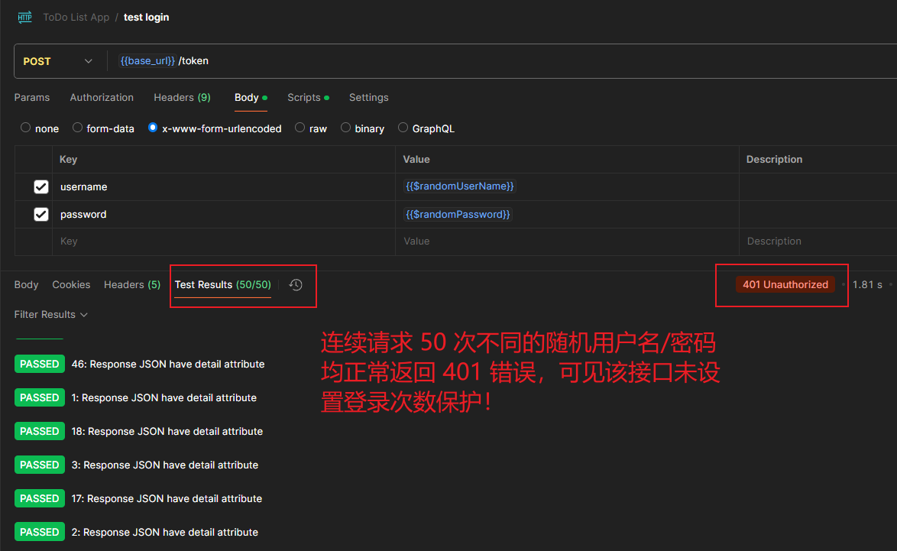

**图 14.1 构造不同的用户名和密码，多次高频调用登录接口，模拟暴力破解过程**


### 1.4 破防的对象级授权（Broken object-level authorization）

这是 2023 年十大安全清单排名第一的高风险议题：

- **问题描述**：未正确验证用户对对象的访问权限，导致越权访问。
- **应对措施**：实施严格的权限验证，确保用户只能访问授权资源。
- **示例**：用登录普通用户（`user1/12345`）的登录令牌去访问管理员帐号，看看示例项目是否会响应 403 错误。

实测结果：

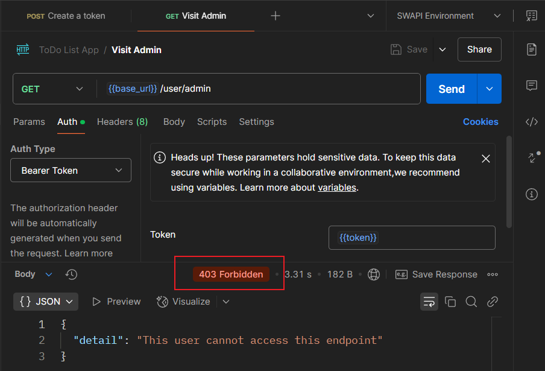

**图 14.2 用 user1 的登录令牌访问管理员 admin 的帐号信息，后台报 403 错误（符合预期）**


### 1.5 破防的属性级授权（Broken property-level authorization）

示例：用 `user1/12345` 登录，先用 `"user1"` 为创建人（即 `create_by` 字段）添加一个正常的待办项，然后看看是否可以通过 `PUT` 请求篡改该创建人信息（例如改为 `"user2"`）。

测试脚本：

```js
// PUT request's Post-response
pm.collectionVariables.set('reqPut', pm.request);

// Pre-request
pm.sendRequest(
  pm.collectionVariables.get('reqPut'),
  function(err, resp) {
    if(err) {
      console.error('Updated failure：', err);
      return;
    }
    pm.test('PUT req: status code should be 200', () => {
      console.log(resp)
      pm.expect(resp.code).to.eq(200);
    });
  }
)

// Post-response
pm.test('The creator should not be updated (user1) after running PUT req',
  () => {
    const [{ created_by: creator }] = pm.response.json();
    pm.expect(creator).to.eql('user1')
  });
```

实测结果：

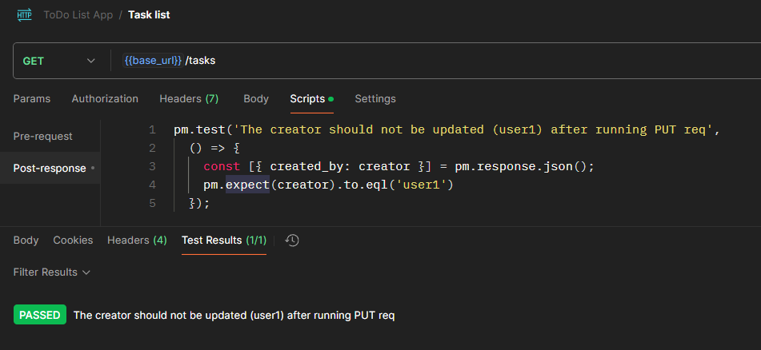

**图 14.3 实测属性级授权漏洞（篡改失败，符合预期）**

但实测发现，在创建待办项时人为设置创建人为 **非当前登录用户**（如 `"user2"`），最后仍然创建成功了，说明该接口还是有问题的：

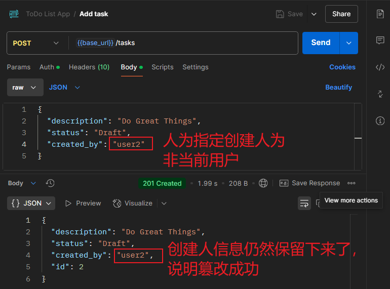

**图 14.4 创建任务时篡改创建人信息，最终任务创建成功，说明该接口仍然支持篡改信息**


### 1.6 不受控制的资源消耗（Unrestricted resource consumption）

方式一：通过耗尽所有系统资源来损害系统，导致系统瘫痪（denial-of-service attacks，拒绝服务攻击）；

方式二：由于未对接口调用次数进行限制，大量请求将拖慢响应速度；如果接口调用了第三方付费资源，还会产生大量费用。


### 1.7 不受限制地访问业务流（Unrestricted access to business workflows）

攻击者可能会利用抓包、监控请求数据等方式获取系统内部通信 API，从而获悉内部工作流结构，给系统带来严重威胁（例如恶意逃票等）。

应对措施：仔细考虑暴露了哪些接口；严格控制接口访问权限。


### 1.8 不安全地使用 API 接口（Unsafe consumption of APIs）

典型案例：引用了被黑客攻击的第三方 API。

这类测试较为棘手，可能需要搭建一个模拟服务器，让从第三方 API 响应的数据在该模拟器上先行缓冲，或者模拟危险数据进行测试，看看本地后台是否能够鉴别该类数据。


## 2 模糊测试（Fuzzy）

### 2.1 相关概念

定义：**模糊测试（Fuzzy）** 是一种通过向程序提供无效、随机或意外的输入来发现漏洞和错误的测试技术。

主要特征：

- 非通用测试技术
- 有助于发现未考虑到、或未测试到的问题


具体的运行方式：

- 手动执行：通过在 UI 中输入伪随机数据来完成（极少）；
- 编程执行：以程序的形式运行（绝大多数）。工具如 `PeachFuzzer` 或自定义输入集。


输入的生成：

- 生成大量随机或半随机数据，可能包含格式错误或危险字符（如转义字符、引号等）。
- 输入通常是随机的，但有一些边界限制（例如，字节 vs ASCII/Unicode 字符串）。
- 输入可以偏向已知的“危险”字符（例如转义字符、引号等）。


输入内容的具体方式：

- 通过命令行参数注入
- 通过文件输入
- 通过网络协议
- 通过 API 输入（特别适合模糊测试，易于用程序控制）


模糊查询的应用场景：

- 安全测试场景：揭示未能预见的攻击方向，发现错误处理机制中的薄弱环节等；
- API 测试场景：具有易于访问且数量巨大的测试输入，尤其适合 API 测试。


### 2.2 实战：在 Postman 中执行模糊测试

以 `GitHub` 开源项目 [**Big List of Naughty Strings**](https://github.com/minimaxir/big-list-of-naughty-strings) 的 `JSON` 文件为数据源，利用 `Collection Runner` 对 `GitPod` 演示项目 `ToDo List App` 进行基于数据驱动的模糊测试，看看 `POST /tasks` 接口在大量随机输入下的响应情况。

首先从开源项目下载原始数据文件 `blns.base64.json`。该原始数据为 `Base64` 编码的字符串数组：

```json
[
  "", 
  "dW5kZWZpbmVk", 
  "dW5kZWY=", 
  "bnVsbA==", 
  ...
]
```

使用前需要先处理成如下格式（可使用 `vim` 宏的批量操作完成）：

```json
[
  {"naughtyString":""}, 
  {"naughtyString":"dW5kZWZpbmVk"}, 
  {"naughtyString":"dW5kZWY="}, 
  {"naughtyString":"bnVsbA=="}, 
  ...
]
```

然后创建测试集合 `FuzzyTest` 以及 `POST` 请求 `Create a task`，其 `URL` 设置为 `{{base_url}}/tasks`，其中 `base_url` 为集合变量，其值为 `GitPod` 演示项目的基础 `URL`（启动链接：[https://gitpod.io/new/#https://github.com/djwester/todo-list-testing](https://gitpod.io/new/#https://github.com/djwester/todo-list-testing)）。

接着，在测试请求的请求体中输入如下内容（这里有个大坑，后面会讲）：

```js
{
  "description": "{{naughtyString}}",
  "status": "Draft"
}
```

上述代码中的 `naughtyString` 为数据驱动测试启动后、经 `Pre-request` 脚本处理得到的动态变量：

```js
const atob = require('atob');
const encoded_string = pm.iterationData.get("naughtyString");
pm.collectionVariables.set('naughtyString', atob(encoded_string));
```

对应的 `Post-response` 响应后脚本如下：

```js
pm.test("Status code is 201", function() {
    pm.response.to.have.status(201);
});
```

一切准备就绪后，启动 `Collection Runner`，加载 `JSON` 映射文件，执行模糊测试：

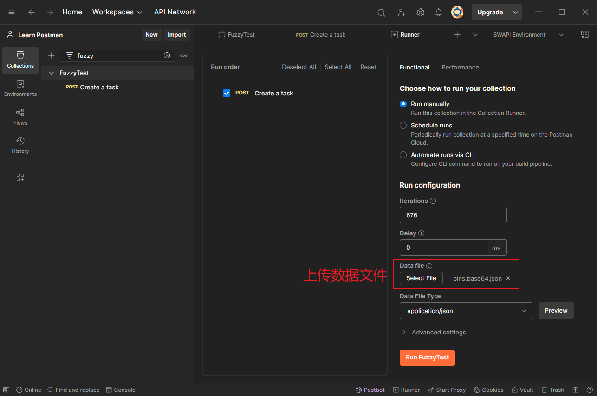

**图 14.5 利用 Collection Runner，发起基于JSON 文件数据驱动的模糊测试**

由于是分别读取每行数据并调用创建接口，整个过程需要多等些时间，最终得到结果：

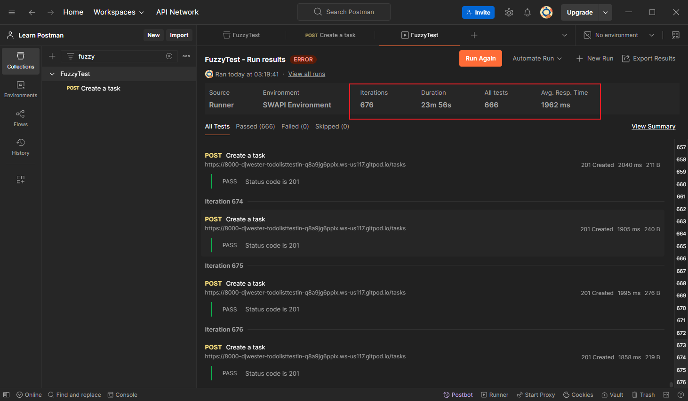

**图 14.6 Collection Runner 运行结束后的实测截图**

由于作者演示时用的是本地部署的 `ToDo List App`，全套数据测完只用了 `1'14"`，和我实测时的 `23'56"` 真是天壤之别（没办法，Python 基础有限，几次尝试本地部署都失败了）。但奇怪的是，除了 10 个请求因为网络原因发送失败，其余 666 个都成功了，并没有报错。

可高兴不到一分钟，我就知道出问题了。作者并没有交代要用 `user2` 登录，而我新增任务前压根儿就没登录，导致后续的数据清空全部失败了：

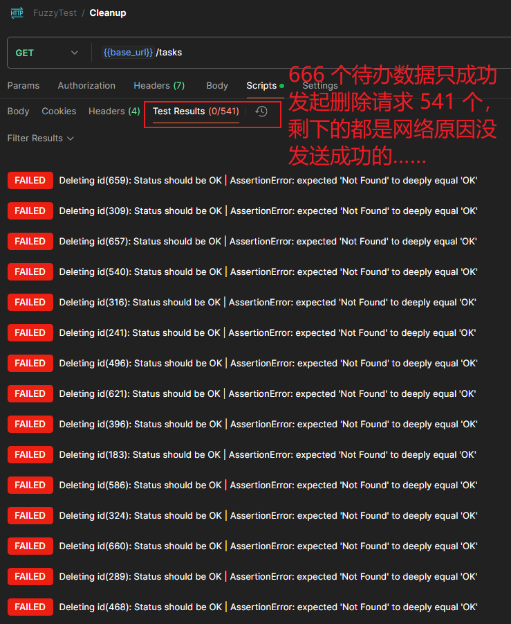

**图 14.7 由于新增任务时没有登录，导致后续的批量删除全部失败（神坑）**

没办法，只能重置项目，重新来过……

先 <kbd>Ctrl</kbd> + <kbd>C</kbd> 中断 `GitPod` 项目，运行重置数据命令 `poetry run python remove_tables.py`，然后执行 `make run-dev` 重新启动。

这次先用 `user2/12345` 换取登录令牌，再到新增接口中完成鉴权：

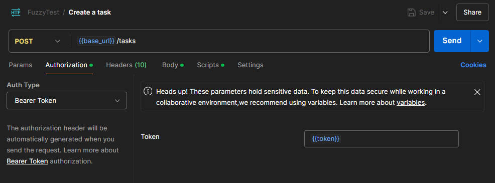

**图 14.8 用 user2 的登录令牌完成新增接口的鉴权设置**

然后只选取新增接口，再次上传 `JSON` 数据集运行 `Collection Runner`：

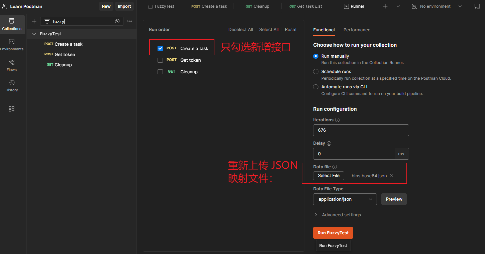

**图 14.9 重新运行 Collection Runner 的配置界面截图**

也不知道是不是这份死磕精神感动了马克思，第二次运行居然全部成功了：

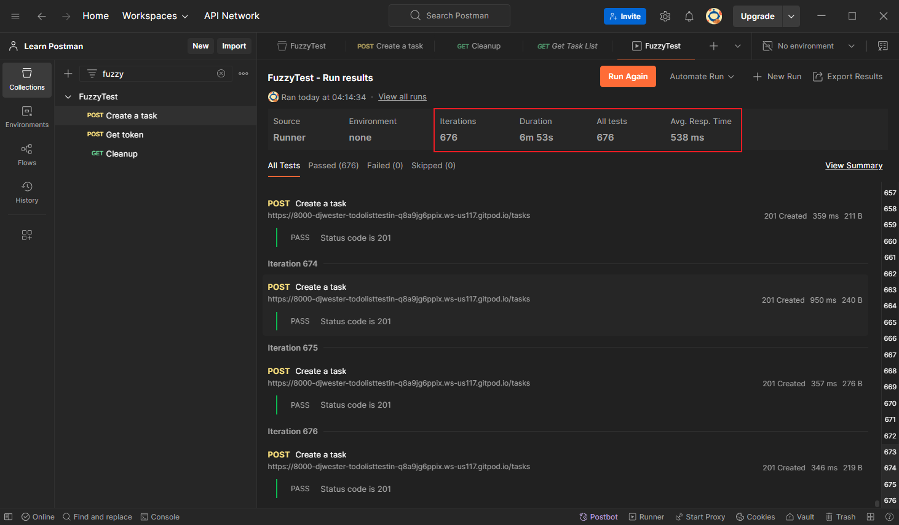

**图 14.10 第二次运行结果截图（676 条数据全部新增成功）**

接着在浏览器查看项目首页，也没有书中说的 `alert` 注入问题（当真欧皇附体？）：

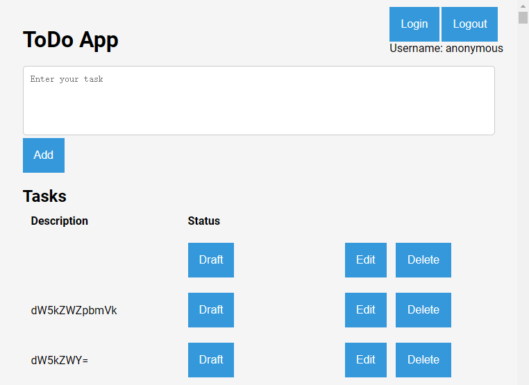

借着这波好运，赶紧再跑一遍数据批量清空。在 `GET {{base_url}}/task` 接口的响应后脚本中输入以下内容（直接用 JS 脚本批量删除，书中方法太过陈旧，还得再消耗一次 `Collection Runner` 免费额度，不知道作者怎么想的）：

```js
const tasks = pm.response.json();
const task_ids = tasks.map(t => t.id);

const base_url = pm.collectionVariables.get('base_url');
const auth = {
  type: 'bearer',
  bearer: [{
    key: 'token',
    value: pm.collectionVariables.replaceIn('{{token}}'),
    type: 'string'
  }]
};
const getCallback = task_id => (err, response) => {
  if(err) {
    console.error(err);
    return;
  }
  pm.test(`Deleting id(${task_id}): Status should be OK`, function() {
    pm.expect(response.status).to.eql('OK');
  });
};

for(const id of task_ids) {
  // Delete the task by id
  pm.sendRequest({
    url: `${base_url}/tasks/${id}`,
    method: 'DELETE',
    auth
  }, getCallback(id));
}
```

结果还是报错：

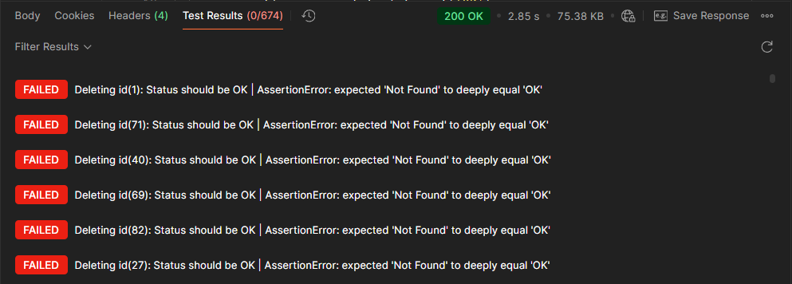

仔细一想，真相大白了：新增接口必须在请求体中手动指定 `created_by` 字段，否则 **一律按匿名处理**（就当是作者故意挖的坑吧）。

只有再重来一遍了：

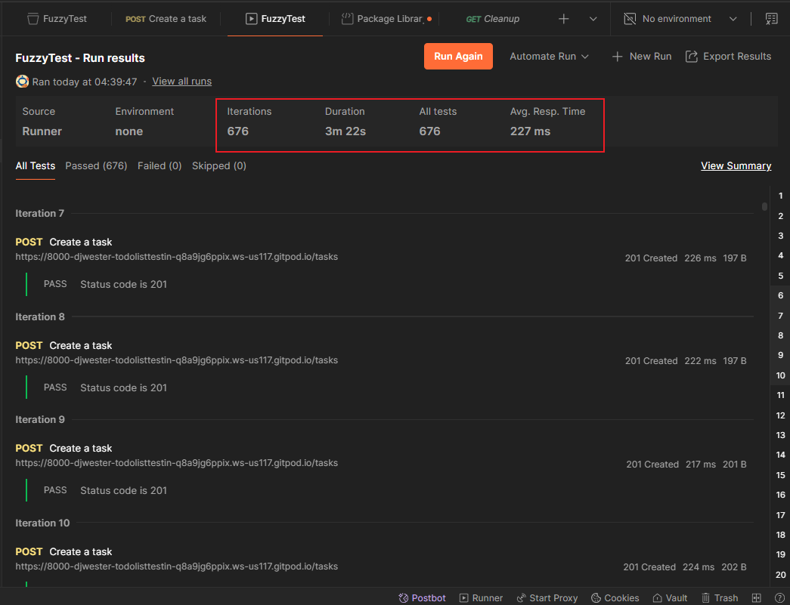

再次执行批量删除，只有一次是后台原因删除失败，五次请求未发送，其余全部删除成功，终于熬出头了：

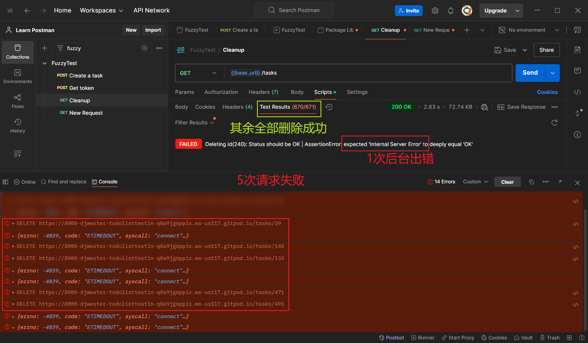


### 2.3 绕开 Collection Runner 的测试方案

其实只要具备 `JavaScript` 基础，完全可以跳过 `Collection Runner` 的限制，在 `Pre-request` / `Post-response` 脚本中实现批量新增和删除。

批量新增的纯 JS 脚本实现：

1. 将原始 `JSON` 数据集不经任何处理直接放到 `Postman` 的私有模块中，例如 `my-blns`：

   ```js
   const data = [
     "", 
     "dW5kZWZpbmVk", 
     "dW5kZWY=", 
     "bnVsbA==", 
     "TlVMTA==", 
     "KG51bGwp", 
     // ...
     "e3sgIiIuX19jbGFzc19fLl9fbXJvX19bMl0uX19zdWJjbGFzc2VzX18oKVs0MF0oIi9ldGMvcGFz",
     "c3dkIikucmVhZCgpIH19"
   ];
   module.exports = {
       data
   };
   ```

2. 新建请求 `GET {{base_url}}/tasks`，用于在批量新增后查询总的待办项列表：

   1. 在 `Pre-request` 中输入以下脚本：

      ```js
      const atob = require('atob');
      const { data } = pm.require('your/package/path/to/my-blns');
      // console.log(data.length);
      
      const postRequest = description => ({
        url: pm.collectionVariables.replaceIn('{{base_url}}/tasks'),
        method: 'POST',
        header: { 'Content-Type': 'application/json' },
        body: {
          mode: 'raw',
          raw: JSON.stringify({
            description,
            status: "Draft",
            created_by: "user2"
          })
        }
      });
      
      data.map(d => atob(d))
        .map((description, i) => pm.sendRequest(
          postRequest(description), 
          (err, resp) => {
            if(err) {
              console.error(err);
              return;
            }
            pm.test(`Create task_${i+1} completed: the status code should be 201`,
              () => pm.expect(resp.code).to.eql(201));
          }
        ));
      ```

   2. 在 `Post-response` 输入以下脚本：

      ```js
      pm.test('Task list length should be greater than 0', function () {
           pm.expect(pm.response.json())
               .to.be.an('array')
               .and
               .to.have.lengthOf.at.least(1, "Task list length should be greater than 0");
      });
      ```

3. 至于批量删除，刚才实测过程中已经看过脚本了，这里只说明一下实现逻辑。利用列表查询接口 `GET {{base_url}}/tasks` 获取到任务列表后，批量提取任务列表的 `id`；然后分别调用 `DELETE` 接口 `POST {{base_url}}/tasks/:id` 完成删除（注意：删除待办项时，别忘了在请求中带上鉴权配置对象 `auth`）。

这样就可以在 `Postman` 中随意批量新增和删除待办任务了，完全不受 `Collection Runner` 的制约。


## 3 利用 Postman 内置随机变量实现模糊测试

其实就是将上传的 `JSON` 文件内容用 `Postman` 内置的各种随机变量实现同样的模糊测试效果，例如将新增接口请求体中的 `JSON` 改为：

```json
{
    "description": "{{$randomLoremSentence}}",
    "status": "Draft",
    "created_by": "user2"
}
```

或者借助测试脚本，引入 `lodash` 实现更多模糊测试效果：

```js
const _ = require('lodash');
// _.sample(collection): Gets a random element from collection.
const description = _.sample(["{{$randomAbbreviation}}", "{{$randomAdjective}}"]);
const jsonBody = {
    description,
    "status", "Draft",
    "created_by": "user2"
}
```


## 4 小结

本章内容整体感觉较敷衍，上半部分介绍相关概念几乎全是蜻蜓点水式的描述，后半段实战环节的条理性又明显不如前面的章节，漏掉很多关键细节，且在方案选择上过分依赖 `Collection Runner`，致使我在实测过程中浪费了不少免费额度。不过依次填完这些坑后，我也有机会用纯 `JavaScript` 脚本的方式实现待办任务的批量创建与删除，顺便学习了用 `pm.sendRequest()` 发送 `POST` 请求和 `DELETE` 请求的写法，也算是因祸得福了吧。


> **后记**
> 最后再跟大家分享个操作技巧，遇到不会写的 `Postman` 脚本，可以利用其自带的 AI 机器人 `Postbot` 直接给答案。本章实测中几种 `pm.sendRequest()` 的写法就是这么来的，比查官方文档快多了。大家一定要学会使用 AI 工具，千万不要故步自封，成为 AI 时代的 “新文盲”。
