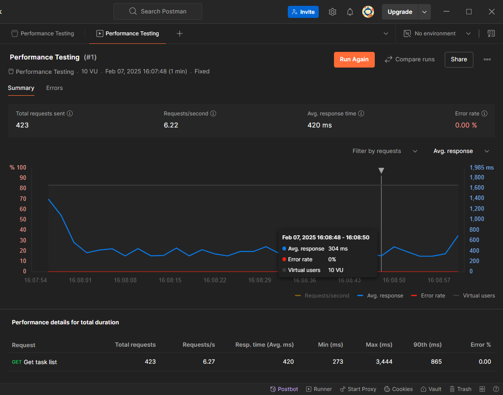
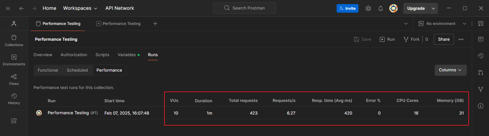
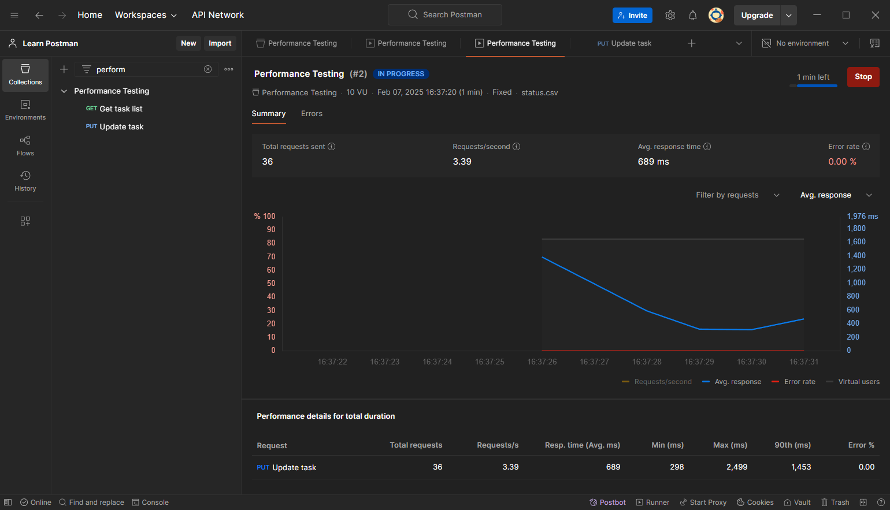

# 第十五章 API 接口性能测试


> **本章要点**
>
> - 性能负载的不同类型
> - 负载配置文件在 `Postman` 中的用法
> - 性能测试在 `Postman` 中的运行方法
> - 性能测试注意事项

API 接口通过编程进行交互，从而促成了自动化访问，同时也意味着出现性能问题。本章将基于 Postman 简要介绍接口性能测试。

---


## 1 性能负载的类型

性能测试的复杂之处在于，需要全面综合考虑可能导致系统变慢的各种因素。

性能负载主要可分三类：

1. **处理负荷（Processing Load）**：是指处理单元的负荷，可能发生在计算资源开销极为昂贵的任务中；
2. **内存负载（Memory Load）**：涉及临时内存（RAM）或存储设备的高内存使用率；
3. **连接负载（Connection Load）**：涉及服务器可处理的最大同时连接数等。


## 2 Postman 负载配置

`Postman` 实现性能测试，主要是通过 `Collection Runner` 中的 `Performance` 配置页实现的：


**图 15.1 Postman 实现基本性能测试的配置页面及负载配置选项截图**

目前共支持四类负载配置类型：

|            类型             |                             特点                             |                   适用场景                   |
| :-------------------------: | :----------------------------------------------------------: | :------------------------------------------: |
|    **Fixed（固定负载）**    | 模拟恒定不变的负载，用户数量或请求速率在整个测试期间保持不变 |       适用于评估系统在稳定负载下的表现       |
| **Ramp up（逐步增加负载）** |      负载从低到高逐步增加，模拟用户或请求逐渐增多的场景      | 适用于测试系统在负载逐步增加时的响应和稳定性 |
|    **Spike（突发负载）**    |          短时间内负载急剧增加，模拟突发的高流量场景          | 适用于测试系统在突发高负载下的表现和恢复能力 |
|    **Peak（峰值负载）**     |        负载在短时间内达到峰值，模拟系统在高峰期的表现        |   适用于评估系统在最大负载下的性能和稳定性   |

切换每个类型，下方都会显示该类型的可视化配置图，表征虚拟用户数（`Virtual Users`，即 `VUs`）随时间的变化趋势：


**图 15.2 Fixed 型负载配置示意图**


**图 15.3 Ramp up 型负载配置示意图**


**图 15.4 Spike 型负载配置示意图**


**图 15.5 Peak 型负载配置示意图**

由于在 `Postman` 的 `Collection Runner` 进行性能测试，只能模拟最多 100 个虚拟用户节点发起请求，不仅测试规模有限，性能参数的监控也不够全面，仅供了解即可。


## 3 Postman 性能测试实战

总思路：以 `GitPod` 在线演示项目 `ToDo List App` 为基础，利用 `Collection Runner` 进行基础的性能测试。

### 3.1 Fixed 型负载下的性能测试

新建测试集合 `Performance Testing`，并添加示例请求 `Get task list`，请求接口 `GET {{url}}/tasks`。

模拟 10 个虚拟用户节点、1 分钟内的性能测试：


**图 15.6 Fixed 型负载下模拟 10 个虚拟用户 1 分钟内的性能测试配置页截图**

运行结果如下：


**图 15.7 性能测试进行中的实时监控情况截图**



**图 15.8 性能测试完成后的结果展示页截图**

从测试集合的运行统计表中还可以看到更多性能指标：



**图 15.9 从测试集合的运行统计栏中还可以看到更多性能指标数据**

其余负载类型均可如法炮制。


### 3.2 基于数据驱动的 Postman 接口性能测试

本例演示上传 CSV 数据文件进行 `Fixed` 型负载性能测试，目标接口为 `ToDo List App` 项目的 `PUT /tasks/1` 修改接口。

首先从浏览器登录 `user1`（`user1/12345`），并手动添加一则待办事项：


**图 15.10 先从页面登录 user1，并新增一则待办事项**

然后创建一个控制 `status` 状态的 CSV 文件 `status.csv`，内容如下（可用 Excel 另存为 `csv` 格式）：

```markdown
Status
Draft
In Progress
Complete
```

同时设置 `PUT` 请求的请求体为，注意变量名 `Status` 要与 `CSV` 文件的字段列名称保持一致：

```json
{
    "description": "Do Something Great",
    "status": "{{Status}}"
}
```

上传该 `CSV` 文件，此时会立即弹出一个临时窗口，选择随机插值后确认：


**图 15.11 上传 CSV 数据文件时，在自动弹出的窗口中设置插值方式为随机插值**

最后检查其他配置，再次运行 `Collection Runner`：


**图 15.12 再次确认性能测试各项配置**

运行结果如下：



**图 15.13 基于数据驱动的性能测试实时运行界面截图**


**图 15.14 基于数据驱动的性能测试实时 GitPod 后端运行界面截图**


**图 15.15 基于数据驱动的性能测试运行结束后的界面截图**

此外，还可以在某个运行详情页与其他性能测试记录进行对比，并结合统计图中的选筛条件，实现更多性能指标的综合对比：


**图 15.16 不同性能测试的运行指标对比效果图**


## 4 性能测试的注意事项

**何时进行**：尽量在开发周期的早期阶段进行。


**性能测试中各个基准指标的确定**：

- 单一负载：尽量设计得简单可靠；
- 复杂负载：除了考察可以接受的响应速度边界，还应考虑时间随负载的变化趋势。


**可重复性的考虑**：

性能测试对可重复性的要求相对较低，但这并不意味着可重复性不重要，而是要在有限条件下尽可能确保可重复性：

- 尽可能确保 **测试环境的标准化**：相同的底层硬件、相同数量的内核环境、内存配置、相同的 `Docker` 容器配置等等，尽可能降低性能测试的噪音；
- 认真考虑 **初始数据** 对性能测试的影响，尽量保持一致；
- 一致的性能测试数据清理流程；
- 建议不要总是自动删除数据，而是根据实际情况决定是否有必要保留（既有数据也可能会有助于后续调试）；
- 系统的冷启动问题：初始阶段可能性能尚不稳定；
- 推荐制定一套明确的操作步骤文档；
- 各性能指标的确认需要多方参与，综合考虑，避免纸上谈兵，闭门造车。
