# DIY2：最新版《Postman 接口测试与开发实战》示例 API 项目本地部署保姆级搭建教程

---

## 1 前言

2025 年 2 月 7 日，我顺利完成了高分实战专栏《[Postman接口测试与开发实战](https://blog.csdn.net/frgod/category_12784404.html)》最后一篇自学笔记的梳理。系统复盘时才发现 [示例 API 项目](https://github.com/djwester/todo-list-testing) 的本地化问题一直没有解决。该项目是一个用 `Python` 搭建的待办清单简易应用，不仅开放了 `API` 接口和 `OpenAPI` 文档页，还提供了一个简易页面方便进行 `CRUD` 操作：

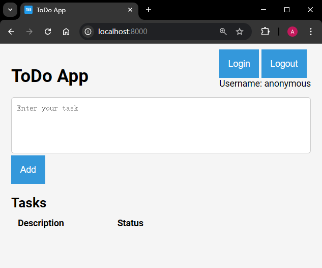

**图 1：示例 API 项目首页效果图**

我试过按照 **README** 的提示进行操作，结果服务端虽然启动成功了，一访问门户首页就报 500 异常；但是接口文档页（即 **Swagger** 接口页）又能正常打开。随后几天我又在 **GitHub Copilot** 的提示下了解了 `Django`、`Flask` 以及 `FastAPI` 相关的知识，才慢慢对这个示例项目有了点感觉。趁着刚学完 `FastAPI` 集成 `SQLite` 的新鲜劲，今天再次挑战一举拿下，便有了这篇复盘文章。

一旦解决了该项目的本地部署问题，原书《**API Testing and Development with Postman, Second Edition**》中的配套练习就无需再用 `GitPod` 的线上环境来搭建了；苛刻的无操作超时的问题也消失了；后续遇到新的测试需求也能第一时间在本地直接调试验证，可谓一举多得。

最关键的是，借助这次调试 `Python` 项目的实战经历，我对 AI 辅助编程又有了更立体的认识。


## 2 准备工作

相关前置准备工作如下：

- `Git`：`v2.45.1`（能克隆 `GitHub` 项目就行）；
- 一个有效的 `GitHub` 帐号；
- `Python`：`v3.11` 及以上（示例项目要求）；
- `Anaconda Prompt`：`v24.11.3`（方便创建 `Python` 虚拟环境）；


## 3 具体部署

### 3.1 将项目 Fork 到自己名下

示例项目地址：`https://github.com/djwester/todo-list-testing`。

为了方便后续二次开发，最好将原项目复刻到自己名下：

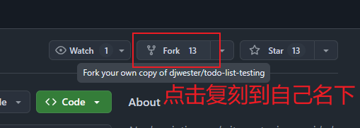

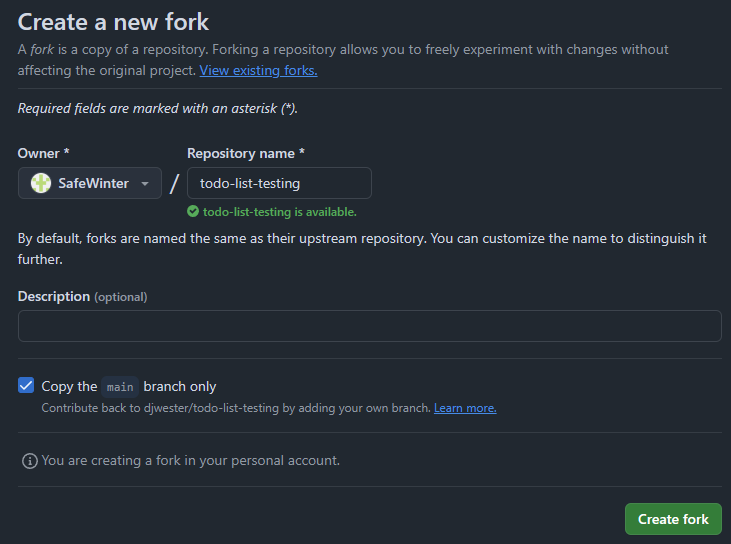

**图 2：复刻原项目到自己名下**

```bash
$ (pwd).Path
D:\sandbox
$ git clone git@github.com:SafeWinter/todo-list-testing.git
$ cd todo-list-testing
```

实测效果图：

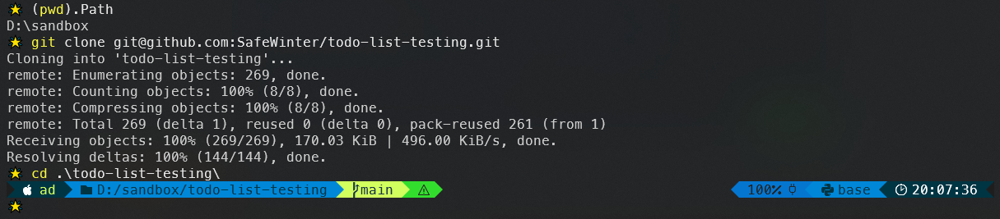

**图 3：将 Fork 后的示例项目克隆到本地**


### 3.2 创建虚拟环境并安装依赖

本地项目代码就绪后，再来创建一个 `Python` 虚拟环境 `todolist`（在 `Anaconda Prompt` 命令行中实现）：

```bash
# 查看当前环境列表
> conda env list

# conda environments:
#
base                *  C:\Users\ad\anaconda3
myenv                  C:\Users\ad\anaconda3\envs\myenv

# 新建 todolist 环境
> conda create --prefix D:\conda_venvs\todolist python=3.11
# 配置自定义虚拟环境所在路径
> conda config --add envs_dirs D:\conda_venvs
# 切到 todolist 环境
> conda activate todolist
# 确认当前环境
> conda env list

# conda environments:
#
base                   C:\Users\ad\anaconda3
myenv                  C:\Users\ad\anaconda3\envs\myenv
todolist             * D:\conda_venvs\todolist
>
```

> [!tip]
>
> **关于虚拟环境的删除**
>
> 如果哪天不需要该环境，则可使用以下命令彻底删除：
>
> ```bash
> # 使用 conda env remove 命令
> > conda env remove --prefix=D:\conda_venvs\todolist
> # 如果上述命令不成功，则可手动删除
> > rm -rf D:\conda_venvs\todolist
> # 清理 Conda 缓存和元数据
> > conda clean --all
> # 验证操作结果
> > conda env list
> ```
>
> **注意：**
>
> 1. 删除虚拟环境后，所有安装在该环境中的包和数据都会被清除，**且无法恢复**；
> 2. 如果虚拟环境正在使用中（已激活状态），请先停用该环境：`conda deactivate`。

虚拟环境搭好后，根据 **README** 文档，需要安装 `poetry` 依赖管理工具：

```bash
> curl -sSL https://install.python-poetry.org | python -
```

其中：

- `-s`（`--silent`）：静默模式，不显示进度条或错误信息；
- `-S`（`--show-error`）：与 `-s` 一起使用时，如果请求失败，`curl` 会显示错误信息；
- `-L`（`--location`）：如果请求的 URL 有重定向，`curl` 会自动跟随重定向；
- `-`：表示标准输入（`stdin`），用于将 `curl` 下载的内容直接传递给 `python` 解释器执行。

然后进入刚才的示例项目根路径，利用 `poetry install` 安装所需依赖项：

```bash
(D:\conda_venvs\todolist) C:\Users\ad> D:
(D:\conda_venvs\todolist) D:\> cd sandbox\todo-list-testing
(D:\conda_venvs\todolist) D:\sandbox\todo-list-testing> poetry install
Installing dependencies from lock file

Package operations: 54 installs, 0 updates, 0 removals

  - Installing mdurl (0.1.2)
  - Installing colorama (0.4.6)
# ...
  - Installing requests (2.32.3)
  - Installing sqlalchemy (2.0.31)

Installing the current project: todo-list (0.1.0)
Error: The current project could not be installed: No file/folder found for package todo-list
If you do not want to install the current project use --no-root.
If you want to use Poetry only for dependency management but not for packaging, you can disable package mode by setting package-mode = false in your pyproject.toml file.
If you did intend to install the current project, you may need to set `packages` in your pyproject.toml file.


(D:\conda_venvs\todolist) D:\sandbox\todo-list-testing> 
```

可以看到，安装到最后有个报错（其实并不影响项目启动）：

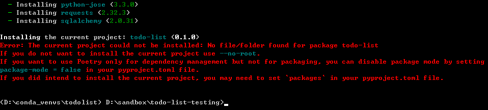

**图 4：执行 poetry install 到最后显示的报错界面（不影响）**

也可以根据提示再次运行 `poetry install --no-root`，警告就消失了：

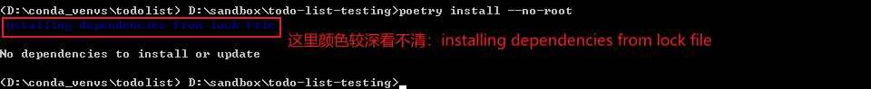

**图 5：添加 --no-root 选项后依赖安装过程就不报错了**


### 3.3 初始运行与项目调试

到了这一步，项目就初步具备启动条件了，执行命令 `poetry run uvicorn main:app --reload` 即可运行服务端：


**图 6：直接通过 poetry run 启动后台服务端（运行正常）**

但只要在浏览器中访问首页 URL `http://127.0.0.1:8000` 则会报错：

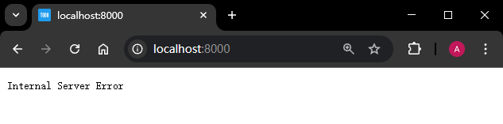

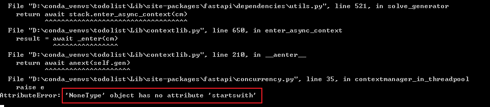

**图 7：在浏览器打开项目首页看到的页面及后台报错情况**

但此时访问接口文档页（`GET /docs`）却能正常打开：

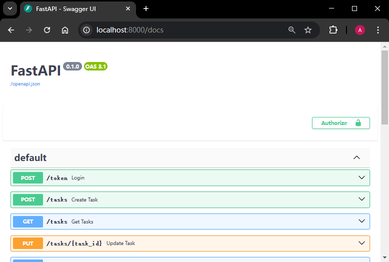

**图 8：示例项目的接口文档页可以正常打开**

为什么会报错呢？其实控制台最后一句话已经提示得很明显了（我之前一直没仔细看）：某语句在调用 `startswith` 属性时报了空指针异常；但是控制台并没有给出具体的文件位置。根据 `README` 的操作提示可以得知，这里跳过了复制生成 `.envrc` 文件的步骤，其中定义了一个只在 `Linux` 系统生效的环境变量 `DATABASE_URL`：

```bash
# 漏掉的命令：cp .envrc.example .envrc
# .envrc.example 只有一个语句：
export DATABASE_URL="sqlite+pysqlite:///./sql_db.db"
```

这就说明报错来自数据库的初始化。其实也可以用 `VSCode` 全局检索关键字 `startswith`，即可锁定问题出处：

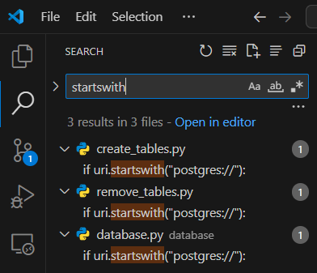

**图 9：在 VSCode 中全局检索 startswith 锁定后端报错的具体出处**

这样就定位到了三处包含 `startswith` 方法调用的文件，打开任意一个，例如 `database.py`，可以看到如下内容：

```python
def db_session():
    uri = os.getenv("DATABASE_URL")
    if uri.startswith("postgres://"):
        uri = uri.replace("postgres://", "postgresql://", 1)
    engine = create_engine(uri)

    Session = sessionmaker(autocommit=False, autoflush=False, bind=engine)
    db = Session()
    maybe_initialize_db(db, engine)
    with Session() as session:
        yield session
        session.close()
```

注意第 2 至 4 行，这表明 `uri` 是从环境变量中读取 `DATABASE_URL` 的值，且项目还支持 `postgreSQL` 数据库；可惜实际运行时读取失败了。

为了在 `Windows` 系统中实现快速启动，这里直接导入一个硬编码的 `uri` 模块，并令其取值为默认字符串 `"sqlite+pysqlite:///./sql_db.db"`：

于是新建模块 `database/uri.py` 并输入以下内容：

```python
uri = "sqlite+pysqlite:///./sql_db.db"
```

然后分别导入报错的那三个文件，并进行如下调整：

```python
# database/database.py
from database.uri import uri
# ...
def db_session():
    engine = create_engine(uri)
    # ...

# create_tables.py
from database.uri import uri
# ...
engine = create_engine(uri)

# remove_tables.py
from database.uri import uri
# ...
engine = create_engine(uri)
```

改好后，再次刷新浏览器页面，就能看到项目首页了（启动服务端时加了 `--reload` 选项支持动态更新）：

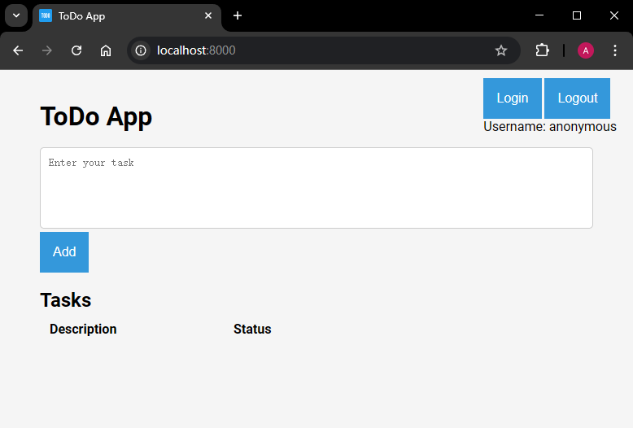

**图 10：对 uri 模块进行硬编码导入后看到的项目首页效果**


## 4 示例项目的用法

该项目看似简陋，其实还包含了很多必要的功能点：

- 用户登录：用户名可以是 `user1`、`user2`、`admin`，登录密码均为 `12345`；
- 只有自己创建的待办事项可以被删除；
- 页面上可以修改待办事项的几个状态：`Draft`、`In Progress`、`Complete`；
- 如果存在删不掉的数据，可退出运行，并执行数据库初始化命令：`poetry run python remove_tables.py`

如果想调用 `API` 接口，则可以打开 `GET /docs` 页面利用 `OpenAPI` 接口规范生成的标准接口进行测试（如获取登录令牌 `POST /token`）：

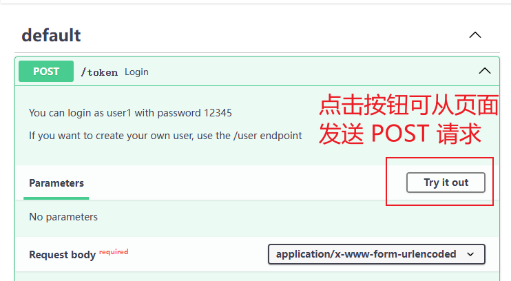

**图 11：在 OpenAPI 接口页尝试发送 POST 请求获取登录令牌**

更多操作步骤，可以结合源码进行二次开发，加深对 `API` 接口调试的理解。


## 5 复盘与总结

这次的项目本地化实战其实走了很多弯路：明明可以从后台报错信息中直接找到解决方案，之前的几次尝试我都忽略了这个关键细节，反而让 `GH Copilot` 列出项目用到的主要技术栈，然后一个一个地去了解、一个一个从零学起。这么做不能说没用，毕竟项目调试始终存在一定的偶然性，全面了解项目用到的技术栈可以大幅提高调试的一次通过率；只是对于这个项目而言有点杀鸡用牛刀了——最终的解决方案（导出 `uri` 模块）和任何一个 `Python Web` 框架本质上都没有任何关系。说到底还是自己的粗心大意白白耽误了一周多的时间。

另一方面也可以看到，强大如 `Copilot`、`DeepSeek` 这样的 AI 工具，其实是无法快速帮我锁定这个漏掉的关键细节的。它们只会按我给的思路和提示词进行回答，从这个角度来看，当下这些炙手可热的 AI 工具似乎又过于笨拙——因为真正有经验的老程序员，是一定会先问我报了什么错再来确定具体的解决方案的。因此，用好 AI 的关键，其实就在于能否从自身出发，切实培养出一系列良好的软件开发习惯，比如：问题导向、低耦合高内聚、重视测试用例……不一而足；能否在大家都能使用 AI 模型指导编程实践的情况下，直达问题本质，率先找到突破口。

这次实战也再次印证了 AI 工具 **遇强则强** 的特点。或许，今后无论 AI 如何发展，人与人之间的各种差距，可能都不会因为 AI 智能的大幅提升而被彻底消除；更有可能出现的情况是进一步加深人们在认知层面上的 “贫富差距”。