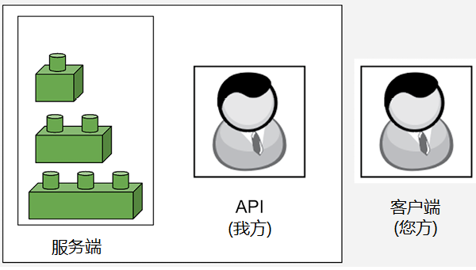
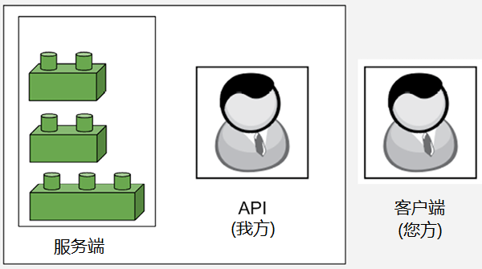

## 1.2 API 的调用类型 Types of API calls

一些 API 调用可以更改服务端上的内容，而另一些则只返回数据，不对内容做任何修改。API 调用可能会以不同的方式影响数据，这些不同的方式可以通过术语 **安全（safe）** 和 **幂等（idempotent）** 来进行描述。这些术语听起来让人有些望而生畏，为了更好地理解它们，不妨来看一个通俗易懂的例子：乐高积木。

试想有这么一张桌子，上面放着几块乐高积木，而我就坐在桌子旁边。我代表一个 API，桌子则代表服务端，乐高积木则代表一些目标对象（objects）。与乐高积木的所有互动都必须通过我来促成。在下面的示意图中，乐高积木代表服务端上的对象，我代表 API（应用程序接口），而您则代表客户端：

**图 1.1：通过 API 连接服务端和客户端示意图**

在上述假想关系中，您代表客户端，言下之意您可以让我用乐高来完成某些事。比如让我告诉您最上面的乐高积木有多大；我回答说，它的大小是 1。这就是 **安全的（safe）** API 请求与响应的示例。**安全请求** 是指不会更改服务端上 **任何内容** 的请求。您只问我请求了服务端中正在发生的事物的信息，因此并没有改变服务端本身的任何内容。

不过，其他类型的 API 调用就不好说了。试想：您给了我一块大小为 2 的积木，让我用那块积木把顶端的积木替换掉。我照做了，这样就改变了服务端的状态。如下图所示，积木堆现在由一块大小为 3 的积木和两块大小为 2 的积木组成：

**图 1.2：新服务端状态示意图**

由于服务端有变动，因此该请求不是一个安全的请求。但是，如果您再给我一块大小为 2 的积木，并再次要求我替换掉最上面的积木，这时服务端就不会有任何变化。那堆积木仍然是由一块大小为 3 的积木和两块大小为 2 的积木组成。这就是 **幂等（idempotent）** 调用的示例。无论调用多少次都返回相同结果的 API 调用，我们就说它是 **幂等的（idempotent）**。

接着再想象另一种调用方式：您给我一块积木，让我把它加到积木堆的顶端。我又照做了，此时积木堆便由四块积木组成。这次显然不是安全调用，因为服务端已经改变了，但它是幂等的吗？

答案是否定的，但请花点时间思考一下，确保您真正理解了该调用不是幂等调用的原因。

如果很难理解，那么不妨想想如果重复同样的请求会发生什么：再给我一块积木，让我把它加到积木顶端。第二次这样做，积木还是我第一次添加后的样子吗？当然不是！此时共有五块积木，并且每让我加一次，积木堆会变动一次。幂等调用仅在第一次执行时改变事物的状态，后续调用都不会做任何改变。而刚才的调用每次都会改变一些东西，因此它不是幂等调用。

安全性（Safety）和幂等性（idempotency）是需要重点掌握的核心概念，尤其是在做 API 测试的时候。如果测试的是安全调用，则可以并行地运行测试，不必担心它们会相互干扰；但如果测试的是不安全的、或非幂等的调用，那么在运行测试的类型和时间上可能需要更加谨慎一些。

除了安全和幂等，我们还需要学习一些更重要的术语，并对 API 请求的结构做进一步深入了解。不过要是手里有看得见摸得着的东西，操作起来就会轻松得多。所以下一节，我们将稍作停顿，先完成 Postman 的安装并发送我们的第一个请求。

