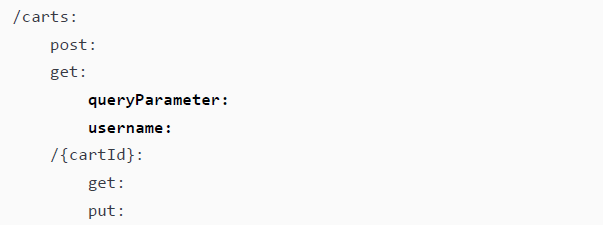

# 关于本书

## 1 前言

在这个快餐当道、快时尚盛行、快速营销策略无孔不入的世界里，**质量** 还重要吗？这个世界给人们带来的压力似乎总在驱使大家去走各种各样的捷径，哪怕是开发高质量的软件也不例外。笔者也一直在为反击这个充斥着“快”文化的疯狂世界而积极奔走，只求略尽绵力。在我看来，质量仍然是至关重要的。生活中那些动不动就状况百出的垃圾产品已经够多的了，也是时候该提高一下质量了。

写这本书算是抛砖引玉，希望能帮助更多的有缘人一窥高质量的软件产品与设计理念。无论您是专业测试人员，还是希望了解更多测试知识的开发者，但愿都能与我一起，通过高质量的软件应用来造福这个世界。

API 接口正在成为互联网的支柱。它既能帮助企业实现外部通信，同时也为现代软件系统的许多内部组件提供通信相关的基础设施。就像美满婚姻需要良好的沟通来维系，互联网也是如此。不同服务之间的良好通信是应用程序的良好运行的极其重要的保障。因此，API 接口测试对于产出优质的软件产品至关重要。

从表面上看，本书主要介绍的是 API 接口测试工具 Postman，但笔者也试图在书中穿插一些实例和教学经验，帮助读者以一种对质量有实际影响的方式来用好 Postman。通过本书的学习，您将深入理解 Postman 的工作原理，同时也将为如何考虑 API 接口测试打下坚实的基础。希望您掌握的不仅仅是 Postman 解决实际问题的各种操作技巧，更能够清楚地知道怎样因地制宜、因时制宜，从而有效地构建高质量的 API 接口。


## 2 本书读者

这本书首先是写过我自己的。书中谈到的许多想法都是我几年前自学的内容。事实上，Postman 的新功能的更新迭代速度极快，甚至这本全新第二版中的部分内容都是我在写书时学到的新知识。

我一直在成长和学习，尤其喜欢与他人分享我学到的新知识，以帮助他们行稳致远。

一开始接触 API 接口测试，可能会让人感到不知所措——毕竟这是一个庞大的主题，可能会让初学者望而生畏。正因如此，我才动了写这本书的念头。本书主要是针对那些需要测试 API 接口、但又不知道从何开始的软件测试人员和开发者。我在书中尽量不去假设读者拥有太多深入的编程经验，但了解一些编程的基础知识无疑会对书中的某些知识点的学习有所帮助。

如果您是一名软件测试人员，并且有兴趣涉猎 API 测试这一领域，本书绝对适合您。如果您是一名开发者，想要提升自己在测试与质量方面的相关技能，那么恭喜您，正在为前途光明的个人职业生涯添砖加瓦！未来懂得如何产出高质量软件的开发者将始终供不应求，备受青睐。无论您的背景如何，其间可能会略过本书的某些内容，但如果花上一些时间阅读学习，您就会发现自己已经能够轻松驾驭 Postman 这款测试神器，并知道如何设计及编写良好的 API 测试。


## 3 本书结构

本书共分为十五个章节，主要内容如下——

**第 1 章：API 术语和类型**，帮助您了解一些基本的 API 术语，并介绍不同类型的 API。

**第 2 章：API 文档与设计**，涵盖了适用于创建和测试 API 的设计原则，以及创建实用文档的方法及注意事项。

**第 3 章：OpenAPI 与 API 规范**，介绍了 API 规范的相关概念及其在 Postman 中的应用。

**第 4 章：良好 API 测试自动化的考虑因素**，教您如何在 Postman 中创建和执行有价值且经久不衰的 API 测试。

**第 5 章：理解鉴权设置**，介绍了如何使用 Postman 中现有的多种 API 接口鉴权方法。

**第 6 章：创建测试验证脚本**，解释了如何在 Postman 中创建和使用测试脚本。

**第 7 章：数据驱动测试**，介绍了数据驱动测试的概念，以及将其用于 Postman 中创建可扩展测试的具体方法。

**第 8 章：工作流测试**，解释了什么是工作流测试，以及如何在 Postman 中创建流程。

**第 9 章：使用 Newman 在 CI 中运行 API 测试**，展示了如何使用 Newman 运行 Postman API 测试的命令行。

**第 10 章：使用 Postman 监控 API**，探讨了如何使用 Postman 监控 API 接口的产品使用情况。

**第 11 章：测试现有 API**，通过一个实际示例展示在测试现有 API 时应该创建什么样的测试。

**第 12 章：在 Postman 中创建和使用模拟服务器**，解释了什么是模拟服务器以及如何在 Postman 中设置和使用它们。

**第 13 章：使用合约测试验证 API**，介绍了合约测试的概念，并演示了其在 Postman 中的用法。

**第 14 章：API 安全测试**，简要介绍了安全测试，并给出了在 Postman 中设置模糊测试的示例。

**第 15 章：API 性能测试**，解释了不同类型的性能测试，并介绍了 Postman 中可以用来评估 API 性能的一些功能。


## 4 本书学习建议

本书旨在为您提供在测试或开发工作中能够起到立竿见影效果的实用技能。如果您想从本书中获得最大的价值，请立即行动起来，学以致用。完成本书中的所有练习后，还要积极尝试将您学到的理念应用到“现实世界”中。

本书不假设读者具备大量关于 API 的先前知识，甚至不需要了解开发和测试原则。只要您对网络技术有基本的了解，并且对软件开发的整体概念有所认识，您就应该能够跟上本书的内容，并掌握所需的一切。本书中一些 Postman 的测试脚本使用了 JavaScript，但您不需要深入了解其工作原理，尽管基本的理解会有所帮助。书中有许多练手机会和拔高测试，它们是本书的重要组成部分，为了充分利用本书，您应该花时间逐一攻克这些问题与挑战。


## 5 代码约定与代码库

### 示例代码与彩页资源

本书完整的示例代码详见本文绑定的代码资源压缩包。彩页为 PDF 格式，也在资源压缩包内。

### 代码约定

本书中使用了多种样式约定。

`CodeInText`：表示文本中嵌入的代码、数据库表名、文件夹名称、文件名、文件扩展名、路径名、虚拟网址、用户输入和推特用户名。例如：“`/product` 端点提供有关通过此 API 访问的产品的信息。”

代码格式示例如下：

```yaml
openapi: 3.0.1
info:
    title: ToDo List API
    description: Manages ToDo list Tasks
    version: "1.0"
servers:
    -url: https://localhost:5000/todolist/api
```

当希望引起您对代码块中特定部分的注意时，相关的行或项目会以粗体显示：



命令行格式如下：

```bash
npm install -g newman
```

**粗体字**：表示一个新术语、一个重要的词，或您在屏幕上看到的词。例如，菜单或对话框中的词在文本中显示为这样。例如：“点击 **导入** 按钮并选择 **OpenAPI** 选项。”

> [!note]
>
> 像这样显示警告或重要说明。

> [!tip]
>
> 像这样显示提示和技巧。
